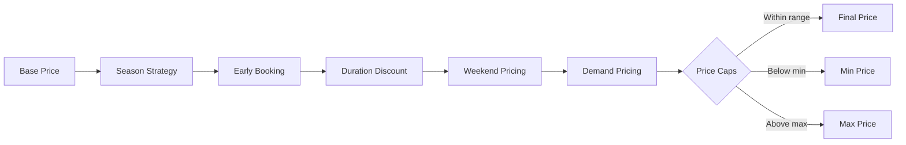
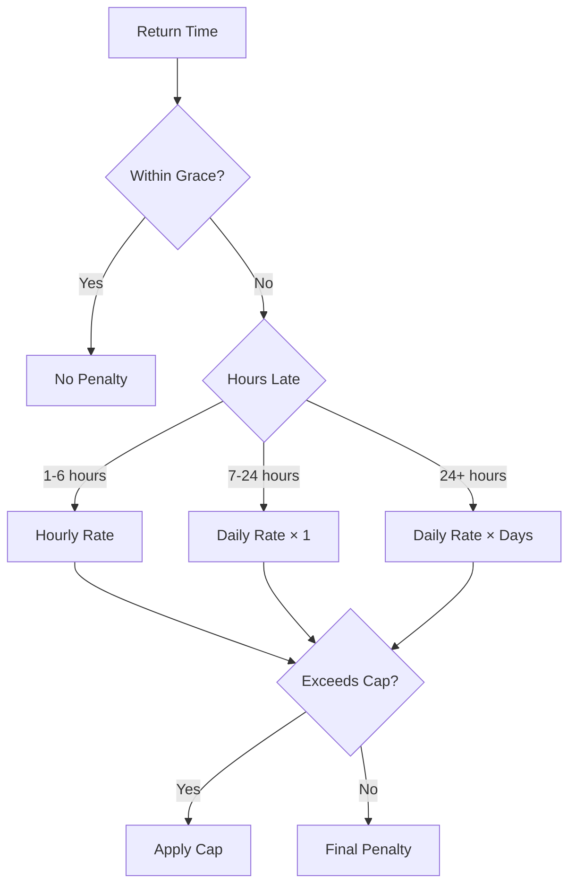
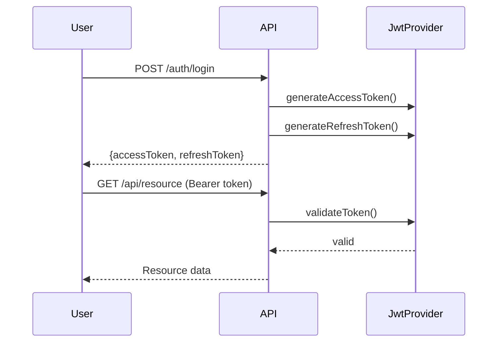

# Design: Architecture Decisions Documentation

## Overview

Bu tasarım, 3 kritik ADR (006, 007, 008) için dosya yapısını ve içerik şablonlarını tanımlar. Mevcut ADR formatı (ADR-003) referans alınarak tutarlı bir yapı oluşturulacak.

## File Structure

```
docs/architecture/adr/
├── ADR-001-spring-modulith.md          (mevcut)
├── ADR-002-cross-module-entity.md      (mevcut)
├── ADR-003-event-driven-communication.md (mevcut)
├── ADR-004-shared-kernel-boundaries.md  (mevcut)
├── ADR-005-payment-module-separation.md (mevcut)
├── ADR-006-dynamic-pricing-strategy.md  (YENİ)
├── ADR-007-late-return-penalty.md       (YENİ)
└── ADR-008-authentication-strategy.md   (YENİ)
```

## ADR Template Structure

Her ADR aşağıdaki section'ları içerecek:

```markdown
# ADR-XXX: [Title]

## Status
**Accepted**

## Context
[Problem tanımı ve karar gerektiren durum]

## Decision
[Alınan karar - kısa ve net]

## Rationale
### Alternatives Evaluated
| Approach | Pros | Cons |
|----------|------|------|
| ... | ... | ... |

### Why [Chosen Approach]?
[Seçim gerekçeleri - numbered list]

### Implementation Details
[Kod yapısı ve konfigürasyon detayları]

## Consequences
### Positive
- ...

### Negative
- ...

## Related ADRs
- ADR-XXX: ...
```

---

## ADR-006: Dynamic Pricing Strategy

### Context Section Content
- Araç kiralama fiyatlandırmasının dinamik olması gereksinimi
- Sezon, erken rezervasyon, süre, hafta sonu, talep faktörleri
- Fiyat hesaplamasının genişletilebilir olması ihtiyacı

### Decision Section Content
- Strategy Pattern ile 5 bağımsız pricing strategy
- Chain of responsibility ile sıralı uygulama
- PricingConfig ile yapılandırılabilir parametreler

### Alternatives Table
| Approach | Pros | Cons |
|----------|------|------|
| Strategy Pattern | Extensible, testable, SRP | More classes |
| Rule Engine (Drools) | Flexible rules | Complex, learning curve |
| ML-based Pricing | Adaptive | Unpredictable, complex |
| Hardcoded Logic | Simple | Not maintainable |

### Implementation Details
```
Strategies (execution order):
1. SeasonPricingStrategy - Peak/off-peak multipliers
2. EarlyBookingStrategy - Lead time discounts
3. DurationDiscountStrategy - Long rental discounts
4. WeekendPricingStrategy - Weekend surcharges
5. DemandPricingStrategy - Availability-based pricing

Price Calculation Flow:
basePrice × strategy1.multiplier × strategy2.multiplier × ... = finalPrice

Price Caps:
- minDailyPrice: Configured minimum
- maxDailyPrice: Configured maximum
```

### Code References
- Interface: `PricingStrategy.java`
- Service: `DynamicPricingServiceImpl.java`
- Config: `com.akif.rental.internal.config.PricingConfig`
- Strategies: `com.akif.car.internal.service.pricing.strategy.*`

---

## ADR-007: Late Return Penalty Calculation

### Context Section Content
- Geç iade durumunda ceza hesaplama ihtiyacı
- Müşteri deneyimi vs gelir kaybı dengesi
- Yapılandırılabilir ve adil bir sistem gerekliliği

### Decision Section Content
- Tiered penalty system (hourly → daily)
- Grace period ile müşteri dostu yaklaşım
- Penalty cap ile aşırı cezalandırmayı önleme

### Penalty Tiers Table
| Duration | Rate | Calculation |
|----------|------|-------------|
| 0-60 min | 0% | Grace period - no penalty |
| 1-6 hours | 10%/hour | dailyRate × 0.10 × hours |
| 7-24 hours | 150%/day | dailyRate × 1.50 |
| 24+ hours | 150%/day | dailyRate × 1.50 × days |
| Cap | 5× daily | Maximum penalty limit |

### Alternatives Table
| Approach | Pros | Cons |
|----------|------|------|
| Tiered (chosen) | Fair, predictable | Complex calculation |
| Flat Fee | Simple | Not proportional |
| Progressive (exponential) | Strong deterrent | Can be excessive |
| No Cap | Maximum revenue | Customer complaints |

### Configuration Validation
```java
gracePeriodMinutes: 0-120 (default: 60)
hourlyPenaltyRate: 0.05-0.25 (default: 0.10)
dailyPenaltyRate: 1.00-2.00 (default: 1.50)
penaltyCapMultiplier: 3.0-10.0 (default: 5.0)
```

### Code References
- Service: `PenaltyCalculationServiceImpl.java`
- Config: `PenaltyConfig.java`
- Result DTO: `PenaltyResult.java`
- Enum: `LateReturnStatus.java` (ON_TIME, GRACE_PERIOD, LATE, SEVERELY_LATE)

---

## ADR-008: Authentication Strategy

### Context Section Content
- Stateless authentication ihtiyacı (scalability)
- Social login desteği gerekliliği
- Token-based security modern standartları

### Decision Section Content
- JWT (JSON Web Token) for stateless auth
- Dual token system (access + refresh)
- OAuth2 with Google and GitHub providers

### Token Structure
```
Access Token:
- subject: username
- claim: userId (Long)
- claim: roles (List<String>)
- expiration: configurable (default: 1 hour)

Refresh Token:
- subject: username
- expiration: configurable (default: 7 days)
```

### Alternatives Table
| Approach | Pros | Cons |
|----------|------|------|
| JWT (chosen) | Stateless, scalable | Token size, revocation |
| Session-based | Simple revocation | Server state, scaling |
| Opaque Tokens | Small size | DB lookup required |
| PASETO | More secure | Less adoption |

### OAuth2 Provider Selection
| Provider | Reason |
|----------|--------|
| Google | Most common, trusted |
| GitHub | Developer-focused audience |
| Facebook | Not included - privacy concerns |
| Twitter/X | Not included - API instability |

### Security Considerations
- HMAC-SHA256 signing with secret key
- Token stored in HttpOnly cookies (recommended)
- Refresh token rotation on use
- Short access token lifetime

### Code References
- Provider: `JwtTokenProvider.java`
- Filter: `JwtAuthenticationFilter.java`
- Config: `SecurityConfig.java`
- OAuth2 Service: `com.akif.auth.internal.service.oauth2.OAuth2AuthService`
- OAuth2 Controller: `com.akif.auth.web.OAuth2Controller`
- OAuth2 Providers: `GoogleOAuth2ProviderService`, `GitHubOAuth2ProviderService`

---

## Mermaid Diagrams

### ADR-006: Pricing Flow


### ADR-007: Penalty Decision Flow


### ADR-008: Authentication Flow


---

## Acceptance Criteria Mapping

| Requirement | ADR Section |
|-------------|-------------|
| Story 1: Strategy Pattern rationale | ADR-006 Rationale |
| Story 1: 5 strategies explained | ADR-006 Implementation |
| Story 1: Alternatives evaluated | ADR-006 Alternatives Table |
| Story 2: Grace period rationale | ADR-007 Context + Decision |
| Story 2: Penalty rates documented | ADR-007 Penalty Tiers Table |
| Story 2: Cap rationale | ADR-007 Rationale |
| Story 3: JWT structure | ADR-008 Token Structure |
| Story 3: OAuth2 providers | ADR-008 Provider Selection |
| Story 3: Security considerations | ADR-008 Security Section |
