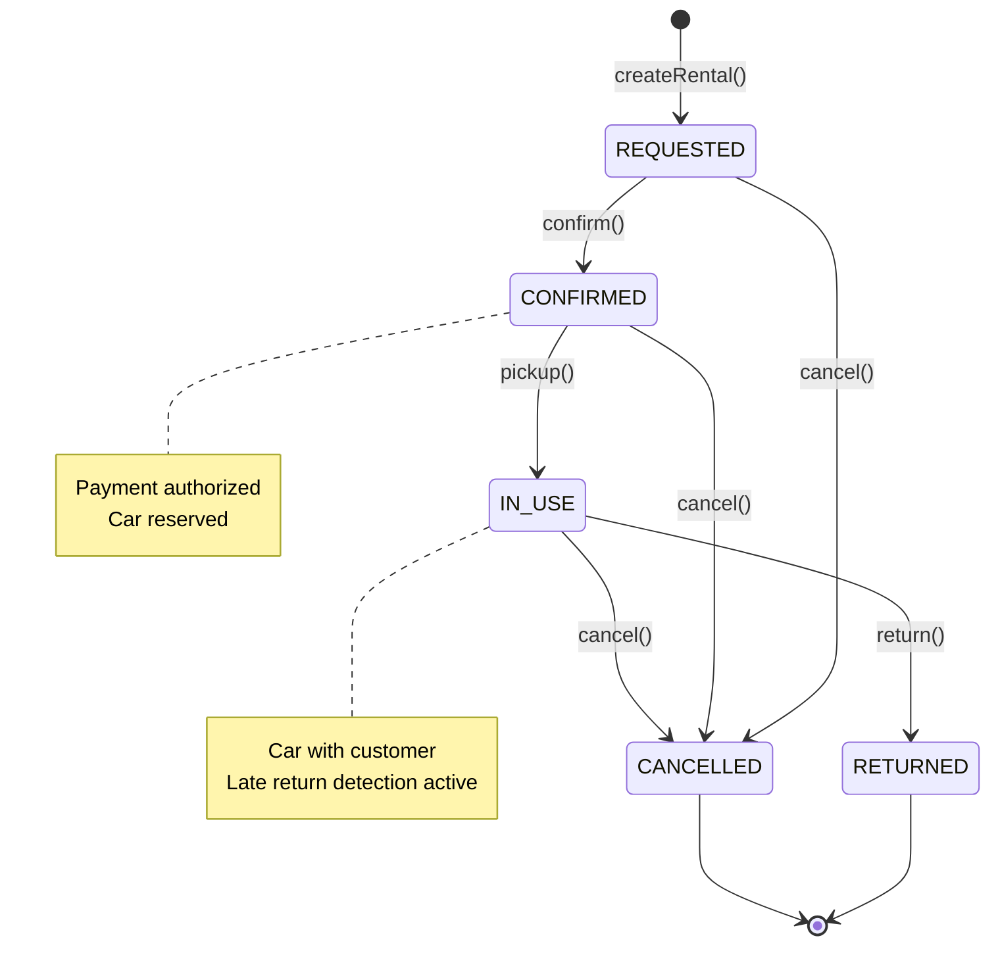
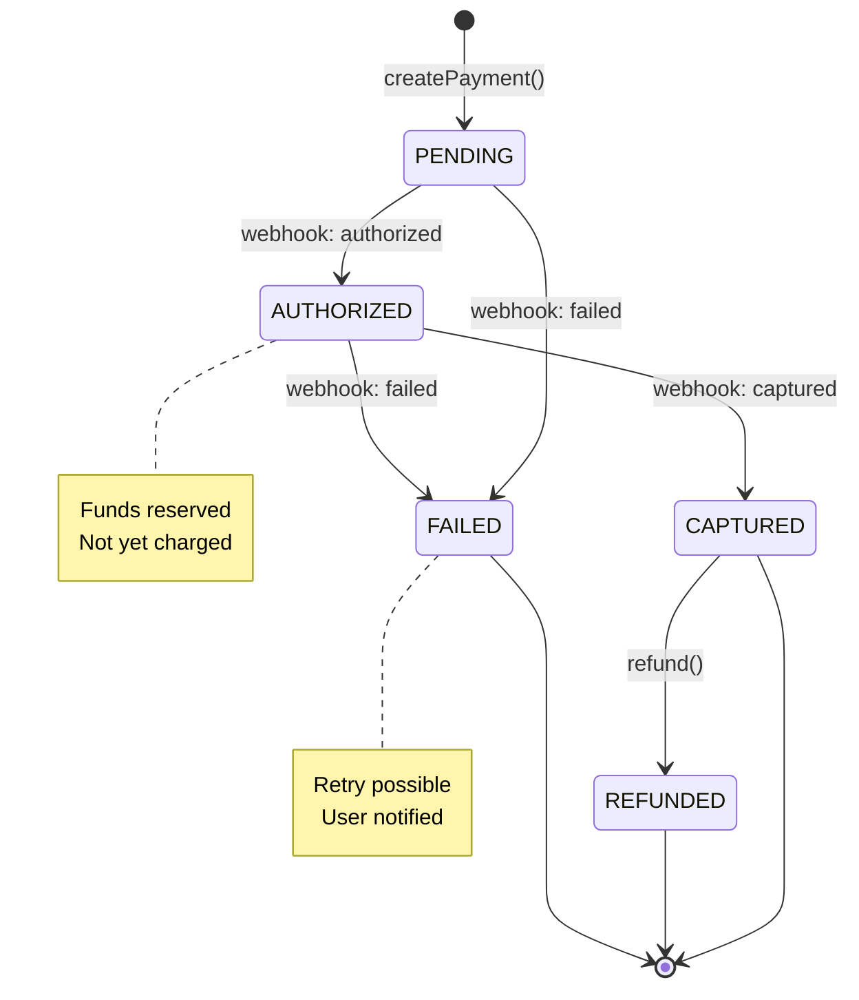
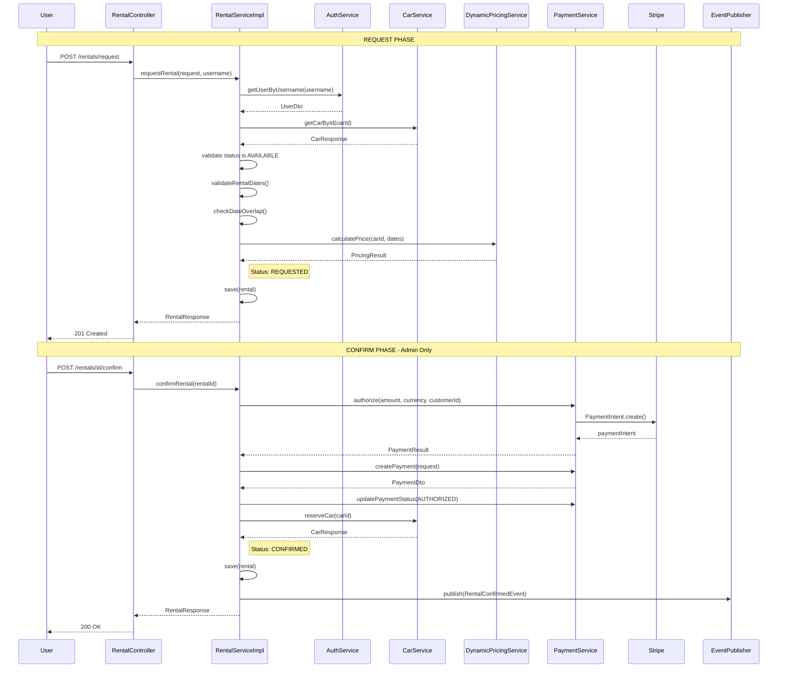
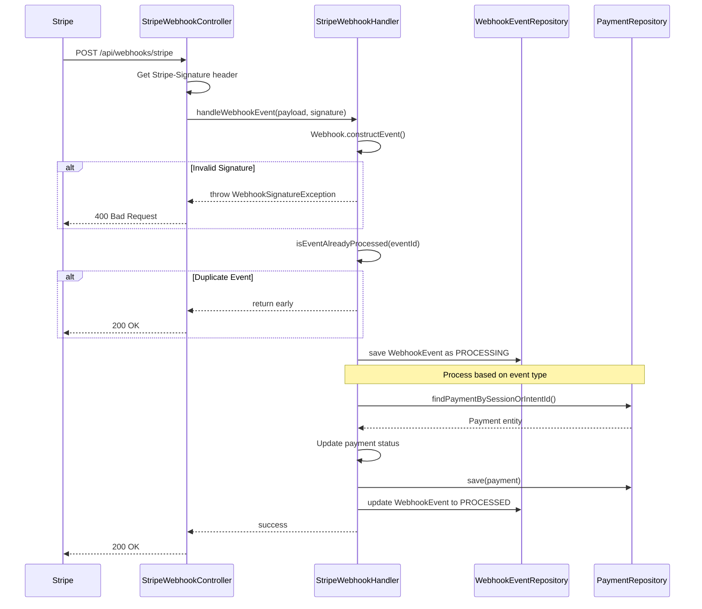
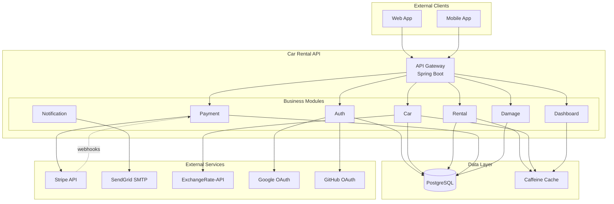

# Design: Architecture Diagrams Documentation

## Overview

Bu tasarım, 5 kritik diyagram için Mermaid formatında içerik şablonlarını tanımlar. Tüm diyagramlar tek bir markdown dosyasında organize edilecek.

## File Structure

```
docs/architecture/
├── adr/                    (mevcut ADR'ler)
├── DEVELOPER_GUIDE.md      (mevcut)
├── MIGRATION.md            (mevcut)
└── DIAGRAMS.md             (YENİ - tüm diyagramlar)
```

## Document Structure

```markdown
# Architecture Diagrams

## Table of Contents
1. [Rental Lifecycle State Diagram](#rental-lifecycle)
2. [Payment Status State Diagram](#payment-status)
3. [Complete Rental Flow](#rental-flow)
4. [Payment Webhook Flow](#webhook-flow)
5. [System Components](#system-components)

---

## 1. Rental Lifecycle State Diagram {#rental-lifecycle}
[Açıklama + Mermaid diagram]

## 2. Payment Status State Diagram {#payment-status}
[Açıklama + Mermaid diagram]

## 3. Complete Rental Flow Sequence Diagram {#rental-flow}
[Açıklama + Mermaid diagram]

## 4. Payment Webhook Flow Sequence Diagram {#webhook-flow}
[Açıklama + Mermaid diagram]

## 5. System Component Diagram {#system-components}
[Açıklama + Mermaid diagram]
```

---

## Diagram 1: Rental Lifecycle State Diagram

### Description
Rental entity'nin yaşam döngüsünü gösteren state diagram. RentalStatus enum değerleri ve valid transition'lar.

### States (from RentalStatus enum)
| State | Display Name | Description |
|-------|--------------|-------------|
| REQUESTED | Requested | Rental request created |
| CONFIRMED | Confirmed | Rental confirmed, payment authorized |
| IN_USE | In Use | Car picked up by customer |
| RETURNED | Returned | Car returned |
| CANCELLED | Cancelled | Rental cancelled |

### Valid Transitions (from enum methods)
| From | To | Trigger | Method |
|------|-----|---------|--------|
| REQUESTED | CONFIRMED | confirm() | canConfirm() |
| REQUESTED | CANCELLED | cancel() | canCancel() |
| CONFIRMED | IN_USE | pickup() | canPickup() |
| CONFIRMED | CANCELLED | cancel() | canCancel() |
| IN_USE | RETURNED | return() | canReturn() |
| IN_USE | CANCELLED | cancel() | canCancel() |

### Mermaid Code


---

## Diagram 2: Payment Status State Diagram

### Description
Payment entity'nin durumlarını gösteren state diagram. Stripe webhook'ları ile tetiklenen transition'lar.

### States (from PaymentStatus enum)
| State | Display Name | Description |
|-------|--------------|-------------|
| PENDING | Pending | Payment pending |
| AUTHORIZED | Authorized | Payment authorized, not yet captured |
| CAPTURED | Captured | Payment captured |
| FAILED | Failed | Payment failed |
| REFUNDED | Refunded | Payment refunded |

### Valid Transitions
| From | To | Trigger |
|------|-----|---------|
| PENDING | AUTHORIZED | Stripe: payment_intent.authorized |
| PENDING | FAILED | Stripe: payment_intent.failed |
| AUTHORIZED | CAPTURED | Stripe: payment_intent.captured |
| AUTHORIZED | FAILED | Stripe: payment_intent.failed |
| CAPTURED | REFUNDED | refund() (canRefund()) |

### Mermaid Code


---

## Diagram 3: Complete Rental Flow Sequence Diagram

### Description
Rental oluşturma (request) ve onaylama (confirm) sürecinin end-to-end akışı. İki ayrı API call gerektirir.

### Participants
- User (Actor)
- RentalController
- RentalServiceImpl
- CarService
- AuthService
- DynamicPricingService
- PaymentService
- Stripe (External)
- EventPublisher

### Flow Steps (Request Phase)
1. User requests rental via POST /rentals/request
2. AuthService retrieves user by username
3. CarService retrieves car and checks status (AVAILABLE)
4. DynamicPricingService calculates price
5. RentalService saves rental (status: REQUESTED)
6. Response returned to user

### Flow Steps (Confirm Phase)
7. Admin confirms rental via POST /rentals/{id}/confirm
8. PaymentService authorizes payment
9. PaymentService creates payment record
10. CarService reserves car
11. EventPublisher publishes RentalConfirmedEvent
12. Response returned

### Mermaid Code


---

## Diagram 4: Payment Webhook Flow Sequence Diagram

### Description
Stripe webhook'larının işlenme akışı. Signature verification, idempotency check ve payment status update. **Not:** Bu akış sadece Stripe Checkout flow için geçerlidir. Ana rental flow'da event'ler RentalServiceImpl tarafından publish edilir.

### Participants
- Stripe (External)
- StripeWebhookController
- StripeWebhookHandler
- PaymentRepository (internal)
- WebhookEventRepository (internal)

### Flow Steps
1. Stripe sends webhook event
2. Controller receives POST /api/webhooks/stripe
3. Handler verifies signature using Webhook.constructEvent()
4. Handler checks idempotency (isEventAlreadyProcessed)
5. Handler saves WebhookEvent with PROCESSING status
6. Handler processes event based on type
7. Handler updates Payment status directly via PaymentRepository
8. Handler updates WebhookEvent status to PROCESSED
9. 200 OK returned to Stripe

### Supported Event Types
- `checkout.session.completed` → Payment status: CAPTURED
- `checkout.session.expired` → Payment status: FAILED
- `payment_intent.payment_failed` → Payment status: FAILED

### Mermaid Code


### Important Notes

> **⚠️ Event Publishing:** StripeWebhookHandler **event publish ETMEZ**. `PaymentCapturedEvent` ve `RentalConfirmedEvent` gibi business event'ler `RentalServiceImpl` tarafından pickup ve confirm işlemlerinde publish edilir.
>
> Bu webhook handler sadece Stripe Checkout Session flow'u için payment status'ü günceller. Ana rental flow'da payment işlemleri `RentalServiceImpl` → `PaymentService` zinciri üzerinden yapılır.

---

## Diagram 5: System Component Diagram

### Description
Sistemin yüksek seviye bileşen diyagramı. External service entegrasyonları ve module boundaries.

### Components
| Component | Type | Description |
|-----------|------|-------------|
| Client | External | Web/Mobile frontend |
| API Gateway | Internal | Spring Boot application |
| PostgreSQL | Internal | Primary database |
| Stripe | External | Payment processing |
| SendGrid | External | Email delivery |
| ExchangeRate-API | External | Currency rates |
| Google OAuth | External | Social login |
| GitHub OAuth | External | Social login |

### Mermaid Code


---

## Acceptance Criteria Mapping

| Requirement | Diagram Section |
|-------------|-----------------|
| Story 1: RentalStatus values | Diagram 1 States |
| Story 1: Valid transitions | Diagram 1 Transitions |
| Story 2: PaymentStatus values | Diagram 2 States |
| Story 2: Webhook triggers | Diagram 2 Transitions |
| Story 3: Module interactions | Diagram 3 Participants |
| Story 3: Event publishing | Diagram 3 Flow |
| Story 4: Signature verification | Diagram 4 Alt block |
| Story 4: Status update flow | Diagram 4 Flow |
| Story 5: External services | Diagram 5 External_Services |
| Story 5: Module boundaries | Diagram 5 Modules |
