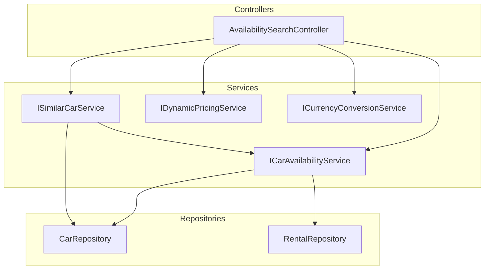

# Design Document

## Overview

The Availability Calendar & Smart Search feature extends the existing car search system to support date-based availability filtering, similar car recommendations, and a visual availability calendar. This design leverages existing components (`CarRepository`, `RentalRepository`, `DynamicPricingService`, `CurrencyConversionService`) while adding new services for availability checking and similar car recommendations.

The feature consists of three main capabilities:
1. **Date-based Availability Search**: Filter cars by rental date range, excluding cars with overlapping rentals or blocking statuses
2. **Similar Car Recommendations**: Suggest alternative cars when a preferred car is unavailable
3. **Availability Calendar**: Display monthly availability for a specific car

## Architecture



## Components and Interfaces

### 1. ICarAvailabilityService

New service interface for availability-related operations.

```java
public interface ICarAvailabilityService {
    
    /**
     * Search for available cars within a date range with optional filters.
     */
    AvailabilitySearchResponseDto searchAvailableCars(AvailabilitySearchRequestDto request);
    
    /**
     * Check if a specific car is available for a date range.
     */
    boolean isCarAvailable(Long carId, LocalDate startDate, LocalDate endDate);
    
    /**
     * Get monthly availability calendar for a specific car.
     */
    CarAvailabilityCalendarDto getCarAvailabilityCalendar(Long carId, YearMonth month);
    
    /**
     * Get list of unavailable dates for a car within a date range.
     */
    List<LocalDate> getUnavailableDates(Long carId, LocalDate startDate, LocalDate endDate);
}
```

### 2. ISimilarCarService

New service interface for similar car recommendations.

```java
public interface ISimilarCarService {
    
    /**
     * Find similar available cars for a given car and date range.
     * Returns up to 5 similar cars ordered by similarity score.
     */
    List<SimilarCarDto> findSimilarAvailableCars(Long carId, LocalDate startDate, LocalDate endDate, int limit);
}
```

### 3. AvailabilitySearchController

New REST controller for availability search endpoints.

```java
@RestController
@RequestMapping("/api/cars/availability")
public class AvailabilitySearchController {
    
    // POST /api/cars/availability/search - Search available cars with date range
    // GET /api/cars/{id}/availability/calendar - Get monthly availability calendar
    // GET /api/cars/{id}/similar - Get similar available cars
}
```

## Data Models

### Request DTOs

```java
@Data
@Builder
public class AvailabilitySearchRequestDto {
    @NotNull
    @FutureOrPresent
    private LocalDate startDate;
    
    @NotNull
    @Future
    private LocalDate endDate;
    
    // Existing filter fields from CarSearchRequestDto
    private String brand;
    private String model;
    private String fuelType;
    private String transmissionType;
    private String bodyType;
    private Integer minSeats;
    private BigDecimal minPrice;
    private BigDecimal maxPrice;
    private Integer minProductionYear;
    private Integer maxProductionYear;
    
    // Pricing options
    private CurrencyType targetCurrency;
    
    // Pagination
    private String sortBy = "price";
    private String sortDirection = "asc";
    private Integer page = 0;
    private Integer size = 20;
}
```

### Response DTOs

```java
@Data
@Builder
public class AvailabilitySearchResponseDto {
    private List<AvailableCarDto> cars;
    private long totalElements;
    private int totalPages;
    private int currentPage;
    private int pageSize;
    private LocalDate searchStartDate;
    private LocalDate searchEndDate;
    private int rentalDays;
}

@Data
@Builder
public class AvailableCarDto {
    // Car info
    private Long id;
    private String brand;
    private String model;
    private Integer productionYear;
    private String bodyType;
    private String fuelType;
    private String transmissionType;
    private Integer seats;
    private String imageUrl;
    private BigDecimal rating;
    
    // Pricing for selected dates
    private BigDecimal dailyRate;
    private BigDecimal totalPrice;
    private CurrencyType currency;
    private List<String> appliedDiscounts;
}

@Data
@Builder
public class CarAvailabilityCalendarDto {
    private Long carId;
    private String carName;
    private YearMonth month;
    private List<DayAvailabilityDto> days;
    private boolean carBlocked; // true if car has blocking status
    private String blockReason; // MAINTENANCE, DAMAGED, etc.
}

@Data
@Builder
public class DayAvailabilityDto {
    private LocalDate date;
    private AvailabilityStatus status; // AVAILABLE, UNAVAILABLE
    private Long rentalId; // if unavailable, the rental blocking it
}

@Data
@Builder
public class SimilarCarDto {
    private Long id;
    private String brand;
    private String model;
    private Integer productionYear;
    private String bodyType;
    private BigDecimal dailyRate;
    private BigDecimal totalPrice;
    private CurrencyType currency;
    private String imageUrl;
    private List<String> similarityReasons; // "Same body type", "Same brand", "Similar price"
    private int similarityScore; // 0-100
}
```

### Enums

```java
public enum AvailabilityStatus {
    AVAILABLE,
    UNAVAILABLE
}
```

## Correctness Properties

*A property is a characteristic or behavior that should hold true across all valid executions of a system-essentially, a formal statement about what the system should do. Properties serve as the bridge between human-readable specifications and machine-verifiable correctness guarantees.*

Based on the prework analysis, the following correctness properties have been identified:

### Property 1: Available cars have no rental conflicts
*For any* date range and search criteria, all cars returned by the availability search SHALL have zero overlapping confirmed or in-use rentals for the specified date range.
**Validates: Requirements 1.1**

### Property 2: Available cars have rentable status
*For any* availability search result, all returned cars SHALL have a status that is NOT in the blocking set (MAINTENANCE, DAMAGED, SOLD, INSPECTION).
**Validates: Requirements 1.2**

### Property 3: Combined filters are applied conjunctively
*For any* availability search with multiple filter criteria, all returned cars SHALL satisfy ALL specified criteria (date availability AND brand AND price range AND other filters).
**Validates: Requirements 1.5**

### Property 4: Similar cars count constraint
*For any* similar cars request, the system SHALL return at most 5 cars.
**Validates: Requirements 2.1**

### Property 5: Similar cars meet similarity criteria
*For any* car in the similar cars result, the car SHALL either have the same body type as the reference car OR have a price within 20% of the reference car's price.
**Validates: Requirements 2.2**

### Property 6: Similar cars include similarity reason
*For any* car in the similar cars result, the similarityReasons list SHALL be non-empty.
**Validates: Requirements 2.5**

### Property 7: Calendar contains all days in month
*For any* valid month request, the calendar response SHALL contain exactly the number of days in that month.
**Validates: Requirements 3.1**

### Property 8: Calendar availability matches rental data
*For any* day in the calendar, the availability status SHALL correctly reflect whether there is an overlapping rental (UNAVAILABLE if rental exists, AVAILABLE otherwise).
**Validates: Requirements 3.2, 3.3**

### Property 9: Blocked cars show all days unavailable
*For any* car with blocking status (MAINTENANCE, DAMAGED, SOLD, INSPECTION), the calendar SHALL mark all days as UNAVAILABLE.
**Validates: Requirements 3.4**

### Property 10: Search results include pricing information
*For any* availability search result with a date range, each car SHALL include both dailyRate and totalPrice fields with non-null values.
**Validates: Requirements 4.1, 4.3**

### Property 11: Dynamic pricing is applied correctly
*For any* car in the search results, the totalPrice SHALL equal the result of calling DynamicPricingService with the same car and date range.
**Validates: Requirements 4.2**

### Property 12: Currency conversion is applied correctly
*For any* search with a target currency specified, all prices SHALL be converted using CurrencyConversionService.
**Validates: Requirements 4.4**

### Property 13: Pagination respects size constraints
*For any* search request, the page size SHALL be between 1 and 100, defaulting to 20 if not specified.
**Validates: Requirements 5.2**

## Error Handling

### Validation Errors (400 Bad Request)

| Error Code | Condition | Message |
|------------|-----------|---------|
| INVALID_DATE_RANGE | startDate > endDate | Start date must be before end date |
| PAST_START_DATE | startDate < today | Start date cannot be in the past |
| DATE_RANGE_TOO_LONG | endDate - startDate > 90 days | Rental period cannot exceed 90 days |
| CALENDAR_MONTH_TOO_FAR | month > currentMonth + 3 | Calendar only available up to 3 months in advance |
| INVALID_PAGE_SIZE | size < 1 or size > 100 | Page size must be between 1 and 100 |

### Not Found Errors (404 Not Found)

| Error Code | Condition | Message |
|------------|-----------|---------|
| CAR_NOT_FOUND | Car ID does not exist | Car not found with id: {id} |

### Custom Exceptions

```java
public class InvalidDateRangeException extends BaseException {
    public InvalidDateRangeException(String message) {
        super("INVALID_DATE_RANGE", message, HttpStatus.BAD_REQUEST);
    }
}

public class CalendarRangeException extends BaseException {
    public CalendarRangeException(String message) {
        super("CALENDAR_RANGE_EXCEEDED", message, HttpStatus.BAD_REQUEST);
    }
}
```

## Testing Strategy

### Unit Tests

Unit tests will cover:
- `CarAvailabilityServiceImpl` - availability checking logic
- `SimilarCarServiceImpl` - similarity calculation and filtering
- Date validation logic
- Price calculation integration

Test cases derived from correctness properties:
1. **Property 1 & 2**: Test that returned cars have no rental conflicts and valid status
2. **Property 3**: Test filter combinations are applied correctly
3. **Property 4-6**: Test similar car constraints (max 5, similarity criteria, reasons)
4. **Property 7-9**: Test calendar accuracy (all days, correct status, blocked cars)
5. **Property 10-12**: Test pricing fields are present and calculated correctly
6. **Property 13**: Test pagination bounds

### Integration Tests

Integration tests will cover:
- Full search flow with database
- Calendar generation with real rental data
- Similar cars with actual car inventory
- Currency conversion integration
- Dynamic pricing integration
- Concurrent access scenarios

### Test Annotations

Each test MUST include comments referencing the correctness property:
```java
// **Feature: availability-calendar, Property {number}: {property_text}**
// **Validates: Requirements X.Y**
```
