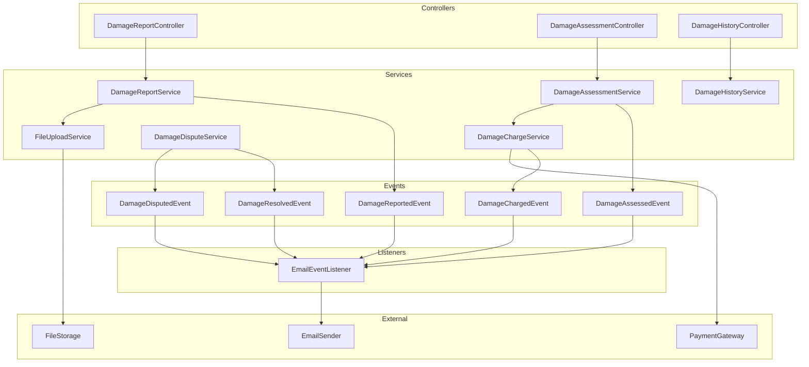

# Design Document: Damage Management System

## Overview

Damage Management System, araç iadesi sırasında tespit edilen hasarları kayıt altına alan, değerlendiren ve ek ücretlendirme sürecini yöneten bir sistemdir. Sistem, mevcut rental, payment ve car altyapısı üzerine inşa edilecek ve event-driven architecture kullanarak bildirim ve ödeme işlemlerini yönetecektir.

### Key Design Decisions

1. **File Storage Strategy**: İlk aşamada local file system, production'da Cloudflare R2'ye geçiş hazır
2. **Event-Driven Notifications**: ApplicationEventPublisher ile bildirim event'leri
3. **Configuration-Driven**: application.properties üzerinden ayarlanabilir threshold'lar
4. **Damage Charge as Separate Payment**: Hasar ödemeleri ayrı Payment kayıtları olarak tutulacak
5. **State Machine Pattern**: 6 status ile workflow yönetimi
6. **Audit Trail**: Tüm hasar işlemleri ve dispute'lar audit log'a kaydedilecek

## Architecture



## Components and Interfaces

### 1. DamageStatus Enum

```java
public enum DamageStatus {
    REPORTED("Reported", "Damage reported, awaiting assessment"),
    UNDER_ASSESSMENT("Under Assessment", "Being evaluated by assessor"),
    ASSESSED("Assessed", "Assessment completed, awaiting charge"),
    CHARGED("Charged", "Customer charged for damage"),
    DISPUTED("Disputed", "Customer disputed the charge"),
    RESOLVED("Resolved", "Dispute resolved or damage closed");
}
```

### 2. DamageSeverity Enum

```java
public enum DamageSeverity {
    MINOR("Minor", "Small cosmetic damage", 0, 500),
    MODERATE("Moderate", "Noticeable damage requiring repair", 500, 2000),
    MAJOR("Major", "Significant damage affecting functionality", 2000, 10000),
    TOTAL_LOSS("Total Loss", "Vehicle severely damaged or totaled", 10000, Integer.MAX_VALUE);
    
    private final String displayName;
    private final String description;
    private final int minCost;
    private final int maxCost;
}
```

### 3. DamageCategory Enum

```java
public enum DamageCategory {
    SCRATCH("Scratch", "Surface scratches or paint damage"),
    DENT("Dent", "Body dents or deformations"),
    GLASS_DAMAGE("Glass Damage", "Windshield, windows, or mirror damage"),
    TIRE_DAMAGE("Tire Damage", "Tire puncture, wear, or rim damage"),
    INTERIOR_DAMAGE("Interior Damage", "Seats, dashboard, or interior components"),
    MECHANICAL_DAMAGE("Mechanical Damage", "Engine, transmission, or mechanical issues");
}
```

### 4. IDamageReportService Interface

```java
public interface IDamageReportService {
    DamageReportResponseDto createDamageReport(Long rentalId, DamageReportRequestDto request);
    DamageReportResponseDto getDamageReport(Long damageId);
    List<DamagePhotoDto> uploadDamagePhotos(Long damageId, List<MultipartFile> photos);
    void deleteDamagePhoto(Long damageId, Long photoId);
    String getPhotoUrl(Long photoId);
}
```

### 5. IDamageAssessmentService Interface

```java
public interface IDamageAssessmentService {
    DamageAssessmentResponseDto assessDamage(Long damageId, DamageAssessmentRequestDto request);
    DamageAssessmentResponseDto updateAssessment(Long damageId, DamageAssessmentRequestDto request);
    BigDecimal calculateCustomerLiability(BigDecimal repairCost, boolean hasInsurance, BigDecimal deductible);
    DamageSeverity determineSeverity(BigDecimal repairCost);
}
```

### 6. IDamageChargeService Interface

```java
public interface IDamageChargeService {
    Payment createDamageCharge(DamageReport damageReport);
    PaymentResult chargeDamage(Payment damagePayment);
    void handleFailedDamageCharge(Payment damagePayment);
}
```

### 7. IDamageDisputeService Interface

```java
public interface IDamageDisputeService {
    DamageDisputeResponseDto createDispute(Long damageId, DamageDisputeRequestDto request);
    DamageDisputeResponseDto resolveDispute(Long damageId, DamageDisputeResolutionDto resolution);
    void processRefundForAdjustment(DamageReport damageReport, BigDecimal adjustedAmount);
}
```

### 8. IDamageHistoryService Interface

```java
public interface IDamageHistoryService {
    Page<DamageReportDto> getDamagesByVehicle(Long carId, Pageable pageable);
    Page<DamageReportDto> getDamagesByCustomer(Long userId, Pageable pageable);
    Page<DamageReportDto> searchDamages(DamageSearchFilterDto filter, Pageable pageable);
    DamageStatisticsDto getDamageStatistics(LocalDate startDate, LocalDate endDate);
}
```

### 9. IFileUploadService Interface

```java
public interface IFileUploadService {
    String uploadFile(MultipartFile file, String directory);
    void deleteFile(String filePath);
    String generateSecureUrl(String filePath, int expirationMinutes);
    boolean validateFileType(MultipartFile file, List<String> allowedTypes);
    boolean validateFileSize(MultipartFile file, long maxSizeBytes);
}
```

## Data Models

### 1. DamageReport Entity

```java
@Entity
@Table(name = "damage_reports")
@Getter
@Setter
@NoArgsConstructor
@AllArgsConstructor
@SuperBuilder
public class DamageReport extends BaseEntity {
    
    @ManyToOne(fetch = FetchType.LAZY)
    @JoinColumn(name = "rental_id", nullable = false)
    private Rental rental;
    
    @ManyToOne(fetch = FetchType.LAZY)
    @JoinColumn(name = "car_id", nullable = false)
    private Car car;
    
    @Column(name = "description", nullable = false, length = 1000)
    private String description;
    
    @Column(name = "damage_location", length = 200)
    private String damageLocation;
    
    @Enumerated(EnumType.STRING)
    @Column(name = "severity", length = 20)
    private DamageSeverity severity;
    
    @Enumerated(EnumType.STRING)
    @Column(name = "category", length = 30)
    private DamageCategory category;
    
    @Enumerated(EnumType.STRING)
    @Column(name = "status", nullable = false, length = 20)
    private DamageStatus status;
    
    @Column(name = "reported_by", nullable = false)
    private Long reportedBy;
    
    @Column(name = "reported_at", nullable = false)
    private LocalDateTime reportedAt;
    
    @Column(name = "assessed_by")
    private Long assessedBy;
    
    @Column(name = "assessed_at")
    private LocalDateTime assessedAt;
    
    @Column(name = "repair_cost_estimate", precision = 12, scale = 2)
    private BigDecimal repairCostEstimate;
    
    @Column(name = "customer_liability", precision = 12, scale = 2)
    private BigDecimal customerLiability;
    
    @Column(name = "insurance_coverage")
    private Boolean insuranceCoverage;
    
    @Column(name = "insurance_deductible", precision = 12, scale = 2)
    private BigDecimal insuranceDeductible;
    
    @Column(name = "payment_id")
    private Long paymentId;
    
    @Column(name = "payment_status", length = 20)
    private String paymentStatus;
    
    @Column(name = "dispute_reason", length = 500)
    private String disputeReason;
    
    @Column(name = "dispute_comments", length = 1000)
    private String disputeComments;
    
    @Column(name = "resolution_notes", length = 1000)
    private String resolutionNotes;
    
    @Column(name = "resolved_by")
    private Long resolvedBy;
    
    @Column(name = "resolved_at")
    private LocalDateTime resolvedAt;
    
    @OneToMany(mappedBy = "damageReport", cascade = CascadeType.ALL, orphanRemoval = true)
    private List<DamagePhoto> photos = new ArrayList<>();
}
```

### 2. DamagePhoto Entity

```java
@Entity
@Table(name = "damage_photos")
@Getter
@Setter
@NoArgsConstructor
@AllArgsConstructor
@SuperBuilder
public class DamagePhoto extends BaseEntity {
    
    @ManyToOne(fetch = FetchType.LAZY)
    @JoinColumn(name = "damage_report_id", nullable = false)
    private DamageReport damageReport;
    
    @Column(name = "file_name", nullable = false, length = 255)
    private String fileName;
    
    @Column(name = "file_path", nullable = false, length = 500)
    private String filePath;
    
    @Column(name = "file_size", nullable = false)
    private Long fileSize;
    
    @Column(name = "content_type", length = 100)
    private String contentType;
    
    @Column(name = "uploaded_by", nullable = false)
    private Long uploadedBy;
    
    @Column(name = "uploaded_at", nullable = false)
    private LocalDateTime uploadedAt;
    
    @Column(name = "display_order")
    private Integer displayOrder;
}
```

### 3. DamageConfig (Configuration)

```java
@Configuration
@ConfigurationProperties(prefix = "damage")
public class DamageConfig {
    private int minorThreshold = 500;
    private int moderateThreshold = 2000;
    private int majorThreshold = 10000;
    private BigDecimal defaultInsuranceDeductible = new BigDecimal("1000.00");
    private int maxPhotosPerReport = 10;
    private long maxPhotoSizeBytes = 10485760; // 10MB
    private List<String> allowedPhotoTypes = List.of("image/jpeg", "image/png", "image/heic");
    private String photoStorageDirectory = "damage-photos";
    private int photoUrlExpirationMinutes = 60;
}
```

### 4. DTOs

```java
// Request DTOs
public record DamageReportRequestDto(
    @NotBlank String description,
    String damageLocation,
    DamageSeverity initialSeverity,
    DamageCategory category
) {}

public record DamageAssessmentRequestDto(
    @NotNull DamageSeverity severity,
    @NotNull DamageCategory category,
    @NotNull @DecimalMin("0.0") BigDecimal repairCostEstimate,
    Boolean insuranceCoverage,
    BigDecimal insuranceDeductible,
    String assessmentNotes
) {}

public record DamageDisputeRequestDto(
    @NotBlank String reason,
    String comments
) {}

public record DamageDisputeResolutionDto(
    @NotNull BigDecimal adjustedRepairCost,
    @NotNull BigDecimal adjustedCustomerLiability,
    @NotBlank String resolutionNotes
) {}

// Response DTOs
public record DamageReportResponseDto(
    Long id,
    Long rentalId,
    Long carId,
    String carLicensePlate,
    String customerName,
    String description,
    String damageLocation,
    DamageSeverity severity,
    DamageCategory category,
    DamageStatus status,
    BigDecimal repairCostEstimate,
    BigDecimal customerLiability,
    Boolean insuranceCoverage,
    LocalDateTime reportedAt,
    LocalDateTime assessedAt,
    List<DamagePhotoDto> photos
) {}

public record DamagePhotoDto(
    Long id,
    String fileName,
    String secureUrl,
    Long fileSize,
    LocalDateTime uploadedAt
) {}

public record DamageStatisticsDto(
    int totalDamages,
    int minorCount,
    int moderateCount,
    int majorCount,
    int totalLossCount,
    BigDecimal totalRepairCost,
    BigDecimal totalCustomerLiability,
    BigDecimal averageRepairCost,
    int disputedCount,
    int resolvedCount
) {}
```

## Business Rules

### Rule 1: Damage Severity Classification
Repair cost'a göre otomatik severity belirleme:
- **MINOR**: 0-500 TRY
- **MODERATE**: 500-2000 TRY
- **MAJOR**: 2000-10000 TRY
- **TOTAL_LOSS**: 10000+ TRY

**Validates: Requirements 3.1, 4.1, 4.2, 4.3, 4.4**

### Rule 2: Customer Liability Calculation
Insurance coverage'a göre müşteri sorumluluğu:
- **Insurance var**: customer_liability = MIN(repair_cost, deductible)
- **Insurance yok**: customer_liability = repair_cost
- **Örnek**: 3000 TRY hasar, 1000 TRY deductible → müşteri 1000 TRY öder

**Validates: Requirements 4.1, 4.2, 4.3, 4.4, 4.5**

### Rule 3: Mandatory Photo Evidence
Her damage report için en az 1 fotoğraf zorunlu.

**Validates: Requirements 1.2**

### Rule 4: Photo Upload Limits
- Maksimum 10 fotoğraf per report
- Maksimum 10MB per fotoğraf
- Allowed formats: JPEG, PNG, HEIC

**Validates: Requirements 2.1, 2.2, 2.3**

### Rule 5: Status Workflow
Damage status workflow:
REPORTED → UNDER_ASSESSMENT → ASSESSED → CHARGED → [DISPUTED] → RESOLVED

**Validates: Requirements 1.4, 3.5, 5.4**

### Rule 6: Automatic Car Status Update
- **MAJOR veya TOTAL_LOSS**: Car status otomatik MAINTENANCE'a
- **MODERATE**: Admin kararı
- **MINOR**: Car status değişmez (AVAILABLE kalır)

**Validates: Requirements 10.1, 10.2, 10.3**

### Rule 7: Payment Currency Consistency
Damage charge, orijinal rental'ın para birimi ile aynı olmalıdır.

**Validates: Requirements 5.5**

### Rule 8: Dispute Refund Logic
Dispute sonrası adjusted amount < original charge ise fark refund edilir.

**Validates: Requirements 8.5**

### Rule 9: Photo URL Expiration
Secure photo URL'leri 60 dakika sonra expire olur (security).

**Validates: Requirements 2.5**

### Rule 10: Assessment Required Before Charge
Damage charge ancak assessment tamamlandıktan sonra oluşturulabilir.

**Validates: Requirements 5.1**

## Error Handling

### Exception Types

```java
public class DamageReportException extends BaseException {
    public DamageReportException(String message) {
        super("DAMAGE_REPORT_ERROR", message, HttpStatus.BAD_REQUEST);
    }
}

public class DamageAssessmentException extends BaseException {
    public DamageAssessmentException(String message) {
        super("DAMAGE_ASSESSMENT_ERROR", message, HttpStatus.BAD_REQUEST);
    }
}

public class FileUploadException extends BaseException {
    public FileUploadException(String message) {
        super("FILE_UPLOAD_ERROR", message, HttpStatus.BAD_REQUEST);
    }
}

public class DamageDisputeException extends BaseException {
    public DamageDisputeException(String message) {
        super("DAMAGE_DISPUTE_ERROR", message, HttpStatus.BAD_REQUEST);
    }
}

public class InvalidDamageConfigException extends BaseException {
    public InvalidDamageConfigException(String message) {
        super("INVALID_DAMAGE_CONFIG", message, HttpStatus.BAD_REQUEST);
    }
}
```

### Error Scenarios

| Scenario | Exception | HTTP Status | Recovery |
|----------|-----------|-------------|----------|
| No photos uploaded | DamageReportException | 400 | Require at least 1 photo |
| File size exceeds limit | FileUploadException | 400 | Return validation error |
| Invalid file type | FileUploadException | 400 | Return validation error |
| Assessment before report | DamageAssessmentException | 400 | Return validation error |
| Charge before assessment | DamageAssessmentException | 400 | Return validation error |
| Payment gateway fails | PaymentFailedException | 500 | Mark as PENDING, notify admin |
| Damage not found | DamageNotFoundException | 404 | Return not found error |
| Unauthorized access | AccessDeniedException | 403 | Return forbidden error |

## Testing Strategy

### Testing Approach

Bu sistem standart JUnit 5 unit testler ve Spring Boot integration testler ile test edilecektir:
- **Unit Tests**: Spesifik senaryolar, edge case'ler ve hata durumları
- **Integration Tests**: Controller endpoint'leri ve servis entegrasyonları
- **E2E Tests**: Tam akış testleri (report → assess → charge → dispute)

### Test Framework

- **JUnit 5**: Unit ve integration testler
- **Mockito**: Mock'lama
- **AssertJ**: Assertion'lar
- **MockMvc**: Controller testleri
- **@MockitoBean**: Spring Boot 3.4+ için bean mock'lama
- **MockMultipartFile**: File upload testleri

### Unit Test Scenarios

1. **DamageReportServiceTest**
   - Create damage report with valid data
   - Create damage report without photos (should fail)
   - Upload multiple photos
   - Delete photo
   - Generate secure URL

2. **DamageAssessmentServiceTest**
   - Assess damage with insurance coverage
   - Assess damage without insurance
   - Calculate customer liability (various scenarios)
   - Determine severity based on repair cost
   - Update assessment

3. **DamageChargeServiceTest**
   - Create damage charge
   - Successful charge
   - Failed charge
   - Currency consistency

4. **DamageDisputeServiceTest**
   - Create dispute
   - Resolve dispute with adjustment
   - Process refund for adjustment
   - Invalid dispute (wrong status)

5. **FileUploadServiceTest**
   - Upload valid file
   - Upload file exceeding size limit (should fail)
   - Upload invalid file type (should fail)
   - Delete file
   - Generate secure URL with expiration

6. **DamageHistoryServiceTest**
   - Get damages by vehicle
   - Get damages by customer
   - Search with filters
   - Calculate statistics

### Integration Test Scenarios

1. **DamageReportControllerIntegrationTest**
   - Create damage report (admin only)
   - Upload photos
   - Get damage report
   - Unauthorized access (non-admin)

2. **DamageAssessmentControllerIntegrationTest**
   - Assess damage (admin only)
   - Update assessment
   - Invalid assessment (missing fields)

3. **DamageHistoryControllerIntegrationTest**
   - Get vehicle damage history
   - Get customer damage history
   - Search damages with filters
   - Get statistics

4. **End-to-End Damage Flow**
   - Create rental → Return → Report damage → Upload photos → Assess → Charge → Dispute → Resolve

## File Storage Strategy

### Local Storage (Development)

```java
@Profile("!prod")
@Service
public class LocalFileStorageService implements IFileUploadService {
    private final String uploadDirectory = "uploads/damage-photos/";
    
    @Override
    public String uploadFile(MultipartFile file, String directory) {
        // Save to local file system
        String fileName = UUID.randomUUID() + "_" + file.getOriginalFilename();
        Path filePath = Paths.get(uploadDirectory, directory, fileName);
        Files.copy(file.getInputStream(), filePath);
        return filePath.toString();
    }
}
```

### R2 Storage (Production)

```java
@Profile("prod")
@Service
public class R2FileStorageService implements IFileUploadService {
    private final S3Client r2Client; // AWS SDK v2 - S3-compatible API
    private final String bucketName;
    private final S3Presigner presigner;
    
    @Override
    public String uploadFile(MultipartFile file, String directory) {
        // Upload to Cloudflare R2
        String key = directory + "/" + UUID.randomUUID() + "_" + file.getOriginalFilename();
        r2Client.putObject(
            PutObjectRequest.builder().bucket(bucketName).key(key).build(),
            RequestBody.fromInputStream(file.getInputStream(), file.getSize())
        );
        return key;
    }
    
    @Override
    public String generateSecureUrl(String filePath, int expirationMinutes) {
        // Generate pre-signed URL
        GetObjectRequest getObjectRequest = GetObjectRequest.builder()
            .bucket(bucketName)
            .key(filePath)
            .build();
        GetObjectPresignRequest presignRequest = GetObjectPresignRequest.builder()
            .signatureDuration(Duration.ofMinutes(expirationMinutes))
            .getObjectRequest(getObjectRequest)
            .build();
        return presigner.presignGetObject(presignRequest).url().toString();
    }
}
```

## API Endpoints

### Damage Report Endpoints

```
POST   /api/admin/damages                    - Create damage report
GET    /api/admin/damages/{id}               - Get damage report
POST   /api/admin/damages/{id}/photos        - Upload photos
DELETE /api/admin/damages/{id}/photos/{photoId} - Delete photo
GET    /api/damages/photos/{photoId}/url     - Get secure photo URL
```

### Damage Assessment Endpoints

```
POST   /api/admin/damages/{id}/assess        - Assess damage
PUT    /api/admin/damages/{id}/assess        - Update assessment
```

### Damage Dispute Endpoints

```
POST   /api/damages/{id}/dispute             - Create dispute (customer)
POST   /api/admin/damages/{id}/resolve       - Resolve dispute (admin)
```

### Damage History Endpoints

```
GET    /api/admin/damages/vehicle/{carId}    - Get vehicle damage history
GET    /api/admin/damages/customer/{userId}  - Get customer damage history
GET    /api/admin/damages/search             - Search damages
GET    /api/admin/damages/statistics         - Get damage statistics
```

## Security Considerations

1. **Role-Based Access**:
   - Damage report creation: ADMIN only
   - Damage assessment: ADMIN only
   - Dispute creation: Customer (own rentals only)
   - Dispute resolution: ADMIN only
   - History viewing: ADMIN (all), Customer (own only)

2. **Photo Security**:
   - Secure URLs with expiration (60 min)
   - File type validation
   - File size validation
   - Virus scanning (future enhancement)

3. **Data Privacy**:
   - Customer can only view own damage reports
   - Admin can view all damage reports
   - Soft delete for audit trail

## Performance Considerations

1. **Photo Storage**:
   - Async upload processing
   - Thumbnail generation (future)
   - CDN integration (future)

2. **Database Optimization**:
   - Index on rental_id, car_id, status
   - Pagination for history queries
   - Lazy loading for photos

3. **Caching**:
   - Cache damage statistics (1 hour TTL)
   - Cache photo URLs (until expiration)
