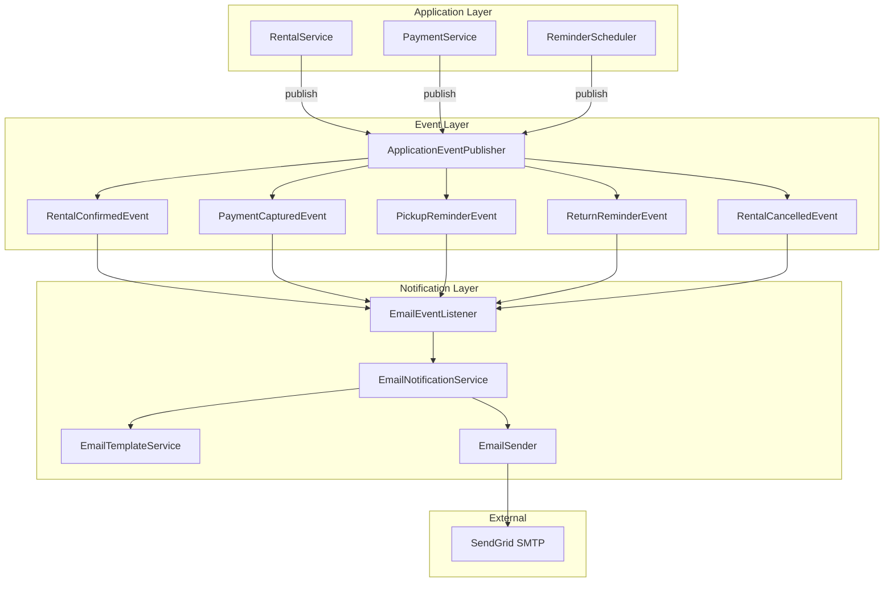

# Design Document: Email Notification System

## Overview

This design document describes the implementation of an event-driven email notification system for the rent-a-car application. The system uses Spring Events for decoupled event publishing, async processing for non-blocking email delivery, and Thymeleaf for HTML email templates.

The design follows the existing project patterns, integrating with the rental lifecycle to send automated emails at key points: confirmation, payment receipt, pickup reminder, return reminder, and cancellation.

## Architecture



## Components and Interfaces

### 1. Domain Events

```java
public abstract class RentalEvent extends ApplicationEvent {
    private final Long rentalId;
    private final String customerEmail;
    private final LocalDateTime occurredAt;
}

public class RentalConfirmedEvent extends RentalEvent {
    private final String carBrand;
    private final String carModel;
    private final LocalDate pickupDate;
    private final LocalDate returnDate;
    private final BigDecimal totalPrice;
    private final CurrencyType currency;
    private final String pickupLocation;
}

public class PaymentCapturedEvent extends ApplicationEvent {
    private final Long paymentId;
    private final Long rentalId;
    private final String customerEmail;
    private final BigDecimal amount;
    private final CurrencyType currency;
    private final String transactionId;
    private final LocalDateTime paymentDate;
}

public class PickupReminderEvent extends RentalEvent {
    private final LocalDate pickupDate;
    private final String pickupLocation;
    private final String carBrand;
    private final String carModel;
}

public class ReturnReminderEvent extends RentalEvent {
    private final LocalDate returnDate;
    private final String returnLocation;
    private final BigDecimal dailyPenaltyRate;
}

public class RentalCancelledEvent extends RentalEvent {
    private final LocalDateTime cancellationDate;
    private final String cancellationReason;
    private final boolean refundProcessed;
    private final BigDecimal refundAmount;
    private final String refundTransactionId;
}
```

### 2. EmailEventListener

Listens for domain events and delegates to EmailNotificationService.

```java
@Component
@RequiredArgsConstructor
@Slf4j
public class EmailEventListener {
    
    private final EmailNotificationService emailNotificationService;
    
    @Async("emailTaskExecutor")
    @EventListener
    public void handleRentalConfirmed(RentalConfirmedEvent event);
    
    @Async("emailTaskExecutor")
    @EventListener
    public void handlePaymentCaptured(PaymentCapturedEvent event);
    
    @Async("emailTaskExecutor")
    @EventListener
    public void handlePickupReminder(PickupReminderEvent event);
    
    @Async("emailTaskExecutor")
    @EventListener
    public void handleReturnReminder(ReturnReminderEvent event);
    
    @Async("emailTaskExecutor")
    @EventListener
    public void handleRentalCancelled(RentalCancelledEvent event);
}
```

### 3. IEmailNotificationService

Interface for email notification operations.

```java
public interface IEmailNotificationService {
    
    void sendRentalConfirmation(RentalConfirmedEvent event);
    
    void sendPaymentReceipt(PaymentCapturedEvent event);
    
    void sendPickupReminder(PickupReminderEvent event);
    
    void sendReturnReminder(ReturnReminderEvent event);
    
    void sendCancellationConfirmation(RentalCancelledEvent event);
}
```

### 4. EmailNotificationService

Implementation with Spring Retry for declarative retry logic.

```java
@Service
@RequiredArgsConstructor
@Slf4j
public class EmailNotificationService implements IEmailNotificationService {
    
    private final EmailTemplateService templateService;
    private final IEmailSender emailSender;
    
    @Retryable(
        retryFor = EmailSendException.class,
        maxAttempts = 4,
        backoff = @Backoff(delay = 1000, multiplier = 2)
    )
    public void sendRentalConfirmation(RentalConfirmedEvent event) {
        String body = templateService.renderConfirmationEmail(event);
        EmailMessage message = new EmailMessage(
            event.getCustomerEmail(),
            "Rental Confirmation - #" + event.getRentalId(),
            body,
            EmailType.RENTAL_CONFIRMATION,
            event.getRentalId()
        );
        emailSender.send(message);
        log.info("Rental confirmation email sent. RentalId: {}, To: {}", 
            event.getRentalId(), event.getCustomerEmail());
    }
    
    @Recover
    public void recoverFromEmailFailure(EmailSendException e, RentalConfirmedEvent event) {
        log.error("Email send failed after all retries. RentalId: {}, Error: {}", 
            event.getRentalId(), e.getMessage());
        // Could persist to a failed_notifications table for manual retry
    }
}
```

### 5. EmailTemplateService

Renders HTML templates using Thymeleaf.

```java
@Service
@RequiredArgsConstructor
public class EmailTemplateService {
    
    private final SpringTemplateEngine templateEngine;
    
    public String renderConfirmationEmail(RentalConfirmedEvent event);
    
    public String renderPaymentReceiptEmail(PaymentCapturedEvent event);
    
    public String renderPickupReminderEmail(PickupReminderEvent event);
    
    public String renderReturnReminderEmail(ReturnReminderEvent event);
    
    public String renderCancellationEmail(RentalCancelledEvent event);
}
```

### 6. IEmailSender

Interface for email sending abstraction.

```java
public interface IEmailSender {
    
    void send(EmailMessage message) throws EmailSendException;
}
```

### 7. SendGridEmailSender (Production)

```java
@Service
@Profile("prod")
@RequiredArgsConstructor
public class SendGridEmailSender implements IEmailSender {
    
    private final JavaMailSender mailSender;
    
    @Override
    public void send(EmailMessage message) throws EmailSendException;
}
```

### 8. MockEmailSender (Development)

```java
@Service
@Profile("!prod")
@Slf4j
public class MockEmailSender implements IEmailSender {
    
    @Override
    public void send(EmailMessage message) {
        log.info("MOCK EMAIL: To={}, Subject={}, Body={}", 
            message.to(), message.subject(), message.body());
    }
}
```

### 9. ReminderScheduler

Scheduled job for daily reminders.

```java
@Component
@RequiredArgsConstructor
@Slf4j
public class ReminderScheduler {
    
    private final RentalRepository rentalRepository;
    private final ApplicationEventPublisher eventPublisher;
    
    @Scheduled(cron = "0 0 8 * * *") // 8 AM daily
    public void sendPickupReminders();
    
    @Scheduled(cron = "0 0 9 * * *") // 9 AM daily
    public void sendReturnReminders();
}
```

## Data Models

### EmailMessage DTO

```java
public record EmailMessage(
    String to,
    String subject,
    String body,
    EmailType type,
    Long referenceId
) {}
```

### EmailType Enum

```java
public enum EmailType {
    RENTAL_CONFIRMATION,
    PAYMENT_RECEIPT,
    PICKUP_REMINDER,
    RETURN_REMINDER,
    CANCELLATION_CONFIRMATION
}
```

### Rental Entity Updates

Add reminder tracking field:

```java
@Column(name = "pickup_reminder_sent")
private boolean pickupReminderSent = false;

@Column(name = "return_reminder_sent")
private boolean returnReminderSent = false;
```

## Key Behaviors to Test

The following behaviors must be verified through unit and integration tests:

### 1. Event Publishing
- RentalConfirmedEvent contains rental ID, customer email, car details, dates, total price
- PaymentCapturedEvent contains payment ID, rental ID, amount, currency, transaction ID
- RentalCancelledEvent contains rental ID, cancellation reason, refund status
- **Validates: Requirements 1.1, 2.1, 5.1**

### 2. Email Content Composition
- Confirmation email includes rental ID, car brand/model, dates, total price, pickup location
- Payment receipt includes transaction ID, amount, currency, payment date
- Pickup reminder includes pickup date, location, car details
- Return reminder includes return date, location, penalty information
- Cancellation email includes rental ID, cancellation date, refund details if applicable
- **Validates: Requirements 1.3, 2.3, 3.4, 4.4, 5.3, 5.4**

### 3. Reminder Query Logic
- Pickup reminder query returns rentals with: pickup date = tomorrow, status = CONFIRMED, pickupReminderSent = false
- Return reminder query returns rentals with: return date = today, status = IN_USE, returnReminderSent = false
- Reminder sent flag prevents duplicate reminders
- **Validates: Requirements 3.1, 3.5, 4.1**

### 4. Retry Behavior
- Failed email triggers retry (max 3 retries = 4 total attempts)
- Exponential backoff between retries
- Final failure logs error and marks notification as failed
- **Validates: Requirements 6.3, 6.4**

### 5. Profile-Based Configuration
- Development profile uses MockEmailSender (logs instead of sending)
- Production profile uses SendGridEmailSender
- **Validates: Requirements 7.2, 7.3**

## Error Handling

### Email Send Errors

| Error Type | Handling Strategy |
|------------|-------------------|
| SMTP connection failure | Retry with exponential backoff (3 retries) |
| Invalid recipient | Log error, do not retry |
| Template rendering error | Log error, throw exception |
| Rate limit exceeded | Retry with backoff |

### Exception Classes

```java
public class EmailSendException extends RuntimeException {
    private final String recipient;
    private final EmailType emailType;
    private final String smtpErrorCode;
}

public class EmailTemplateException extends RuntimeException {
    private final String templateName;
    private final String errorDetail;
}
```

## Testing Strategy

### Unit Testing

Uses existing project test stack: **JUnit 5 + Mockito + AssertJ**

Test structure follows existing patterns:
- `@ExtendWith(MockitoExtension.class)` for mock injection
- `@Nested` classes for grouping related tests
- `@DisplayName` for readable test descriptions
- AssertJ assertions (`assertThat`, `assertThatThrownBy`)

Unit tests to implement:
- `EmailNotificationServiceTest` - Test email composition and sending with mocked sender
- `EmailTemplateServiceTest` - Test template rendering with various input data
- `EmailEventListenerTest` - Test event handling delegates to service
- `ReminderSchedulerTest` - Test reminder query logic and event publishing

### Integration Testing

Uses `@SpringBootTest` with test profile, following existing patterns.

Integration tests to implement:
- `EmailEventListenerIntegrationTest` - Test full event flow from publish to send
- `ReminderSchedulerIntegrationTest` - Test scheduled job execution

### Test Configuration

```properties
# application-test.properties additions
spring.mail.host=localhost
spring.mail.port=3025
email.from=test@rentacar.com
email.enabled=true
```

## Required Dependencies

Add to `pom.xml`:

```xml
<!-- Email -->
<dependency>
    <groupId>org.springframework.boot</groupId>
    <artifactId>spring-boot-starter-mail</artifactId>
</dependency>

<!-- Thymeleaf for email templates -->
<dependency>
    <groupId>org.springframework.boot</groupId>
    <artifactId>spring-boot-starter-thymeleaf</artifactId>
</dependency>

<!-- Spring Retry for declarative retry logic -->
<dependency>
    <groupId>org.springframework.retry</groupId>
    <artifactId>spring-retry</artifactId>
</dependency>
<dependency>
    <groupId>org.springframework</groupId>
    <artifactId>spring-aspects</artifactId>
</dependency>
```

**Note:** Add `@EnableRetry` to a configuration class to enable retry functionality.

## Configuration

### Application Properties

```properties
# Email Configuration
email.from=${EMAIL_FROM:noreply@rentacar.com}
email.enabled=${EMAIL_ENABLED:true}

# SendGrid SMTP (Production)
spring.mail.host=${SENDGRID_HOST:smtp.sendgrid.net}
spring.mail.port=${SENDGRID_PORT:587}
spring.mail.username=${SENDGRID_USERNAME:apikey}
spring.mail.password=${SENDGRID_API_KEY}
spring.mail.properties.mail.smtp.auth=true
spring.mail.properties.mail.smtp.starttls.enable=true

# Async Configuration
email.async.core-pool-size=2
email.async.max-pool-size=10
email.async.queue-capacity=100
```

### Async and Retry Configuration

```java
@Configuration
@EnableAsync
@EnableRetry
public class AsyncConfig {
    
    @Bean("emailTaskExecutor")
    public Executor emailTaskExecutor() {
        ThreadPoolTaskExecutor executor = new ThreadPoolTaskExecutor();
        executor.setCorePoolSize(2);
        executor.setMaxPoolSize(10);
        executor.setQueueCapacity(100);
        executor.setThreadNamePrefix("email-");
        executor.initialize();
        return executor;
    }
}
```

## Email Templates

Templates located in `src/main/resources/templates/email/`:

- `rental-confirmation.html`
- `payment-receipt.html`
- `pickup-reminder.html`
- `return-reminder.html`
- `cancellation-confirmation.html`

Each template uses Thymeleaf syntax with variables injected from event data.
