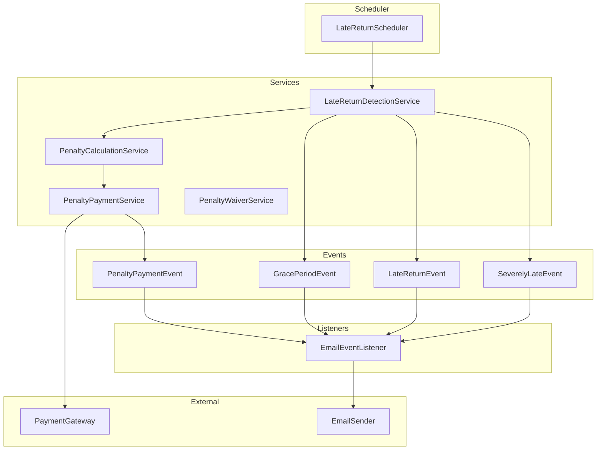

# Design Document: Late Return & Penalty System

## Overview

Late Return & Penalty System, kiralama süresini aşan araç iadelerini otomatik olarak tespit eden, ceza hesaplayan ve tahsilat sürecini yöneten bir sistemdir. Sistem, mevcut rental ve payment altyapısı üzerine inşa edilecek ve event-driven architecture kullanarak bildirim ve ödeme işlemlerini yönetecektir.

### Key Design Decisions

1. **Scheduled Detection**: @Scheduled annotation ile 15 dakikada bir geç iade kontrolü
2. **Event-Driven Notifications**: ApplicationEventPublisher ile bildirim event'leri
3. **Configuration-Driven**: application.properties üzerinden ayarlanabilir parametreler
4. **Penalty as Separate Payment**: Ceza ödemeleri ayrı Payment kayıtları olarak tutulacak
5. **Audit Trail**: Tüm ceza işlemleri ve waiver'lar audit log'a kaydedilecek

## Architecture



## Components and Interfaces

### 1. LateReturnStatus Enum

```java
public enum LateReturnStatus {
    ON_TIME("On Time", "Returned on or before end date"),
    GRACE_PERIOD("Grace Period", "Within grace period, no penalty"),
    LATE("Late", "Past grace period, penalty applies"),
    SEVERELY_LATE("Severely Late", "More than 24 hours late");
}
```

### 2. ILateReturnDetectionService Interface

```java
public interface ILateReturnDetectionService {
    void detectLateReturns();
    LateReturnStatus calculateLateStatus(Rental rental, LocalDateTime currentTime);
    long calculateLateHours(Rental rental, LocalDateTime currentTime);
    long calculateLateDays(Rental rental, LocalDateTime currentTime);
}
```

### 3. IPenaltyCalculationService Interface

```java
public interface IPenaltyCalculationService {
    PenaltyResult calculatePenalty(Rental rental, LocalDateTime returnTime);
    BigDecimal calculateHourlyPenalty(BigDecimal dailyRate, int lateHours);
    BigDecimal calculateDailyPenalty(BigDecimal dailyRate, int lateDays);
    BigDecimal applyPenaltyCap(BigDecimal penalty, BigDecimal dailyRate);
}
```

### 4. IPenaltyPaymentService Interface

```java
public interface IPenaltyPaymentService {
    Payment createPenaltyPayment(Rental rental, BigDecimal penaltyAmount);
    PaymentResult chargePenalty(Payment penaltyPayment);
    void handleFailedPenaltyPayment(Payment penaltyPayment);
}
```

### 5. IPenaltyWaiverService Interface

```java
public interface IPenaltyWaiverService {
    PenaltyWaiver waivePenalty(Long rentalId, BigDecimal waiverAmount, String reason, Long adminId);
    PenaltyWaiver waiveFullPenalty(Long rentalId, String reason, Long adminId);
    List<PenaltyWaiver> getPenaltyHistory(Long rentalId);
    void processRefundForWaiver(PenaltyWaiver waiver);
}
```

### 6. ILateReturnReportService Interface

```java
public interface ILateReturnReportService {
    Page<LateReturnReportDto> getLateReturns(LateReturnFilterDto filter, Pageable pageable);
    LateReturnStatisticsDto getStatistics(LocalDate startDate, LocalDate endDate);
}
```

### 7. LateReturnScheduler

```java
@Component
public class LateReturnScheduler {
    @Scheduled(fixedRate = 900000) // 15 minutes
    public void detectLateReturns();
}
```

## Data Models

### 1. Rental Entity Extensions

```java
// Rental.java'ya eklenecek alanlar
@Column(name = "late_return_status")
@Enumerated(EnumType.STRING)
private LateReturnStatus lateReturnStatus;

@Column(name = "late_detected_at")
private LocalDateTime lateDetectedAt;

@Column(name = "actual_return_time")
private LocalDateTime actualReturnTime;

@Column(name = "late_hours")
private Integer lateHours;

@Column(name = "penalty_amount", precision = 12, scale = 2)
private BigDecimal penaltyAmount;

@Column(name = "penalty_paid")
private Boolean penaltyPaid;
```

### 2. PenaltyWaiver Entity

```java
@Entity
@Table(name = "penalty_waivers")
public class PenaltyWaiver extends BaseEntity {
    @ManyToOne(fetch = FetchType.LAZY)
    @JoinColumn(name = "rental_id", nullable = false)
    private Rental rental;
    
    @Column(name = "original_penalty", precision = 12, scale = 2)
    private BigDecimal originalPenalty;
    
    @Column(name = "waived_amount", precision = 12, scale = 2)
    private BigDecimal waivedAmount;
    
    @Column(name = "remaining_penalty", precision = 12, scale = 2)
    private BigDecimal remainingPenalty;
    
    @Column(name = "reason", nullable = false)
    private String reason;
    
    @Column(name = "admin_id", nullable = false)
    private Long adminId;
    
    @Column(name = "waived_at", nullable = false)
    private LocalDateTime waivedAt;
    
    @Column(name = "refund_initiated")
    private Boolean refundInitiated;
    
    @Column(name = "refund_transaction_id")
    private String refundTransactionId;
}
```

### 3. PenaltyConfig (Configuration)

```java
@Configuration
@ConfigurationProperties(prefix = "penalty")
public class PenaltyConfig {
    private int gracePeriodMinutes = 60;
    private BigDecimal hourlyPenaltyRate = new BigDecimal("0.10");
    private BigDecimal dailyPenaltyRate = new BigDecimal("1.50");
    private BigDecimal penaltyCapMultiplier = new BigDecimal("5.0");
    private int severelyLateThresholdHours = 24;
}
```

### 4. PenaltyResult DTO

```java
public record PenaltyResult(
    BigDecimal penaltyAmount,
    BigDecimal dailyRate,
    int lateHours,
    int lateDays,
    LateReturnStatus status,
    String breakdown,
    boolean cappedAtMax
) {}
```

### 5. LateReturnReportDto

```java
public record LateReturnReportDto(
    Long rentalId,
    String customerName,
    String customerEmail,
    String carBrand,
    String carModel,
    String licensePlate,
    LocalDate endDate,
    LocalDateTime actualReturnTime,
    int lateHours,
    int lateDays,
    LateReturnStatus status,
    BigDecimal penaltyAmount,
    CurrencyType currency,
    boolean penaltyPaid
) {}
```

### 6. LateReturnStatisticsDto

```java
public record LateReturnStatisticsDto(
    int totalLateReturns,
    int severelyLateCount,
    BigDecimal totalPenaltyAmount,
    BigDecimal collectedPenaltyAmount,
    BigDecimal pendingPenaltyAmount,
    double averageLateHours,
    double lateReturnPercentage
) {}
```

## Business Rules

### Rule 1: Late Status Classification
Rental'ın IN_USE status'unda end date'i geçtiğinde:
- **GRACE_PERIOD**: Konfigüre edilmiş grace period içinde (varsayılan 1 saat)
- **LATE**: Grace period sonrası, 24 saat içinde
- **SEVERELY_LATE**: 24 saatten fazla geç

**Validates: Requirements 1.3, 1.4, 1.5**

### Rule 2: Penalty Calculation
Geç iade için ceza hesaplama:
- **1-6 saat geç**: saat × %10 × günlük ücret
- **7-24 saat geç**: %150 × günlük ücret
- **1+ gün geç**: gün × %150 × günlük ücret
- **Maksimum**: 5× günlük ücret (penalty cap)

**Validates: Requirements 2.1, 2.2, 2.3, 2.4**

### Rule 3: Grace Period Zero Penalty
Grace period içinde iade edilen rental'lar için ceza = 0.

**Validates: Requirements 2.5**

### Rule 4: Penalty Cap Enforcement
Hesaplanan ceza hiçbir zaman penalty cap'i (varsayılan 5× günlük ücret) aşamaz.

**Validates: Requirements 2.4**

### Rule 5: Status Change Notification
GRACE_PERIOD, LATE veya SEVERELY_LATE status değişikliklerinde bildirim event'i yayınlanır.

**Validates: Requirements 3.1, 3.2, 3.3**

### Rule 6: Penalty Payment Currency Consistency
Ceza ödemesi, orijinal rental'ın para birimi ile aynı olmalıdır.

**Validates: Requirements 4.5**

### Rule 7: Configuration Validation
Konfigürasyon değerleri:
- Grace period: 0-120 dakika
- Saatlik ceza oranı: %5-%25
- Günlük ceza oranı: %100-%200
- Penalty cap: 3×-10× günlük ücret

**Validates: Requirements 6.1, 6.2, 6.3, 6.4**

### Rule 8: Waiver Audit Trail
Her ceza iptali için: sebep, admin ID, timestamp, orijinal/iptal edilen/kalan tutarlar kaydedilir.

**Validates: Requirements 7.1, 7.2**

### Rule 9: Partial Waiver Calculation
Kısmi iptal: kalan ceza = orijinal ceza - iptal edilen tutar.

**Validates: Requirements 7.3**

### Rule 10: Late Detection Timestamp Recording
Geç tespit edilen her rental için tespit timestamp'i kaydedilir.

**Validates: Requirements 1.2**

## Error Handling

### Exception Types

```java
public class LateReturnException extends BaseException {
    public LateReturnException(String message) {
        super("LATE_RETURN_ERROR", message, HttpStatus.BAD_REQUEST);
    }
}

public class PenaltyCalculationException extends BaseException {
    public PenaltyCalculationException(String message) {
        super("PENALTY_CALCULATION_ERROR", message, HttpStatus.INTERNAL_SERVER_ERROR);
    }
}

public class PenaltyWaiverException extends BaseException {
    public PenaltyWaiverException(String message) {
        super("PENALTY_WAIVER_ERROR", message, HttpStatus.BAD_REQUEST);
    }
}

public class InvalidPenaltyConfigException extends BaseException {
    public InvalidPenaltyConfigException(String message) {
        super("INVALID_PENALTY_CONFIG", message, HttpStatus.BAD_REQUEST);
    }
}
```

### Error Scenarios

| Scenario | Exception | HTTP Status | Recovery |
|----------|-----------|-------------|----------|
| Penalty calculation fails | PenaltyCalculationException | 500 | Log error, retry on next scheduler run |
| Payment gateway fails | PaymentFailedException | 500 | Mark as PENDING, notify admin |
| Invalid waiver amount | PenaltyWaiverException | 400 | Return validation error |
| Invalid config value | InvalidPenaltyConfigException | 400 | Reject config update |
| Rental not found | RentalNotFoundException | 404 | Return not found error |

## Testing Strategy

### Testing Approach

Bu sistem standart JUnit 5 unit testler ve Spring Boot integration testler ile test edilecektir:
- **Unit Tests**: Spesifik senaryolar, edge case'ler ve hata durumları
- **Integration Tests**: Controller endpoint'leri ve servis entegrasyonları
- **E2E Tests**: Tam akış testleri (late detection → penalty → payment)

### Test Framework

- **JUnit 5**: Unit ve integration testler
- **Mockito**: Mock'lama
- **AssertJ**: Assertion'lar
- **MockMvc**: Controller testleri
- **@MockitoBean**: Spring Boot 3.4+ için bean mock'lama

### Unit Test Scenarios

1. **LateReturnDetectionServiceTest**
   - Rental on time (no late status)
   - Rental in grace period
   - Rental late (1-24 hours)
   - Rental severely late (24+ hours)
   - Multiple rentals detection

2. **PenaltyCalculationServiceTest**
   - Hourly penalty (1-6 hours)
   - Daily penalty (7-24 hours)
   - Multi-day penalty
   - Penalty cap enforcement
   - Zero penalty for grace period

3. **PenaltyPaymentServiceTest**
   - Successful penalty payment
   - Failed penalty payment
   - Currency consistency

4. **PenaltyWaiverServiceTest**
   - Full waiver
   - Partial waiver
   - Waiver after payment (refund)
   - Invalid waiver amount

5. **LateReturnSchedulerTest**
   - Scheduler execution
   - Pagination handling
   - Error recovery

### Integration Test Scenarios

1. **LateReturnControllerIntegrationTest**
   - Get late returns report
   - Filter by date range
   - Sort by different fields
   - Get statistics

2. **PenaltyWaiverControllerIntegrationTest**
   - Waive penalty (admin only)
   - View penalty history
   - Unauthorized access

3. **End-to-End Late Return Flow**
   - Create rental → Confirm → Pickup → Late detection → Return → Penalty payment
