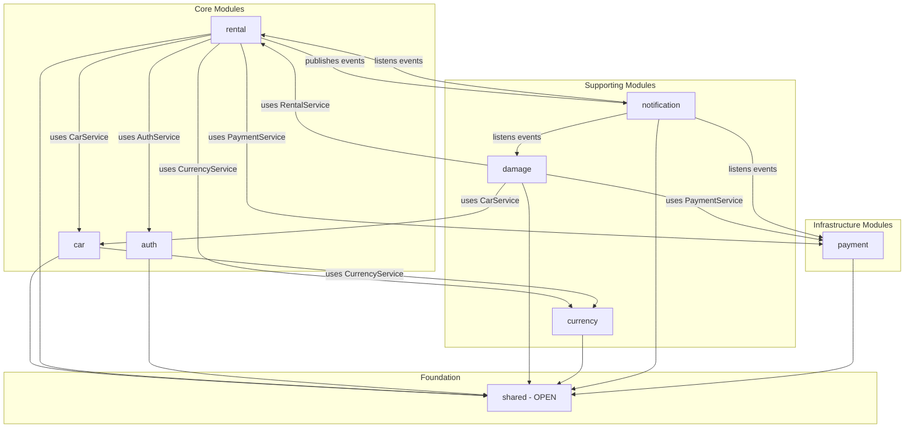

# Design Document: Spring Modulith Modular Monolith

## Overview

Bu doküman, CarGalleryProject'in Spring Modulith kullanarak Modular Monolith mimarisine dönüşümünün teknik tasarımını içerir. Spring Modulith, Spring Boot 3.x ile gelen resmi framework olup, package-based module boundaries, event-driven communication ve test-time verification sağlar.

**Spring Modulith Avantajları:**
- Tek POM, tek JAR (basit deployment)
- Package-based module detection (convention over configuration)
- Test-time boundary verification
- Event-driven communication built-in
- Module documentation generation
- Future-proof (Kafka/RabbitMQ event externalization)

**Mevcut Yapı:**
```
com.akif/
├── config/          # Tüm configuration'lar karışık
├── controller/      # 18+ controller
├── dto/             # Tüm DTO'lar karışık
├── model/           # 10+ entity karışık
├── repository/      # Tüm repository'ler karışık
├── service/         # 13+ service domain klasörü
└── ...
```

**Hedef Yapı (Spring Modulith):**
```
com.akif/
├── rental/                      # Application Module
│   ├── RentalService.java       # Public API (top-level = public)
│   ├── RentalRequestDto.java    # Public DTO
│   ├── RentalResponseDto.java   # Public DTO
│   ├── RentalConfirmedEvent.java # Public Event
│   ├── package-info.java        # Module metadata
│   ├── domain/                  # Internal (sub-package = internal)
│   │   ├── Rental.java
│   │   ├── Payment.java
│   │   └── PenaltyWaiver.java
│   ├── internal/                # Internal services
│   │   ├── RentalServiceImpl.java
│   │   ├── PenaltyCalculationService.java
│   │   └── LateReturnDetectionService.java
│   ├── repository/              # Internal
│   │   ├── RentalRepository.java
│   │   └── PaymentRepository.java
│   └── web/                     # Internal
│       └── RentalController.java
│
├── damage/                      # Application Module
│   ├── DamageService.java       # Public API
│   ├── DamageReportedEvent.java # Public Event
│   ├── domain/
│   │   ├── DamageReport.java
│   │   └── DamagePhoto.java
│   ├── internal/
│   └── repository/
│
├── car/                         # Application Module
│   ├── CarService.java          # Public API
│   ├── CarDto.java              # Public DTO
│   ├── domain/
│   │   └── Car.java
│   ├── internal/
│   │   ├── CarServiceImpl.java
│   │   ├── AvailabilityService.java
│   │   └── PricingService.java
│   └── repository/
│
├── auth/                        # Application Module
│   ├── AuthService.java         # Public API
│   ├── UserDto.java             # Public DTO
│   ├── domain/
│   │   ├── User.java
│   │   └── LinkedAccount.java
│   ├── internal/
│   │   ├── AuthServiceImpl.java
│   │   └── OAuth2Service.java
│   └── repository/
│
├── currency/                    # Application Module
│   ├── CurrencyService.java     # Public API
│   ├── ExchangeRateDto.java     # Public DTO
│   └── internal/
│
├── notification/                # Application Module
│   ├── NotificationService.java # Public API
│   ├── internal/
│   │   ├── EmailService.java
│   │   └── TemplateService.java
│   └── listener/
│       └── RentalEventListener.java
│
├── payment/                     # Infrastructure Module
│   ├── PaymentService.java      # Public API
│   ├── PaymentResult.java       # Public DTO
│   ├── CheckoutSessionResult.java # Public DTO
│   ├── PaymentCapturedEvent.java # Public Event
│   ├── domain/
│   │   ├── WebhookEvent.java
│   │   └── enums/
│   │       ├── PaymentStatus.java
│   │       └── WebhookEventStatus.java
│   ├── internal/
│   │   ├── gateway/
│   │   │   ├── IPaymentGateway.java
│   │   │   ├── StripePaymentGateway.java
│   │   │   └── IdempotencyKeyGenerator.java
│   │   ├── webhook/
│   │   │   └── StripeWebhookHandler.java
│   │   ├── reconciliation/
│   │   │   └── PaymentReconciliationService.java
│   │   ├── scheduler/
│   │   │   └── ReconciliationScheduler.java
│   │   └── config/
│   │       └── StripeConfig.java
│   ├── repository/
│   │   └── WebhookEventRepository.java
│   └── web/
│       └── StripeWebhookController.java
│
└── shared/                      # Shared Kernel (Open Module)
    ├── domain/
    │   └── BaseEntity.java
    ├── enums/
    │   ├── CurrencyType.java
    │   └── Role.java
    ├── exception/
    │   ├── BaseException.java
    │   └── GlobalExceptionHandler.java
    ├── security/
    │   ├── SecurityConfig.java
    │   └── JwtTokenProvider.java
    └── config/
        ├── CorsConfig.java
        └── AsyncConfig.java
```

### Shared Kernel Kuralları (STRICT)

Shared kernel'ın şişmesini önlemek için **AÇIK KURALLAR:**

#### ✅ SHARED'A GİREBİLİR:
| Kategori | Örnekler | Neden |
|----------|----------|-------|
| Base classes | `BaseEntity`, `BaseException` | Tüm entity/exception'lar extend eder |
| Generic enums | `CurrencyType`, `Role` | 5+ modül kullanıyor |
| Security infrastructure | `JwtTokenProvider`, `SecurityConfig` | Cross-cutting, modül-agnostik |
| Cross-cutting config | `CorsConfig`, `AsyncConfig` | Uygulama geneli |
| Global filters | `CorrelationIdFilter` | Tüm request'lere uygulanır |

#### ❌ SHARED'A GİREMEZ (KESİNLİKLE):
| Kategori | Örnek | Olması Gereken Yer |
|----------|-------|--------------------|
| Modül-specific exception | `RentalNotFoundException` | `rental/` |
| Modül-specific enum | `RentalStatus`, `DamageStatus` | İlgili modül |
| Business logic içeren class | `PriceCalculator`, `PenaltyService` | İlgili modül |
| Utils/Helper classes | `DateUtils`, `StringUtils` | Her modül kendi util'ini tutsun |
| DTO classes | `CommonResponseDto` | Her modül kendi DTO'sunu tanımlar |
| "Birkaç modülde lazım" olanlar | Herhangi bir şey | DRY < Modül bağımsızlığı |

#### 🚨 KARAR KURALI:
```
Soru: "Bu class shared'a mı girmeli?"

1. Business logic içeriyor mu? → ❌ HAYIR, modülde kalsın
2. Sadece 1-2 modül mü kullanıyor? → ❌ HAYIR, modülde kalsın (DRY < İzolasyon)
3. 5+ modül aynı kodu mu tekrarlıyor? → ✅ BELKI, code review ile karar ver
4. Şüphen mi var? → ❌ HAYIR, modülde tut

VARSAYILAN: Modülde tut. Shared'a alma kararı explicit olmalı.
```

#### Shared Kernel Metriği:
- **Hedef:** ≤ 10 class
- **Alarm:** > 15 class → Refactor gerekli
- **Kritik:** > 20 class → Mimari sorun, DURDUR

## Architecture

### Spring Modulith Module Detection

Spring Modulith, top-level package'ları otomatik olarak application module olarak algılar:

```
com.akif/           # Base package
├── rental/         # Module: rental
├── damage/         # Module: damage
├── car/            # Module: car
├── auth/           # Module: auth
├── currency/       # Module: currency
├── notification/   # Module: notification
└── shared/         # Module: shared (open)
```

### Module Visibility Rules

Spring Modulith'te visibility kuralları:

| Location | Visibility | Erişim |
|----------|------------|--------|
| `rental/RentalService.java` | **Public** | Tüm modüller erişebilir |
| `rental/domain/Rental.java` | **Internal** | Sadece rental modülü |
| `rental/internal/*` | **Internal** | Sadece rental modülü |
| `rental/repository/*` | **Internal** | Sadece rental modülü |
| `shared/*` | **Open** | Tüm modüller (özel config) |

### Module Dependency Graph



## Components and Interfaces

### Module Public API Pattern

Her modül, top-level package'da public API expose eder:

```java
// rental/RentalService.java - PUBLIC API
public interface RentalService {
    RentalResponseDto requestRental(RentalRequestDto request, String username);
    RentalResponseDto confirmRental(Long rentalId);
    RentalResponseDto getRentalById(Long id);
    Page<RentalResponseDto> getMyRentals(String username, Pageable pageable);
}

// rental/internal/RentalServiceImpl.java - INTERNAL
@Service
@RequiredArgsConstructor
class RentalServiceImpl implements RentalService {
    private final RentalRepository rentalRepository;
    private final CarService carService;  // Cross-module: uses public API
    private final AuthService authService; // Cross-module: uses public API
    // ...
}
```

### Event-Driven Communication

```java
// rental/RentalConfirmedEvent.java - PUBLIC EVENT
public record RentalConfirmedEvent(
    Long rentalId,
    String userEmail,
    LocalDateTime confirmedAt,
    String carBrand,
    String carModel,
    LocalDate startDate,
    LocalDate endDate,
    BigDecimal totalPrice,
    CurrencyType currency
) {}

// notification/listener/RentalEventListener.java - INTERNAL LISTENER
@Component
@RequiredArgsConstructor
class RentalEventListener {
    private final EmailService emailService;
    
    @EventListener
    void onRentalConfirmed(RentalConfirmedEvent event) {
        emailService.sendRentalConfirmation(event);
    }
}
```

### Package-Info Configuration

```java
// rental/package-info.java
@org.springframework.modulith.ApplicationModule(
    allowedDependencies = {"car", "auth", "currency", "shared"}
)
package com.akif.rental;

// shared/package-info.java
@org.springframework.modulith.ApplicationModule(
    type = ApplicationModule.Type.OPEN
)
package com.akif.shared;
```

## Data Models

### Module-Entity Mapping

| Module | Entities | Tables |
|--------|----------|--------|
| car | Car | car |
| rental | Rental, Payment, PenaltyWaiver | rental, payment, penalty_waivers |
| auth | User, LinkedAccount | users, linked_accounts |
| damage | DamageReport, DamagePhoto | damage_reports, damage_photos |
| notification | - (stateless) | - |
| currency | - (cache-based) | - |

## Cross-Module Dependencies (CRITICAL)

Bu bölüm, modüller arası bağımlılıkların nasıl yönetileceğini detaylı olarak tanımlar.

### Mevcut Cross-Module Bağımlılıklar

| Source Module | Target Module | Current Access | Required Change |
|---------------|---------------|----------------|-----------------|
| rental | car | `CarRepository` (direct) | → `CarService` (public API) |
| rental | auth | `UserRepository` (direct) | → `AuthService` (public API) |
| damage | rental | `RentalRepository` (direct) | → `RentalService` (public API) |
| damage | car | `CarRepository` (direct) | → `CarService` (public API) |
| notification | auth | `UserRepository` (direct) | → `AuthService` (public API) |

### Module Public API Definitions

Her modül, top-level package'da **public interface** expose eder. Implementasyonlar `internal/` sub-package'da kalır.

#### CarService Public API

```java
// car/CarService.java - PUBLIC API
public interface CarService {
    // Query methods
    CarDto getCarById(Long id);
    Optional<CarDto> getCarByIdOptional(Long id);
    boolean isCarAvailable(Long carId, LocalDate startDate, LocalDate endDate);
    BigDecimal getDailyPrice(Long carId, CurrencyType currency);
    
    // Command methods (for cross-module state changes)
    void reserveCar(Long carId);      // AVAILABLE → RESERVED
    void releaseCar(Long carId);      // RESERVED → AVAILABLE
    void markAsMaintenance(Long carId); // Any → MAINTENANCE (for MAJOR damage)
}
```

#### AuthService Public API

```java
// auth/AuthService.java - PUBLIC API
public interface AuthService {
    // Query methods
    UserDto getUserById(Long id);
    UserDto getUserByUsername(String username);
    Optional<UserDto> getUserByIdOptional(Long id);
    boolean userExists(String username);
    
    // For internal use (authentication)
    UserDetails loadUserByUsername(String username);
}
```

#### RentalService Public API

```java
// rental/RentalService.java - PUBLIC API
public interface RentalService {
    // Query methods
    RentalResponseDto getRentalById(Long id);
    boolean isRentalActive(Long rentalId);
    boolean hasActiveRentalForCar(Long carId);
    Optional<RentalSummaryDto> getRentalSummary(Long rentalId);
    
    // Note: Command methods (requestRental, confirmRental, etc.) 
    // are NOT exposed as they're only called from RentalController
}
```

#### CurrencyService Public API

```java
// currency/CurrencyService.java - PUBLIC API
public interface CurrencyService {
    BigDecimal convert(BigDecimal amount, CurrencyType from, CurrencyType to);
    BigDecimal getExchangeRate(CurrencyType from, CurrencyType to);
    Map<CurrencyType, BigDecimal> getAllRates(CurrencyType baseCurrency);
}
```

#### DamageService Public API

```java
// damage/DamageService.java - PUBLIC API
public interface DamageService {
    DamageReportDto getDamageReportById(Long id);
    List<DamageReportDto> getDamageReportsByRentalId(Long rentalId);
    boolean hasPendingDamageReports(Long rentalId);
}
```

### Cross-Module DTOs

Her modül, cross-module communication için **minimal DTO** expose eder:

#### CarDto (Cross-Module)

```java
// car/CarDto.java - PUBLIC DTO
public record CarDto(
    Long id,
    String brand,
    String model,
    String licensePlate,
    BigDecimal dailyPrice,
    CurrencyType currency,
    CarStatusType status,
    boolean available
) {}
```

#### UserDto (Cross-Module)

```java
// auth/UserDto.java - PUBLIC DTO
public record UserDto(
    Long id,
    String username,
    String email,
    String fullName,
    Role role
) {}
```

#### RentalSummaryDto (Cross-Module)

```java
// rental/RentalSummaryDto.java - PUBLIC DTO
public record RentalSummaryDto(
    Long id,
    RentalStatus status,
    LocalDate startDate,
    LocalDate endDate,
    Long carId,
    Long userId
) {}
```

### Entity Refactoring Strategy

Spring Modulith'te modüller arası JPA `@ManyToOne` ilişkileri **YASAKTIR**. Entity'ler **ID reference** ile birbirlerine bağlanır.

#### Rental Entity Refactoring

```java
// ❌ ÖNCE (Cross-Module JPA İlişkisi - YANLIŞ)
@Entity
public class Rental extends BaseEntity {
    @ManyToOne(fetch = FetchType.LAZY)
    @JoinColumn(name = "car_id", nullable = false)
    private Car car;  // ❌ Car başka modülde!
    
    @ManyToOne(fetch = FetchType.LAZY)
    @JoinColumn(name = "user_id", nullable = false)
    private User user;  // ❌ User başka modülde!
}

// ✅ SONRA (ID Reference + Denormalization - DOĞRU)
@Entity
public class Rental extends BaseEntity {
    // ID References (foreign key korunur)
    @Column(name = "car_id", nullable = false)
    private Long carId;
    
    @Column(name = "user_id", nullable = false)
    private Long userId;
    
    // Denormalized Fields (frequently accessed data)
    @Column(name = "car_brand", nullable = false, length = 50)
    private String carBrand;
    
    @Column(name = "car_model", nullable = false, length = 50)
    private String carModel;
    
    @Column(name = "car_license_plate", nullable = false, length = 20)
    private String carLicensePlate;
    
    @Column(name = "user_email", nullable = false, length = 255)
    private String userEmail;
    
    @Column(name = "user_full_name", length = 100)
    private String userFullName;
}
```

#### DamageReport Entity Refactoring

```java
// ✅ SONRA (ID Reference - DOĞRU)
@Entity
public class DamageReport extends BaseEntity {
    @Column(name = "rental_id", nullable = false)
    private Long rentalId;
    
    @Column(name = "car_id", nullable = false)
    private Long carId;
    
    // Denormalized for display
    @Column(name = "car_license_plate", nullable = false, length = 20)
    private String carLicensePlate;
}
```

### RentalServiceImpl Refactoring

```java
// ❌ ÖNCE (Direct Repository Access - YANLIŞ)
@Service
@RequiredArgsConstructor
class RentalServiceImpl implements RentalService {
    private final RentalRepository rentalRepository;
    private final CarRepository carRepository;      // ❌ Cross-module!
    private final UserRepository userRepository;    // ❌ Cross-module!
    
    @Transactional
    public RentalResponseDto requestRental(RentalRequestDto request, String username) {
        Car car = carRepository.findById(request.carId())
            .orElseThrow(() -> new CarNotFoundException(request.carId()));
        
        User user = userRepository.findByUsername(username)
            .orElseThrow(() -> new UserNotFoundException(username));
        
        // Direkt entity kullanımı
        Rental rental = Rental.builder()
            .car(car)           // ❌ Entity reference
            .user(user)         // ❌ Entity reference
            .startDate(request.startDate())
            .build();
        
        car.setCarStatusType(CarStatusType.RESERVED);  // ❌ Direkt entity modify
        carRepository.save(car);
        
        return rentalMapper.toDto(rentalRepository.save(rental));
    }
}

// ✅ SONRA (Public Service API - DOĞRU)
@Service
@RequiredArgsConstructor
class RentalServiceImpl implements RentalService {
    private final RentalRepository rentalRepository;
    private final CarService carService;    // ✅ Public API
    private final AuthService authService;  // ✅ Public API
    
    @Transactional
    public RentalResponseDto requestRental(RentalRequestDto request, String username) {
        // Cross-module data via public API
        CarDto car = carService.getCarById(request.carId());
        UserDto user = authService.getUserByUsername(username);
        
        // Build rental with denormalized data
        Rental rental = Rental.builder()
            .carId(car.id())            // ✅ ID reference
            .userId(user.id())          // ✅ ID reference
            .carBrand(car.brand())      // ✅ Denormalized
            .carModel(car.model())      // ✅ Denormalized
            .carLicensePlate(car.licensePlate())
            .userEmail(user.email())    // ✅ Denormalized
            .userFullName(user.fullName())
            .startDate(request.startDate())
            .build();
        
        // Cross-module command via public API
        carService.reserveCar(car.id());  // ✅ Public API call
        
        return rentalMapper.toDto(rentalRepository.save(rental));
    }
}
```

### Denormalization Strategy

**Ne zaman denormalize edilmeli?**

| Data | Denormalize? | Reason |
|------|--------------|--------|
| `carBrand`, `carModel` | ✅ Evet | Display'de sık kullanılır, nadiren değişir |
| `carLicensePlate` | ✅ Evet | Receipt/email'lerde gösterilir |
| `userEmail` | ✅ Evet | Notification'larda kullanılır |
| `userFullName` | ✅ Evet | Display/email'lerde kullanılır |
| `carDailyPrice` | ✅ Evet | Rental oluşturulduğundaki fiyat SAKLANMALI |
| `carStatus` | ❌ Hayır | Dinamik, her zaman güncel olmalı |
| `userRole` | ❌ Hayır | Dinamik, yetki kontrolünde güncel olmalı |

**Denormalization kuralları:**
1. **Immutable at creation time:** Rental oluşturulduğunda araba markası değişmeyecek
2. **Frequently accessed:** Her rental listesinde gösterilecek
3. **Audit trail:** Fiyat, rental anındaki fiyat olmalı (sonradan değişse bile)

### Database Migration

```sql
-- V12__rental_denormalization.sql
-- Note: V10, V11 already used for damage tables

-- Step 1: Add new columns
ALTER TABLE rental 
ADD COLUMN car_brand VARCHAR(50),
ADD COLUMN car_model VARCHAR(50),
ADD COLUMN car_license_plate VARCHAR(20),
ADD COLUMN user_email VARCHAR(255),
ADD COLUMN user_full_name VARCHAR(100);

-- Step 2: Populate from existing data
UPDATE rental r
SET 
    car_brand = c.brand,
    car_model = c.model,
    car_license_plate = c.license_plate,
    user_email = u.email,
    user_full_name = CONCAT(u.first_name, ' ', u.last_name)
FROM car c, users u
WHERE r.car_id = c.id AND r.user_id = u.id;

-- Step 3: Make columns NOT NULL after population
ALTER TABLE rental
ALTER COLUMN car_brand SET NOT NULL,
ALTER COLUMN car_model SET NOT NULL,
ALTER COLUMN car_license_plate SET NOT NULL,
ALTER COLUMN user_email SET NOT NULL;

-- Step 4: Keep foreign keys for referential integrity
-- car_id and user_id columns remain as-is with FK constraints
```

### Event Data Strategy

Event'ler entity reference içermemeli, sadece primitive/DTO içermeli:

```java
// ✅ DOĞRU - Denormalized data from Rental entity
public record RentalConfirmedEvent(
    Long rentalId,
    Long carId,
    Long userId,
    String carBrand,        // From rental.getCarBrand()
    String carModel,        // From rental.getCarModel()
    String userEmail,       // From rental.getUserEmail()
    LocalDate startDate,
    LocalDate endDate,
    BigDecimal totalPrice,
    CurrencyType currency
) {}

// ❌ YANLIŞ - Entity reference
public record RentalConfirmedEvent(
    Long rentalId,
    Rental rental,  // ❌ Entity!
    Car car,        // ❌ Entity!
    User user       // ❌ Entity!
) {}
```

### Cross-Module Data Access (Summary)

Spring Modulith'te entity'ler internal olduğundan, cross-module data access public service üzerinden yapılır:

```java
// ÖNCE (direct repository access - YANLIŞ)
@Service
class RentalServiceImpl {
    private final CarRepository carRepository;  // ❌ Cross-module internal access
    
    void createRental(Long carId) {
        Car car = carRepository.findById(carId);  // ❌
    }
}

// SONRA (public service API - DOĞRU)
@Service
class RentalServiceImpl {
    private final CarService carService;  // ✅ Cross-module public API
    
    void createRental(Long carId) {
        CarDto car = carService.getCarById(carId);  // ✅
    }
}
```

## Cross-Module Refactoring Strategy

Bu bölüm, mevcut cross-module direct access'lerin nasıl refactor edileceğini detaylı açıklar.

### Mevcut Cross-Module Bağımlılıklar

| Consumer Module | Provider Module | Mevcut Erişim | Hedef Erişim |
|-----------------|-----------------|---------------|--------------|
| rental | car | CarRepository | CarService |
| rental | auth | UserRepository | AuthService |
| damage | rental | RentalRepository | RentalService |
| damage | car | CarRepository | CarService |

### Module Public API Tanımları

#### CarService Public API

```java
// car/CarService.java - PUBLIC API
public interface CarService {
    // === READ OPERATIONS (DTO döner) ===
    CarDto getCarById(Long id);
    CarDto getCarByLicensePlate(String licensePlate);
    boolean existsById(Long id);
    boolean isCarAvailable(Long carId);
    boolean isCarAvailableForDates(Long carId, LocalDate startDate, LocalDate endDate);
    
    // === WRITE OPERATIONS (void veya boolean döner) ===
    void reserveCar(Long carId);           // Status → RESERVED
    void releaseCar(Long carId);           // Status → AVAILABLE
    void markAsMaintenance(Long carId);    // Status → MAINTENANCE
    
    // === SEARCH OPERATIONS ===
    Page<CarDto> searchAvailableCars(CarSearchCriteria criteria, Pageable pageable);
    List<CarDto> findSimilarCars(Long carId, int limit);
}
```

#### CarDto (Cross-Module için)

```java
// car/CarDto.java - PUBLIC DTO
public record CarDto(
    Long id,
    String brand,
    String model,
    String licensePlate,
    BigDecimal dailyPrice,
    CurrencyType currency,
    CarStatusType status,
    String bodyType,
    Integer seats,
    boolean available,
    boolean deleted
) {
    // Convenience methods
    public boolean isAvailableForRental() {
        return available && !deleted && status == CarStatusType.AVAILABLE;
    }
}
```

#### AuthService Public API

```java
// auth/AuthService.java - PUBLIC API
public interface AuthService {
    // === READ OPERATIONS ===
    UserDto getUserById(Long id);
    UserDto getUserByUsername(String username);
    UserDto getUserByEmail(String email);
    boolean existsByUsername(String username);
    boolean existsByEmail(String email);
    
    // === AUTHENTICATION ===
    AuthResponseDto login(LoginRequestDto request);
    AuthResponseDto register(RegisterRequestDto request);
    AuthResponseDto refreshToken(RefreshTokenRequestDto request);
}
```

#### UserDto (Cross-Module için)

```java
// auth/UserDto.java - PUBLIC DTO
public record UserDto(
    Long id,
    String username,
    String email,
    String firstName,
    String lastName,
    Set<Role> roles,
    boolean active
) {
    public boolean isAdmin() {
        return roles != null && roles.contains(Role.ADMIN);
    }
}
```

#### RentalService Public API

```java
// rental/RentalService.java - PUBLIC API
public interface RentalService {
    // === READ OPERATIONS ===
    RentalDto getRentalById(Long id);
    RentalDto getRentalById(Long id, String username); // with authorization
    Page<RentalDto> getMyRentals(String username, Pageable pageable);
    Page<RentalDto> getAllRentals(Pageable pageable);
    boolean hasActiveRental(Long userId, Long carId);
    
    // === WRITE OPERATIONS ===
    RentalDto requestRental(RentalRequestDto request, String username);
    RentalDto confirmRental(Long rentalId);
    RentalDto pickupRental(Long rentalId, String pickupNotes);
    RentalDto returnRental(Long rentalId, String returnNotes);
    RentalDto cancelRental(Long rentalId, String username);
}
```

### Entity Refactoring: JPA Relationship → ID Reference

#### Rental Entity (ÖNCE)

```java
// ❌ ÖNCE - Direct entity references
@Entity
public class Rental extends BaseEntity {
    @ManyToOne(fetch = FetchType.LAZY)
    @JoinColumn(name = "car_id", nullable = false)
    private Car car;  // ❌ Cross-module entity
    
    @ManyToOne(fetch = FetchType.LAZY)
    @JoinColumn(name = "user_id", nullable = false)
    private User user;  // ❌ Cross-module entity
}
```

#### Rental Entity (SONRA)

```java
// ✅ SONRA - ID references + denormalized fields
@Entity
public class Rental extends BaseEntity {
    // ID references (no JPA relationship)
    @Column(name = "car_id", nullable = false)
    private Long carId;
    
    @Column(name = "user_id", nullable = false)
    private Long userId;
    
    // Denormalized fields (for events and display)
    @Column(name = "car_brand", length = 50)
    private String carBrand;
    
    @Column(name = "car_model", length = 50)
    private String carModel;
    
    @Column(name = "car_license_plate", length = 20)
    private String carLicensePlate;
    
    @Column(name = "user_email", length = 100)
    private String userEmail;
    
    @Column(name = "user_full_name", length = 100)
    private String userFullName;
}
```

### RentalServiceImpl Refactoring

#### ÖNCE (Cross-Module Direct Access)

```java
// ❌ ÖNCE
@Service
class RentalServiceImpl implements RentalService {
    private final CarRepository carRepository;      // ❌ Cross-module
    private final UserRepository userRepository;    // ❌ Cross-module
    
    @Transactional
    public RentalResponseDto requestRental(RentalRequestDto request, String username) {
        User user = userRepository.findByUsername(username)
            .orElseThrow(() -> new UserNotFoundException(username));
        
        Car car = carRepository.findById(request.getCarId())
            .orElseThrow(() -> new CarNotFoundException(request.getCarId()));
        
        if (!car.getCarStatusType().equals(CarStatusType.AVAILABLE)) {
            throw new CarNotAvailableException(car.getId());
        }
        
        Rental rental = Rental.builder()
            .user(user)           // ❌ Entity reference
            .car(car)             // ❌ Entity reference
            .build();
    }
    
    @Transactional
    public RentalResponseDto confirmRental(Long rentalId) {
        Rental rental = findRentalById(rentalId);
        rental.getCar().setCarStatusType(CarStatusType.RESERVED);  // ❌ Cross-module mutation
    }
}
```

#### SONRA (Public API Access)

```java
// ✅ SONRA
@Service
class RentalServiceImpl implements RentalService {
    private final CarService carService;      // ✅ Public API
    private final AuthService authService;    // ✅ Public API
    
    @Transactional
    public RentalResponseDto requestRental(RentalRequestDto request, String username) {
        // Get user via public API
        UserDto user = authService.getUserByUsername(username);
        
        // Get car via public API
        CarDto car = carService.getCarById(request.getCarId());
        
        // Validate via DTO
        if (!car.isAvailableForRental()) {
            throw new CarNotAvailableException(car.id());
        }
        
        // Create rental with ID references + denormalized data
        Rental rental = Rental.builder()
            .userId(user.id())                    // ✅ ID reference
            .carId(car.id())                      // ✅ ID reference
            .carBrand(car.brand())                // ✅ Denormalized
            .carModel(car.model())                // ✅ Denormalized
            .carLicensePlate(car.licensePlate())  // ✅ Denormalized
            .userEmail(user.email())              // ✅ Denormalized
            .userFullName(user.firstName() + " " + user.lastName())
            .build();
    }
    
    @Transactional
    public RentalResponseDto confirmRental(Long rentalId) {
        Rental rental = findRentalById(rentalId);
        
        // Update car status via public API
        carService.reserveCar(rental.getCarId());  // ✅ Public API call
        
        // Event uses denormalized data (no cross-module access needed)
        RentalConfirmedEvent event = new RentalConfirmedEvent(
            rental.getId(),
            rental.getUserEmail(),      // ✅ Denormalized
            rental.getCarBrand(),       // ✅ Denormalized
            rental.getCarModel()        // ✅ Denormalized
        );
    }
}
```

### Denormalization Strategy

#### Ne Zaman Denormalize Edilmeli?

| Veri | Denormalize? | Neden |
|------|--------------|-------|
| carBrand, carModel | ✅ Evet | Event'lerde ve display'de sık kullanılıyor |
| userEmail | ✅ Evet | Email notification'larda gerekli |
| userFullName | ✅ Evet | Display'de gerekli |
| dailyPrice | ❌ Hayır | Rental'da zaten totalPrice var |
| userRoles | ❌ Hayır | Authorization runtime'da kontrol edilmeli |

#### Denormalized Data Güncelleme

Denormalized data genellikle güncellenmez (rental oluşturulduğunda snapshot alınır). Eğer güncelleme gerekirse:

```java
// Event-driven update (opsiyonel)
@EventListener
void onCarUpdated(CarUpdatedEvent event) {
    rentalRepository.updateCarInfo(
        event.carId(),
        event.newBrand(),
        event.newModel()
    );
}
```

### Database Migration

```sql
-- V12__rental_denormalization.sql
-- Note: V10, V11 already used for damage tables

-- Add denormalized columns
ALTER TABLE rental ADD COLUMN car_brand VARCHAR(50);
ALTER TABLE rental ADD COLUMN car_model VARCHAR(50);
ALTER TABLE rental ADD COLUMN car_license_plate VARCHAR(20);
ALTER TABLE rental ADD COLUMN user_email VARCHAR(100);
ALTER TABLE rental ADD COLUMN user_full_name VARCHAR(100);

-- Populate from existing data (one-time migration)
UPDATE rental r
SET 
    car_brand = c.brand,
    car_model = c.model,
    car_license_plate = c.license_plate
FROM car c
WHERE r.car_id = c.id;

UPDATE rental r
SET 
    user_email = u.email,
    user_full_name = CONCAT(u.first_name, ' ', u.last_name)
FROM users u
WHERE r.user_id = u.id;

-- Note: Foreign keys remain for data integrity
-- car_id and user_id columns are NOT removed
```

### Refactoring Checklist

Her cross-module bağımlılık için:

- [ ] Public API interface tanımla (top-level package)
- [ ] DTO tanımla (gerekli alanlar)
- [ ] Service implementation'ı güncelle (Repository → Service)
- [ ] Entity'yi güncelle (JPA relationship → ID + denormalized)
- [ ] Event'leri güncelle (entity reference → primitive/DTO)
- [ ] Migration script yaz (denormalized columns)
- [ ] Unit test'leri güncelle (mock Service, not Repository)
- [ ] Integration test'leri güncelle


## Module Verification

Spring Modulith, module boundary verification'ı `ApplicationModules.verify()` ile otomatik yapar. Ayrı property-based test yazmaya gerek yok.

### Otomatik Verify Edilen Kurallar

`ApplicationModules.verify()` aşağıdaki tüm kuralları tek bir test ile kontrol eder:

1. **Module Structure Compliance** - Sub-package'lar (domain, internal, repository) dışarıdan erişilemez
2. **No Circular Dependencies** - Modüller arası döngüsel bağımlılık yok
3. **Public API Only Access** - Cross-module erişim sadece top-level package üzerinden
4. **Repository Module Isolation** - Repository'ler sadece kendi modülünden erişilebilir
5. **Service Implementation Hiding** - Service impl'ler internal'da, dışarıdan erişilemez
6. **Controller Module Isolation** - Controller'lar sub-package'da, dışarıdan erişilemez
7. **Shared Module Accessibility** - OPEN module olarak configure edilmiş shared herkes tarafından erişilebilir

### Event Data Isolation (Manuel Kontrol)

Event'lerin entity içermemesi Spring Modulith tarafından otomatik kontrol edilmez. Bu kural code review ile enforce edilir:

```java
// ✅ DOĞRU - Sadece primitive ve DTO
public record RentalConfirmedEvent(
    Long rentalId,           // primitive
    String userEmail,        // primitive
    BigDecimal totalPrice    // value object
) {}

// ❌ YANLIŞ - Entity reference
public record RentalConfirmedEvent(
    Rental rental,           // Entity - YASAK!
    User user                // Entity - YASAK!
) {}
```

## Error Handling

### Module-Level Exception Handling

Her modül kendi exception'larını tanımlar:

```java
// rental/RentalNotFoundException.java - PUBLIC (top-level)
public class RentalNotFoundException extends BaseException {
    public RentalNotFoundException(Long id) {
        super("RENTAL_NOT_FOUND", "Rental not found: " + id, HttpStatus.NOT_FOUND);
    }
}
```

GlobalExceptionHandler shared module'de kalır ve tüm exception'ları handle eder.

## Testing Strategy

### MapStruct Mapper Strategy

Migration sırasında mapper'lar güncellenecek/oluşturulacak:

| Module | Mapper | Status | Notes |
|--------|--------|--------|-------|
| car | CarMapper | Güncelle | Yeni package path |
| rental | RentalMapper | Güncelle | `rental.getCar()` → `rental.getCarBrand()` |
| damage | DamageMapper | **YENİ** | DamageReport → DamageReportDto, manuel mapping'leri replace et |
| auth | - | N/A | DTO'lar basit, mapper gerekmez |

### Spring Modulith Test Support

```xml
<!-- pom.xml -->
<dependency>
    <groupId>org.springframework.modulith</groupId>
    <artifactId>spring-modulith-starter-test</artifactId>
    <scope>test</scope>
</dependency>
```

### ApplicationModuleTest

```java
// src/test/java/com/akif/ModularityTests.java
@SpringBootTest
class ModularityTests {

    @Autowired
    private ApplicationModules modules;

    /**
     * **Feature: modular-monolith, Property 1-8: All Module Properties**
     * **Validates: Requirements 2.3, 3.2, 3.3, 4.4, 5.1, 5.2, 5.4, 5.5, 6.6**
     */
    @Test
    void verifyModuleStructure() {
        modules.verify();
    }

    @Test
    void generateModuleDocumentation() {
        new Documenter(modules)
            .writeModulesAsPlantUml()
            .writeIndividualModulesAsPlantUml();
    }
}
```

### Module-Specific Integration Tests

```java
// src/test/java/com/akif/rental/RentalModuleIntegrationTest.java
@ApplicationModuleTest
class RentalModuleIntegrationTest {

    @Autowired
    private RentalService rentalService;
    
    @MockitoBean
    private CarService carService;  // Mock external module
    
    @MockitoBean
    private AuthService authService;  // Mock external module

    @Test
    void shouldCreateRental() {
        // Given
        when(carService.getCarById(1L)).thenReturn(new CarDto(...));
        when(authService.getUserByUsername("user")).thenReturn(new UserDto(...));
        
        // When
        var result = rentalService.requestRental(request, "user");
        
        // Then
        assertThat(result).isNotNull();
    }
}
```

### Event Publication Testing

```java
@ApplicationModuleTest
class RentalEventTests {

    @Autowired
    private RentalService rentalService;
    
    @Autowired
    private PublishedEvents events;

    @Test
    void shouldPublishRentalConfirmedEvent() {
        // When
        rentalService.confirmRental(1L);
        
        // Then
        assertThat(events.ofType(RentalConfirmedEvent.class))
            .hasSize(1)
            .element(0)
            .extracting(RentalConfirmedEvent::rentalId)
            .isEqualTo(1L);
    }
}
```

## Migration Strategy

**Tahmini Süre:** 15-18 gün (buffer dahil)
**Branch:** `refactor/modular-monolith`

### Rollback Stratejisi

**Big Bang YAPMA.** Her phase sonrası güvenli checkpoint:

```
Phase N tamamlandı?
    ↓
[Tüm testler geçti mi?]
    ├── EVET → Squash merge to main, Phase N+1'e geç
    └── HAYIR → Revert to previous merge, sorunu analiz et
```

**Rollback Kuralları:**
1. **Her phase sonrası squash merge to main** - Küçük, geri alınabilir adımlar
2. **Phase fail ederse** - Revert to previous merge, feature branch'te fix et
3. **3+ gün stuck** - Eski yapıyı geri getir, daha küçük adımlarla tekrar dene
4. **CI kırmızı ise merge YOK** - `modules.verify()` dahil tüm testler yeşil olmalı

**Strangler Fig Pattern (Opsiyonel):**
Eğer risk çok yüksek görülürse:
```
com.akif/
├── legacy/           # Tüm eski kod buraya taşınır (Day 1)
│   ├── controller/
│   ├── service/
│   └── ...
├── rental/           # Yeni modül (Day N)
├── car/              # Yeni modül (Day N+1)
└── ...

# Legacy küçüldükçe sil, yeni modüller büyüdükçe legacy → ∅
```

### Pre-Phase: Quick Wins (Day 1)
1. GlobalExceptionHandler cleanup (40+ handler → 5 handler)
2. MDC Logging Filter ekleme (correlation ID, userId)
3. Logback configuration güncelleme
4. **Neden ÖNCE?** Daha az kod taşınacak, debug için correlation ID lazım

### Phase 1: Spring Modulith Setup (Day 2)
1. pom.xml'e Spring Modulith dependency ekle
2. ModularityTests oluştur
3. Mevcut yapıyı test et (muhtemelen fail edecek)
4. Violation'ları listele, MIGRATION.md oluştur

### Phase 2: Shared Module (Day 3)
1. `shared` package oluştur
2. BaseEntity, common enums, security, exception handler taşı
3. CorrelationIdFilter (Pre-Phase'den) shared.security'ye taşı
4. package-info.java ile OPEN module olarak işaretle
5. ModularityTests çalıştır

### Phase 3-6: Module Restructure (Day 4-8)
Her modül için:
1. Top-level package'a public API taşı (service interface, DTOs, events)
2. Sub-package'lara internal code taşı (impl, repository, entity)
3. Cross-module direct access'leri public API'ye çevir
4. ModularityTests çalıştır

**Sıralama:**
1. `auth` (bağımlılığı az) - Day 4
2. `currency` (bağımlılığı az) - Day 4-5
3. `car` (currency'ye bağlı, CarMapper dahil) - Day 5-6
4. `notification` (event listener) - Day 6
5. **Mid-Project Verification** - Day 7 (squash merge to main)

### Phase 7-8: Rental Module (Day 8-11)
1. Package structure oluştur
2. **Entity Refactoring:** JPA → ID reference + denormalization
3. **RentalMapper güncelle:** rental.getCar() → rental.getCarBrand()
4. **Flyway Migration:** V12__rental_denormalization.sql
5. RentalServiceImpl: CarRepository → CarService, UserRepository → AuthService
6. Event'leri denormalized data kullanacak şekilde güncelle

### Phase 9: Damage Module (Day 12-13)
1. Package structure oluştur
2. **DamageMapper oluştur** (yeni - Tier 2.5'ten)
3. DamageServiceImpl: RentalRepository → RentalService, CarRepository → CarService
4. package-info.java ile allowedDependencies configure et

### Phase 10: Performance & Quality (Day 14-15)
1. N+1 query fix (@EntityGraph, JOIN FETCH)
2. Cache strategy review
3. Test coverage increase (>80% on public APIs)
4. Fix broken tests (import changes)

### Phase 11: Documentation & Cleanup (Day 16)
1. Module documentation generate et (PlantUML)
2. Architecture Decision Records (ADR) oluştur
3. MIGRATION.md güncelle
4. README güncelle
5. Tüm testlerin geçtiğini doğrula
6. Final merge to main

## Dependencies

### Maven Dependencies

```xml
<!-- Spring Modulith Core -->
<dependency>
    <groupId>org.springframework.modulith</groupId>
    <artifactId>spring-modulith-starter-core</artifactId>
</dependency>

<!-- Spring Modulith Test -->
<dependency>
    <groupId>org.springframework.modulith</groupId>
    <artifactId>spring-modulith-starter-test</artifactId>
    <scope>test</scope>
</dependency>

<!-- Optional: Event Externalization (future Kafka support) -->
<dependency>
    <groupId>org.springframework.modulith</groupId>
    <artifactId>spring-modulith-events-api</artifactId>
</dependency>
```

### Spring Boot BOM

```xml
<dependencyManagement>
    <dependencies>
        <dependency>
            <groupId>org.springframework.modulith</groupId>
            <artifactId>spring-modulith-bom</artifactId>
            <version>1.2.0</version>
            <type>pom</type>
            <scope>import</scope>
        </dependency>
    </dependencies>
</dependencyManagement>
```

## Anti-Patterns to Monitor (Kırmızı Bayraklar)

**6 ay sonra bunlardan 3'ünü görürsen → DURDUR, refactor et:**

| # | Anti-Pattern | Neden Tehlikeli | Çözüm |
|---|--------------|-----------------|-------|
| 1 | ❌ `modules.verify()` skip edilmiş | Modül sınırları garanti değil | CI'da zorunlu yap |
| 2 | ❌ Shared kernel > 20 class | Big ball of mud geri dönüyor | Refactor, modüllere dağıt |
| 3 | ❌ Bir modülde > 5 public service | Modül çok büyük, split gerekli | Alt-modüllere böl |
| 4 | ❌ Event'lerde entity tipi var | Domain leak, tight coupling | Sadece primitive/DTO kullan |
| 5 | ❌ DTO yerine entity dönen API | Modül sınırı ihlali | Mapper ile DTO'ya çevir |
| 6 | ❌ Circular dependency | Mimari çürüme | Event-driven'a çevir veya merge et |
| 7 | ❌ Repository'e dışarıdan erişim | Internal leak | Public Service API kullan |
| 8 | ❌ "Şu modül şuna bağlı ama neden bilmiyorum" | Dokümantasyon eksik | ADR yaz, dependency graph güncelle |
| 9 | ❌ Test suite > 10 dakika | Feedback loop çok yavaş | Paralelize, @ApplicationModuleTest kullan |
| 10 | ❌ Yeni feature için 3+ modül değişikliği | Modül boundaries yanlış | Boundaries'ı yeniden çiz |

### Haftalık Sağlık Kontrolü (Migration Sonrası)

```bash
# Her Cuma çalıştır
mvn test -Dtest=ModularityTests              # modules.verify()
find . -path "*/shared/*" -name "*.java" | wc -l  # Shared class sayısı
mvn dependency:tree | grep -c "com.akif"     # Bağımlılık kontrolü
```

## Success Criteria (Ölçülebilir Başarı Kriterleri)

### Migration Tamamlandığında (Day 18)

| Kriter | Hedef | Nasıl Ölçülür |
|--------|-------|---------------|
| `modules.verify()` | ✅ PASS | `mvn test -Dtest=ModularityTests` |
| Tüm mevcut testler | ✅ PASS | `mvn test` |
| Circular dependency | 0 | ModularityTests çıktısı |
| Shared kernel size | ≤ 10 class | `find . -path "*/shared/*" -name "*.java"` |
| CI pipeline | Yeşil | GitHub Actions / Jenkins |

### 3 Ay Sonra

| Kriter | Hedef | Nasıl Ölçülür |
|--------|-------|---------------|
| Modül başına bağımlılık | ≤ 3 | `package-info.java` allowedDependencies |
| Entity leak | 0 | Event record'larını manuel review |
| Test coverage (public API) | > 80% | JaCoCo raporu |
| Shared kernel size | ≤ 10 class | Değişmemeli |
| Yeni feature süresi | -20% | Sprint velocity karşılaştırması |

### 6 Ay Sonra

| Kriter | Hedef | Nasıl Ölçülür |
|--------|-------|---------------|
| Yeni feature için modül değişikliği | 1 modül | Git commit analizi |
| Bug fix için modül değişikliği | 1 modül | Git commit analizi |
| Test suite süresi | < 5 dakika | CI logs |
| Deploy riski | Düşük | Rollback oranı |
| Onboarding süresi | < 1 hafta | Yeni developer feedback |

### Başarı Değerlendirmesi

```
✅ BAŞARILI: Tüm 3-ay kriterleri karşılandı
⚠️  DİKKAT:  1-2 kriter karşılanmadı → İyileştirme planı yap
❌ BAŞARISIZ: 3+ kriter karşılanmadı → Mimari review gerekli
```

## CI/CD Entegrasyonu (KRİTİK)

**`modules.verify()` olmadan modüler yapı SADECE folder structure'dır. Hiçbir garantin yok.**

### GitHub Actions Örneği

```yaml
# .github/workflows/modulith-verify.yml
name: Modulith Verification

on:
  push:
    branches: [main, develop, 'feature/**']
  pull_request:
    branches: [main, develop]

jobs:
  verify-modules:
    runs-on: ubuntu-latest
    steps:
      - uses: actions/checkout@v4
      
      - name: Set up JDK 21
        uses: actions/setup-java@v4
        with:
          java-version: '21'
          distribution: 'temurin'
          cache: maven
      
      - name: Verify Module Structure
        run: mvn test -Dtest=ModularityTests -DfailIfNoTests=false
      
      - name: Check Shared Kernel Size
        run: |
          count=$(find src/main/java -path "*/shared/*" -name "*.java" | wc -l)
          echo "Shared kernel class count: $count"
          if [ $count -gt 15 ]; then
            echo "⚠️  WARNING: Shared kernel has > 15 classes!"
          fi
          if [ $count -gt 20 ]; then
            echo "❌ FAIL: Shared kernel has > 20 classes!"
            exit 1
          fi
```

### ModularityTests Zorunluluğu

```java
// src/test/java/com/akif/ModularityTests.java
@SpringBootTest
class ModularityTests {

    @Autowired
    private ApplicationModules modules;

    /**
     * BU TEST ASLA SKIP EDİLMEMELİ.
     * CI'da fail ederse merge YASAK.
     */
    @Test
    void verifyModuleStructure() {
        modules.verify();
    }
    
    @Test
    void verifyNoCircularDependencies() {
        // verify() bunu zaten kontrol eder, ama explicit olsun
        assertThatCode(() -> modules.verify())
            .doesNotThrowAnyException();
    }
    
    @Test
    void documentModuleStructure() {
        // Her build'de güncel dokümantasyon
        new Documenter(modules)
            .writeModulesAsPlantUml()
            .writeIndividualModulesAsPlantUml();
    }
}
```

---

## Sonuç

Bu tasarım, Spring Modulith kullanarak mevcut "big ball of mud" yapısını modüler, test edilebilir ve sürdürülebilir bir mimariye dönüştürür. **Kritik başarı faktörleri:**

1. **`modules.verify()` CI'da zorunlu** - Skip edilemez
2. **Shared kernel sınırlı** - ≤ 10 class, explicit kurallar
3. **Entity leak yok** - ID reference + denormalization
4. **Metrikler takip ediliyor** - Haftalık sağlık kontrolü
5. **Disiplin** - Anti-pattern'ler aktif olarak izleniyor

**Başarısızlık riski:** Bu kurallar uygulanmazsa, 6 ay içinde aynı kargaşaya geri dönülür.

