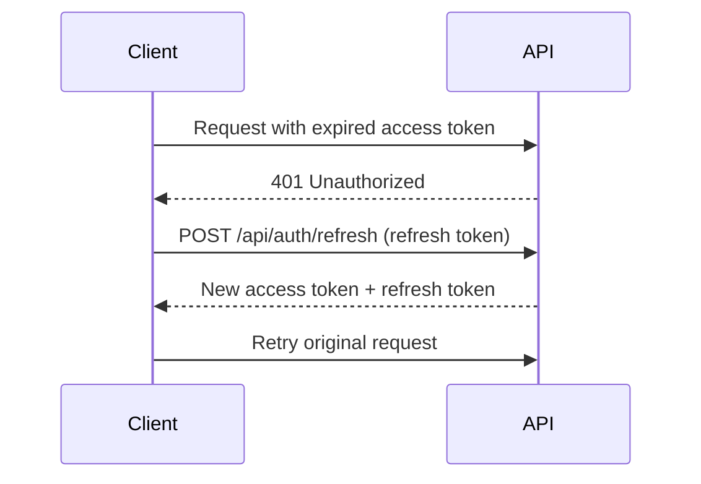
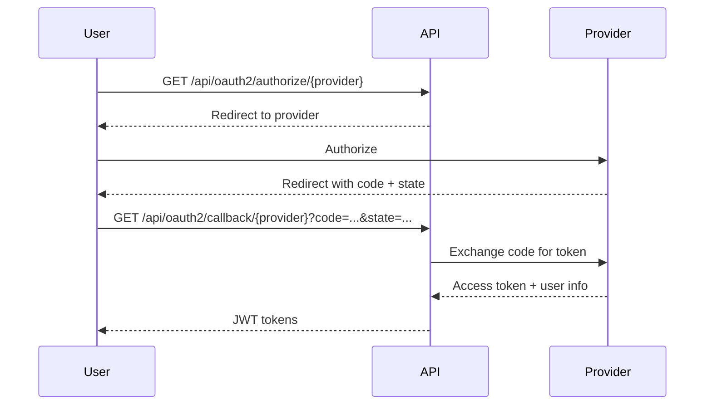

# Design Document: Security Documentation

## Overview

Bu design, Car Rental API projesi için kapsamlı güvenlik dokümantasyonu oluşturmayı tanımlar. İki ana dokümantasyon dosyası oluşturulacak:

1. **SECURITY_POLICY.md** - Güvenlik açığı raporlama, OWASP checklist
2. **AUTHENTICATION.md** - JWT, OAuth2, authorization, webhook security

Her iki dosya da `docs/security/` dizininde yer alacak.

## Architecture

```
docs/
└── security/
    ├── SECURITY_POLICY.md   # Güvenlik politikası ve OWASP checklist
    └── AUTHENTICATION.md    # Authentication ve authorization dokümantasyonu
```

### Mevcut Security Yapısı (Referans)

```
src/main/java/com/akif/
├── shared/security/
│   ├── SecurityConfig.java        # Endpoint security rules
│   ├── JwtTokenProvider.java      # JWT generation/validation
│   ├── JwtAuthenticationFilter.java # Request filter
│   └── CorrelationIdFilter.java   # Request tracing
└── auth/
    ├── web/
    │   ├── AuthController.java    # Login/register endpoints
    │   └── OAuth2Controller.java  # Social login endpoints
    └── internal/service/
        └── oauth2/                # OAuth2 provider implementations
```

## Components and Interfaces

### Component 1: SECURITY_POLICY.md

Güvenlik politikası dokümanı aşağıdaki bölümleri içerecek:

```markdown
# Security Policy

## Table of Contents
1. Reporting a Vulnerability
2. Response Timeline
3. Scope
4. Disclosure Policy
5. Recognition
6. OWASP Top 10 Compliance

## 1. Reporting a Vulnerability

### How to Report
- Email: security@[domain].com
- Subject format: [SECURITY] Brief description
- Include: Description, steps to reproduce, impact assessment

### What to Include
- Detailed description of the vulnerability
- Steps to reproduce
- Potential impact
- Suggested fix (optional)

## 2. Response Timeline

| Stage | Timeline |
|-------|----------|
| Initial Response | 24-48 hours |
| Triage | 3-5 business days |
| Fix Development | Depends on severity |
| Patch Release | Critical: 7 days, High: 30 days |

### Severity Levels
- **Critical**: Remote code execution, data breach
- **High**: Authentication bypass, privilege escalation
- **Medium**: Information disclosure, CSRF
- **Low**: Minor information leakage

## 3. Scope

### In Scope
- Car Rental API application code
- Authentication and authorization
- Payment processing
- Data storage and handling

### Out of Scope
- Third-party services (Stripe, SendGrid, OAuth providers)
- Social engineering attacks
- Physical security
- Denial of service attacks

## 4. Disclosure Policy

- Coordinated disclosure: 90 days
- We will work with you to understand and resolve the issue
- Public disclosure only after fix is deployed

## 5. Recognition

- Security researchers will be acknowledged (with permission)
- Hall of Fame listing on security page
- No bug bounty program currently

## 6. OWASP Top 10 (2025 RC) Compliance

| # | Category | Status | Mitigation |
|---|----------|--------|------------|
| A01 | Broken Access Control | ✅ | Role-based access (USER/ADMIN), @PreAuthorize, SSRF prevention via RestTemplate config |
| A02 | Security Misconfiguration | ✅ | Secure defaults, CORS whitelist, CSRF disabled (stateless JWT), no default credentials |
| A03 | Software Supply Chain Failures | ⚠️ | Dependabot enabled, regular dependency updates, no custom artifact sources |
| A04 | Cryptographic Failures | ✅ | BCrypt password hashing, HMAC-SHA256 JWT signing, HTTPS enforced |
| A05 | Injection | ✅ | JPA parameterized queries, no raw SQL, input validation via @Valid |
| A06 | Insecure Design | ✅ | Spring Modulith module boundaries, domain-driven design, threat modeling |
| A07 | Authentication Failures | ✅ | JWT with configurable expiration, OAuth2 state parameter, refresh token rotation |
| A08 | Software or Data Integrity Failures | ✅ | Stripe webhook signature verification, event idempotency tracking |
| A09 | Logging & Alerting Failures | ✅ | Structured logging, correlation IDs, no PII in logs, audit trail for webhooks |
| A10 | Mishandling of Exceptional Conditions | ✅ | GlobalExceptionHandler, fail-secure defaults, proper error responses |

### Detailed Mitigations

**A01 - Broken Access Control:**
- `SecurityConfig.java` - URL-based security rules
- `@PreAuthorize("hasRole('ADMIN')")` - Method-level security (23 usages across controllers)
- Roles: USER, ADMIN (defined in `Role.java`)

**A02 - Security Misconfiguration:**
- `SecurityConfig.java` - CSRF disabled for stateless API
- `application.properties` - CORS allowed origins configured
- Session management: STATELESS

**A03 - Software Supply Chain Failures:**
- GitHub Dependabot alerts enabled
- Known limitation: No SBOM generation yet

**A04 - Cryptographic Failures:**
- `BCryptPasswordEncoder` for passwords
- `Keys.hmacShaKeyFor()` for JWT signing
- `OAuth2StateService` uses HMAC-SHA256 for state tokens

**A05 - Injection:**
- Spring Data JPA with parameterized queries
- Bean Validation (`@Valid`, `@NotNull`, etc.)

**A06 - Insecure Design:**
- Spring Modulith for module isolation
- Application events for cross-module communication

**A07 - Authentication Failures:**
- `JwtTokenProvider.java` - Token generation with claims
- `JwtAuthenticationFilter.java` - Token validation
- OAuth2 state with HMAC signature and expiration

**A08 - Software or Data Integrity Failures:**
- `StripeWebhookHandler.java` - `Webhook.constructEvent()` for signature verification
- `WebhookEvent` entity for idempotency

**A09 - Logging & Alerting Failures:**
- `CorrelationIdFilter.java` - Request tracing
- Audit logging in webhook handler with timestamps
- No passwords or tokens logged

**A10 - Mishandling of Exceptional Conditions:**
- `GlobalExceptionHandler.java` - Centralized error handling
- Fail-secure: Invalid tokens return 401, not 500
```

### Component 2: AUTHENTICATION.md

Authentication dokümantasyonu aşağıdaki yapıda olacak:

```markdown
# Authentication & Authorization

## Table of Contents
1. Overview
2. JWT Authentication
3. OAuth2 Social Login
4. Authorization (Roles & Permissions)
5. Webhook Security
6. Security Best Practices

## 1. Overview

Car Rental API uses:
- **JWT** for stateless authentication
- **OAuth2** for social login (Google, GitHub)
- **Role-based access control** (USER, ADMIN)

## 2. JWT Authentication

### Token Structure
```json
{
  "sub": "username",
  "userId": 123,
  "roles": ["USER"],
  "iat": 1234567890,
  "exp": 1234567890
}
```

### Token Lifecycle
| Token Type | Expiration | Purpose |
|------------|------------|---------|
| Access Token | Configurable (jwt.access-token-expiration) | API authentication |
| Refresh Token | Configurable (jwt.refresh-token-expiration) | Get new access token |

### Token Refresh Flow


### JwtAuthenticationFilter
- Extracts token from Authorization header
- Validates token signature and expiration
- Sets SecurityContext for authenticated requests

### Password Security
- Algorithm: BCrypt (BCryptPasswordEncoder)
- Work factor: Default (10 rounds)

## 3. OAuth2 Social Login

### Supported Providers
| Provider | Endpoint | Scopes |
|----------|----------|--------|
| Google | /api/oauth2/authorize/google | email, profile |
| GitHub | /api/oauth2/authorize/github | user:email |

### OAuth2 Flow


### CSRF Protection
- State parameter generated per request
- Validated on callback
- Prevents authorization code injection

### Account Linking
- Existing users can link social accounts
- POST /api/oauth2/link/{provider}
- Requires authentication

## 4. Authorization

### Roles
| Role | Description | Permissions |
|------|-------------|-------------|
| USER | Regular customer | Request rentals, view own data |
| ADMIN | Administrator | Manage rentals, cars, users |

### Protected Endpoints by Role

#### ADMIN Only
| Endpoint Pattern | Method | Description |
|-----------------|--------|-------------|
| /api/rentals/*/confirm | POST | Confirm rental request |
| /api/rentals/*/pickup | POST | Mark car as picked up |
| /api/rentals/*/return | POST | Process car return |
| /api/rentals/admin | GET | List all rentals (admin view) |
| /api/cars/** | POST/PUT/PATCH/DELETE | Car management (CRUD) |
| /api/cars/business/** | ALL | Business analytics |
| /api/admin/late-returns/** | ALL | Late return management |
| /api/admin/rentals/*/penalty/** | ALL | Penalty management |
| /api/exchange-rates/refresh | POST | Force currency refresh |
| /api/dashboard/** | ALL | Dashboard (class-level @PreAuthorize) |
| /api/damage/** (write) | POST/PUT/PATCH | Damage reports & assessments |

#### USER Only
| Endpoint Pattern | Method | Description |
|-----------------|--------|-------------|
| /api/rentals/request | POST | Request new rental |
| /api/rentals/me | GET | Get user's own rentals |

#### Authenticated (Any Role)
| Endpoint Pattern | Method | Description |
|-----------------|--------|-------------|
| /api/rentals/* | GET | View specific rental |
| /api/rentals/*/cancel | POST | Cancel own rental |
| /api/pricing/calculate | POST | Calculate rental pricing |
| /api/oauth2/link/** | POST | Link social account |

### Public Endpoints (No Auth Required)

#### Authentication
- /api/auth/** - Login, register, refresh token
- /api/oauth2/authorize/** - OAuth2 authorization redirect
- /api/oauth2/callback/** - OAuth2 callback handling

#### Car Listings (Read Operations)
- /api/cars - List all cars
- /api/cars/{id} - Get car details
- /api/cars/search/** - Search cars
- /api/cars/filter-options - Get filter options
- /api/cars/featured - Featured cars
- /api/cars/active - Active cars
- /api/cars/{id}/similar - Similar cars
- /api/cars/{id}/availability/** - Check availability
- /api/cars/availability/search - Search by availability

#### Pricing & Currency
- /api/pricing/preview - Preview pricing
- /api/pricing/strategies - List pricing strategies
- /api/exchange-rates/** (GET) - Currency exchange rates

#### Webhooks & Infrastructure
- /api/webhooks/** - Stripe webhooks (signature verified internally)
- /health, /actuator/health - Health checks
- /swagger-ui/**, /v3/api-docs/** - API documentation

### Error Responses
| Status | Description |
|--------|-------------|
| 401 | Missing or invalid token |
| 403 | Insufficient permissions |

## 5. Webhook Security

### Stripe Webhook Verification
- Signature header: `Stripe-Signature`
- Verification: `Webhook.constructEvent(payload, signature, webhookSecret)`
- Handler: `StripeWebhookHandler.java`

### Replay Attack Prevention
- **Event ID Idempotency**: Each webhook event ID is stored in `WebhookEvent` entity
- **Status Tracking**: Events tracked as PROCESSING → PROCESSED or FAILED
- **Duplicate Detection**: `isEventAlreadyProcessed()` checks before processing
- **DUPLICATE status**: Re-received events marked as DUPLICATE

### Supported Webhook Events
| Event Type | Action |
|------------|--------|
| checkout.session.completed | Mark payment as CAPTURED |
| checkout.session.expired | Mark payment as FAILED |
| payment_intent.payment_failed | Mark payment as FAILED with error |

### Error Handling
| Scenario | Response | HTTP Status |
|----------|----------|-------------|
| Missing signature | "Missing signature" | 400 |
| Invalid signature | "Invalid signature" | 400 |
| Processing error | "Error processing webhook" | 500 |
| Success | "Webhook processed successfully" | 200 |

### Endpoint Configuration
- `/api/webhooks/**` - permitAll (signature verified internally by handler)

## 6. Security Best Practices

### For Developers
- Never log tokens or passwords
- Use @PreAuthorize for method-level security
- Validate all user input
- Use parameterized queries

### For API Consumers
- Store tokens securely
- Implement token refresh logic
- Use HTTPS only
```

## Data Models

Bu spec kod değil dokümantasyon oluşturduğu için data model yoktur.

## Error Handling

| Durum | Çözüm |
|-------|-------|
| Endpoint SecurityConfig'de yok | Gap olarak işaretle |
| OWASP mitigation eksik | "In Progress" olarak işaretle |
| OAuth2 provider config yok | Sadece mevcut provider'ları dokümante et |

## Testing Strategy

### Manual Verification Checklist

1. **Completeness Check**
   - [ ] Tüm roller (USER, ADMIN) dokümante edilmiş
   - [ ] Tüm protected endpoint'ler listelenmiş
   - [ ] 10 OWASP kategorisi var

2. **Accuracy Check**
   - [ ] JWT claim'leri JwtTokenProvider ile eşleşiyor
   - [ ] Endpoint security rules SecurityConfig ile eşleşiyor
   - [ ] OAuth2 flow gerçek implementasyonla tutarlı

3. **Consistency Check**
   - [ ] Terminoloji tutarlı
   - [ ] Mermaid diyagramları render ediliyor
   - [ ] Markdown formatı düzgün
