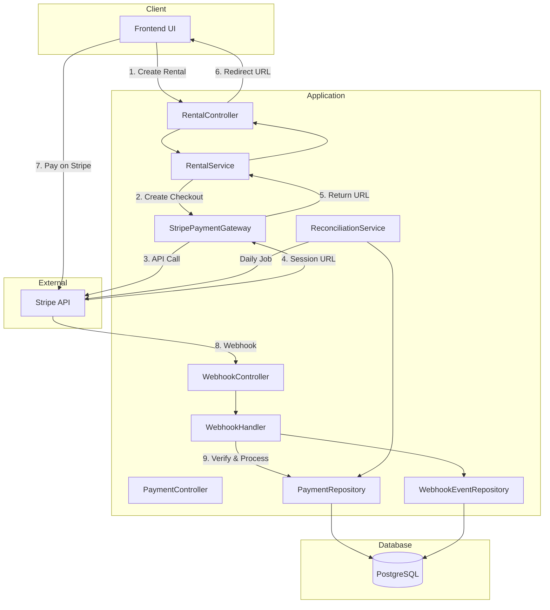

# Design Document: Stripe Payment Gateway Integration

## Overview

This design document describes the integration of Stripe as the production payment gateway for the rent-a-car application. The integration replaces the existing stub payment gateway with a real Stripe implementation that handles Checkout Sessions, webhook events, idempotency, refunds, and reconciliation.

The design follows a clean architecture approach, implementing the existing `IPaymentGateway` interface while adding Stripe-specific components for webhook handling and reconciliation.

## Architecture



## Components and Interfaces

### 1. StripePaymentGateway

Implements `IPaymentGateway` interface for production use.

```java
@Service
@Profile("prod")
public class StripePaymentGateway implements IPaymentGateway {
    
    CheckoutSessionResult createCheckoutSession(Payment payment, String customerEmail, 
                                                 String successUrl, String cancelUrl);
    
    PaymentResult authorize(BigDecimal amount, CurrencyType currency, String customerId);
    
    PaymentResult capture(String transactionId, BigDecimal amount);
    
    PaymentResult refund(String transactionId, BigDecimal amount);
    
    PaymentResult partialRefund(String transactionId, BigDecimal amount);
}
```

### 2. WebhookHandler

Processes incoming Stripe webhook events.

```java
@Service
public class StripeWebhookHandler {
    
    void handleWebhookEvent(String payload, String signature);
    
    void processCheckoutSessionCompleted(Session session);
    
    void processCheckoutSessionExpired(Session session);
    
    void processPaymentIntentFailed(PaymentIntent paymentIntent);
    
    boolean isEventAlreadyProcessed(String eventId);
}
```

### 3. ReconciliationService

Performs daily payment reconciliation between database and Stripe.

```java
@Service
public class PaymentReconciliationService {
    
    ReconciliationReport runDailyReconciliation(LocalDate date);
    
    List<Payment> fetchDatabasePayments(LocalDate date);
    
    List<StripePayment> fetchStripePayments(LocalDate date);
    
    List<Discrepancy> comparePayments(List<Payment> dbPayments, 
                                       List<StripePayment> stripePayments);
}
```

### 4. WebhookController

REST endpoint for receiving Stripe webhooks.

```java
@RestController
@RequestMapping("/api/webhooks")
public class StripeWebhookController {
    
    @PostMapping("/stripe")
    ResponseEntity<String> handleStripeWebhook(
        @RequestBody String payload,
        @RequestHeader("Stripe-Signature") String signature);
}
```

### 5. IdempotencyKeyGenerator

Generates deterministic idempotency keys.

```java
@Component
public class IdempotencyKeyGenerator {
    
    String generateForCheckout(Long rentalId, LocalDateTime timestamp);
    
    String generateForRefund(Long paymentId, BigDecimal amount);
}
```

## Data Models

### WebhookEvent Entity

```java
@Entity
@Table(name = "webhook_events")
public class WebhookEvent extends BaseEntity {
    
    @Column(name = "event_id", unique = true, nullable = false)
    private String eventId;
    
    @Column(name = "event_type", nullable = false)
    private String eventType;
    
    @Column(name = "payload", columnDefinition = "TEXT")
    private String payload;
    
    @Enumerated(EnumType.STRING)
    @Column(name = "status")
    private WebhookEventStatus status;
    
    @Column(name = "processed_at")
    private LocalDateTime processedAt;
    
    @Column(name = "error_message")
    private String errorMessage;
}
```

### WebhookEventStatus Enum

```java
public enum WebhookEventStatus {
    RECEIVED,
    PROCESSING,
    PROCESSED,
    FAILED,
    DUPLICATE
}
```

### ReconciliationReport DTO

```java
public record ReconciliationReport(
    LocalDate reportDate,
    int totalDatabasePayments,
    int totalStripePayments,
    List<Discrepancy> discrepancies,
    boolean hasDiscrepancies,
    LocalDateTime generatedAt
) {}
```

### Discrepancy DTO

```java
public record Discrepancy(
    DiscrepancyType type,
    String paymentId,
    String stripePaymentIntentId,
    BigDecimal databaseAmount,
    BigDecimal stripeAmount,
    String databaseStatus,
    String stripeStatus,
    String description
) {}
```

### DiscrepancyType Enum

```java
public enum DiscrepancyType {
    MISSING_IN_STRIPE,
    MISSING_IN_DATABASE,
    AMOUNT_MISMATCH,
    STATUS_MISMATCH
}
```

### CheckoutSessionResult DTO

```java
public record CheckoutSessionResult(
    String sessionId,
    String sessionUrl,
    String idempotencyKey
) {}
```

### Payment Entity Updates

Add new fields to existing Payment entity:

```java
@Column(name = "stripe_session_id")
private String stripeSessionId;

@Column(name = "stripe_payment_intent_id")
private String stripePaymentIntentId;

@Column(name = "idempotency_key")
private String idempotencyKey;

@Column(name = "refunded_amount", precision = 12, scale = 2)
private BigDecimal refundedAmount;

@Column(name = "failure_reason")
private String failureReason;
```

## Key Behaviors to Test

The following behaviors must be verified through unit and integration tests:

### 1. Checkout Session Creation
- Session metadata contains rental ID, amount, currency
- Success and cancel URLs are correctly configured
- **Validates: Requirements 1.2, 1.3**

### 2. Webhook Signature Verification
- Valid signatures are accepted
- Invalid signatures are rejected with 400 status
- **Validates: Requirements 2.1, 2.2**

### 3. Webhook Event Processing
- checkout.session.completed → Payment status CAPTURED
- checkout.session.expired → Payment status FAILED
- payment_intent.payment_failed → Payment status FAILED with failure reason
- **Validates: Requirements 2.3, 2.4, 2.5**

### 4. Idempotency
- Same rental ID + timestamp produces same idempotency key
- Duplicate webhook events are detected and not reprocessed
- **Validates: Requirements 3.1, 3.2, 3.3**

### 5. Refund Processing
- Full refund → Payment status REFUNDED
- Partial refund → Payment status CAPTURED, refunded amount tracked
- Failed refund → PaymentFailedException thrown
- **Validates: Requirements 4.1, 4.2, 4.3, 4.4**

### 6. Reconciliation
- Identifies payments in DB but not in Stripe
- Identifies payments in Stripe but not in DB
- Identifies amount/status mismatches
- **Validates: Requirements 5.2, 5.3, 5.4, 5.5**

### 7. Retry Logic
- Network failures trigger retry (max 3 times)
- Exponential backoff between retries
- Exception thrown after all retries exhausted
- **Validates: Requirements 6.3, 6.4**

## Error Handling

### Stripe API Errors

| Error Type | Handling Strategy |
|------------|-------------------|
| Network timeout | Retry with exponential backoff (3 attempts) |
| Invalid API key | Log error, throw configuration exception |
| Card declined | Return failure result with decline reason |
| Rate limit | Retry with backoff, respect Retry-After header |
| Invalid request | Log error, throw validation exception |

### Webhook Errors

| Error Type | Handling Strategy |
|------------|-------------------|
| Invalid signature | Return 400, log security event |
| Unknown event type | Return 200, log warning (Stripe expects 200 for unhandled events) |
| Processing failure | Return 500, Stripe will retry |
| Duplicate event | Return 200, skip processing |

### Exception Classes

```java
public class StripeIntegrationException extends RuntimeException {
    private final String stripeErrorCode;
    private final String stripeErrorMessage;
}

public class WebhookSignatureException extends RuntimeException {
    private final String eventId;
}

public class ReconciliationException extends RuntimeException {
    private final LocalDate reconciliationDate;
}
```

## Testing Strategy

### Unit Testing

Uses existing project test stack: **JUnit 5 + Mockito + AssertJ**

Test structure follows existing patterns:
- `@ExtendWith(MockitoExtension.class)` for mock injection
- `@Nested` classes for grouping related tests
- `@DisplayName` for readable test descriptions
- AssertJ assertions (`assertThat`, `assertThatThrownBy`)

Unit tests to implement:
- `StripePaymentGatewayTest` - Test checkout session creation, refund processing with mocked Stripe client
- `StripeWebhookHandlerTest` - Test event processing, signature verification, duplicate detection
- `PaymentReconciliationServiceTest` - Test comparison logic, discrepancy detection
- `IdempotencyKeyGeneratorTest` - Test key generation determinism

### Integration Testing

Uses `@SpringBootTest` with test profile, following existing patterns like `CurrencyControllerIntegrationTest`.

Integration tests to implement:
- `StripeWebhookControllerIntegrationTest` - Test webhook endpoint with simulated Stripe events
- `StripePaymentGatewayIntegrationTest` - Test actual Stripe API calls using Stripe test mode (requires test API keys)

### Test Configuration

```properties
# application-test.properties additions
stripe.api.key=${STRIPE_TEST_SECRET_KEY:sk_test_placeholder}
stripe.webhook.secret=${STRIPE_TEST_WEBHOOK_SECRET:whsec_test_placeholder}
stripe.api.base-url=https://api.stripe.com
```
