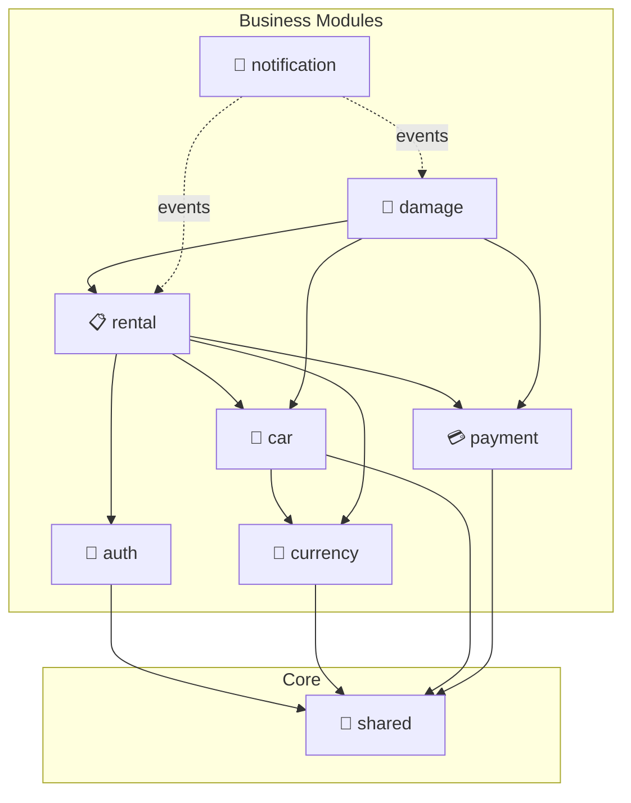

# 🚗 Car Rental API

A production-ready REST API for car rental management, built with **Spring Boot** and **Spring Modulith** modular architecture.

[](https://openjdk.org/)
[](https://spring.io/projects/spring-boot)
[](/)
[](LICENSE)

## ✨ Features

| Feature | Description |
|---------|-------------|
| **Modular Architecture** | 8 Spring Modulith modules with enforced boundaries |
| **Rental Lifecycle** | Request → Confirm → Pickup → Return workflow |
| **Payment Processing** | Stripe integration with webhooks and reconciliation |
| **Dynamic Pricing** | 5 strategies: season, early booking, duration, weekend, demand |
| **Late Return System** | Automated detection, grace period, penalty calculation |
| **Damage Management** | Photo evidence, assessment, disputes, resolution |
| **Email Notifications** | Event-driven with async processing and retry logic |
| **OAuth2 Login** | Google and GitHub social authentication |
| **Currency Conversion** | Real-time exchange rates with fallback |
| **Availability Search** | Date-based search with similar car recommendations |

## 🏛️ Architecture

This project uses **Spring Modulith** for modular monolith architecture with clear module boundaries.

<details>
<summary>📊 <b>View Module Dependency Diagram</b></summary>



</details>

### Modules

| Module | Responsibility | Dependencies |
|--------|----------------|--------------|
| `shared` | Cross-cutting: security, exceptions, base classes | - |
| `auth` | JWT authentication, OAuth2, user management | `shared` |
| `currency` | Exchange rates, currency conversion | `shared` |
| `car` | Vehicle catalog, availability, pricing | `currency`, `shared` |
| `payment` | Stripe gateway, webhooks, reconciliation | `shared` |
| `rental` | Rental lifecycle, late returns, penalties | `car`, `auth`, `currency`, `payment` |
| `damage` | Damage reports, assessment, disputes | `rental`, `car`, `payment` |
| `notification` | Event-driven email notifications | *(events only)* |

📖 See [Architecture Decision Records](docs/architecture/adr/) for design rationale and [Developer Guide](docs/architecture/DEVELOPER_GUIDE.md) for implementation details.

## 🛠️ Tech Stack

| Category | Technology |
|----------|------------|
| Framework | Spring Boot 3.5, Spring Modulith |
| Security | Spring Security, JWT, OAuth2 |
| Database | PostgreSQL, Flyway migrations |
| Payment | Stripe API |
| Email | SendGrid SMTP, Thymeleaf templates |
| Cache | Caffeine |
| Testing | JUnit 5, Mockito, 843+ tests |
| Docs | Swagger/OpenAPI |

## 🚀 Quick Start

### Prerequisites
- Java 17+
- PostgreSQL 15+
- Maven 3.8+

### Setup

```bash
# Clone
git clone https://github.com/TheOdrig/car-rental.git
cd car-rental

# Configure environment
cp .env.example .env
# Edit .env with your credentials

# Run
mvn spring-boot:run
```

### Access
- **API:** `http://localhost:8082`
- **Swagger UI:** `http://localhost:8082/swagger-ui.html`

## 📚 API Overview

### Authentication
```http
POST /api/auth/register     # Register user
POST /api/auth/login        # Login, get JWT
GET  /api/oauth2/authorize/{provider}  # OAuth2 login
```

### Cars
```http
GET  /api/cars              # List all cars
GET  /api/cars/{id}         # Get car details
POST /api/cars/availability/search  # Search by date range
GET  /api/cars/{id}/similar # Similar car recommendations
```

### Rentals
```http
POST /api/rentals/request   # Request rental
GET  /api/rentals/me        # My rentals
POST /api/rentals/{id}/confirm  # Admin: confirm
POST /api/rentals/{id}/return   # Admin: complete return
```

### Admin Operations
```http
GET  /api/admin/late-returns     # Late return report
POST /api/admin/damages          # Create damage report
POST /api/admin/damages/{id}/assess  # Assess damage
```

📖 Full API documentation available at `/swagger-ui.html`

## 🧪 Testing

```bash
# Run all tests
mvn test

# Run modularity verification
mvn test -Dtest=ModularityTests

# Generate coverage report
mvn jacoco:report
```

**Test Coverage:**
- 843+ tests passing
- Unit, integration, and E2E tests
- Module boundary verification
- Complete rental lifecycle coverage

## 📁 Project Structure

```
src/main/java/com/akif/
├── auth/           # Authentication module
├── car/            # Car management module
├── currency/       # Currency conversion module
├── damage/         # Damage management module
├── notification/   # Email notification module
├── payment/        # Payment processing module
├── rental/         # Rental operations module
├── shared/         # Shared kernel
└── starter/        # Application entry point

docs/architecture/
├── adr/            # Architecture Decision Records
├── MIGRATION.md    # Migration documentation
└── DEVELOPER_GUIDE.md  # Developer guide
```

## 🔧 Configuration

See [docs/CONFIGURATION.md](docs/CONFIGURATION.md) for detailed configuration options including:
- Database setup
- Stripe integration
- Email configuration
- Pricing strategies
- OAuth2 providers

## 📊 Technical Highlights

- **Modular Monolith** with Spring Modulith (8 modules, enforced boundaries)
- **Event-Driven Architecture** for decoupled module communication
- **ID Reference + Denormalization** pattern for cross-module entities
- **843+ Automated Tests** with E2E coverage
- **CI/CD Pipeline** with module verification
- **5 ADRs** documenting architectural decisions

## 🤝 Contributing

1. Fork the repository
2. Create feature branch (`git checkout -b feature/amazing-feature`)
3. Run tests (`mvn test`)
4. Commit changes (`git commit -m 'Add amazing feature'`)
5. Push to branch (`git push origin feature/amazing-feature`)
6. Open Pull Request

## 📝 License

This project is licensed under the MIT License - see the [LICENSE](LICENSE) file for details.

## 👤 Author

**Mehmet Akif Uludag**

[](https://github.com/TheOdrig)

---
