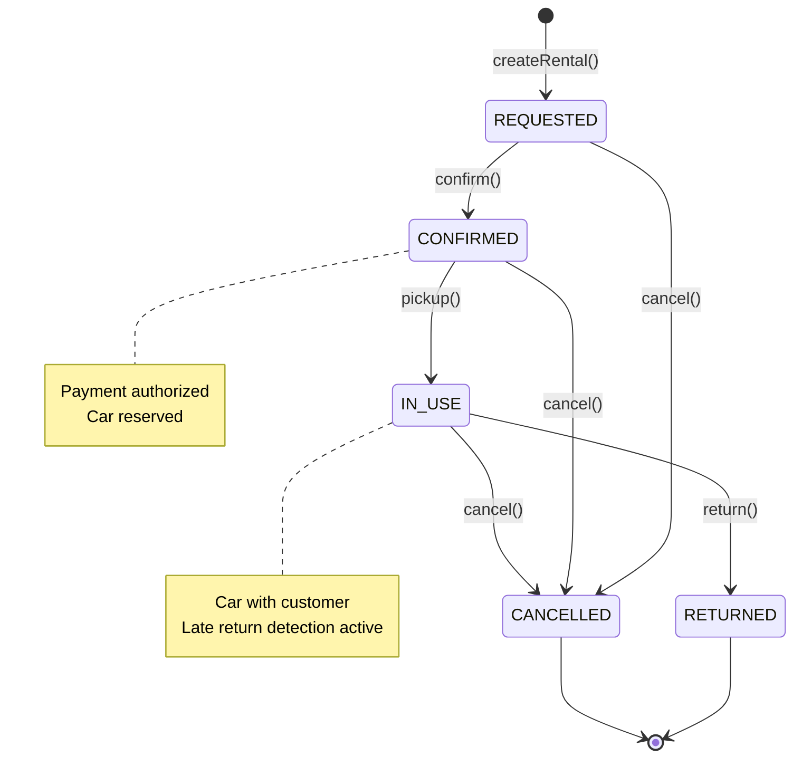
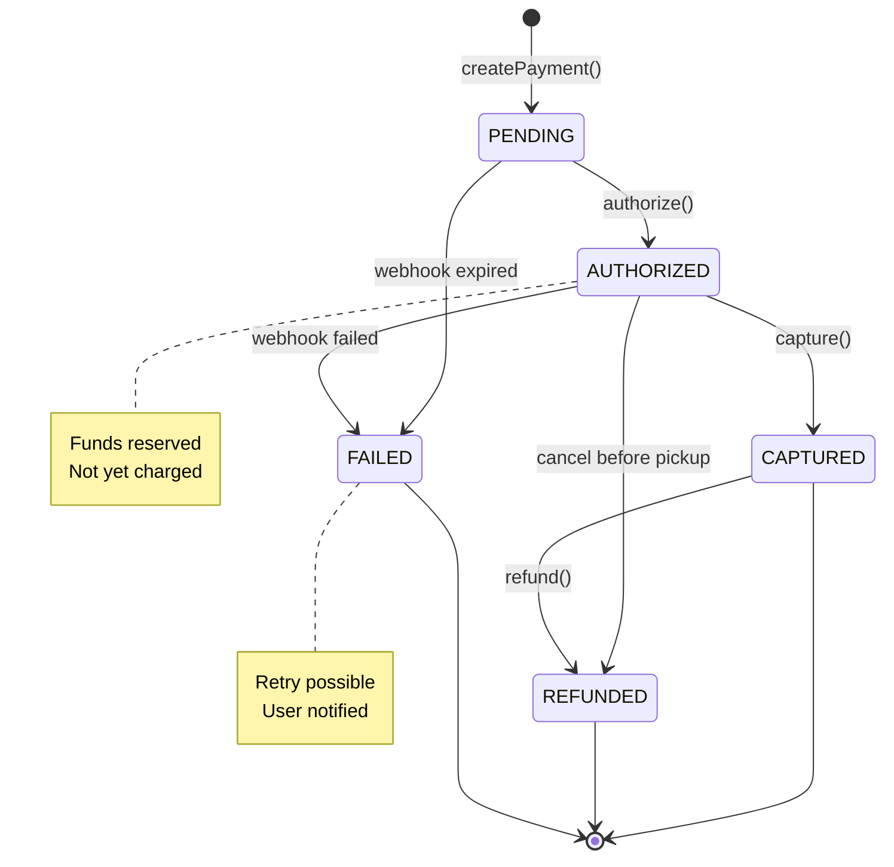
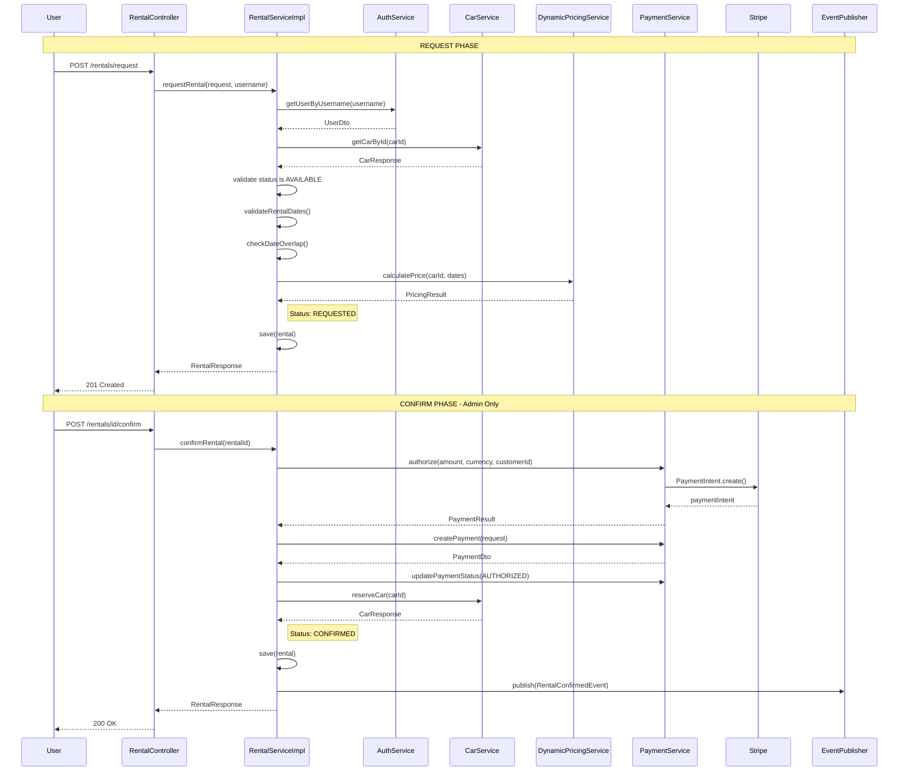
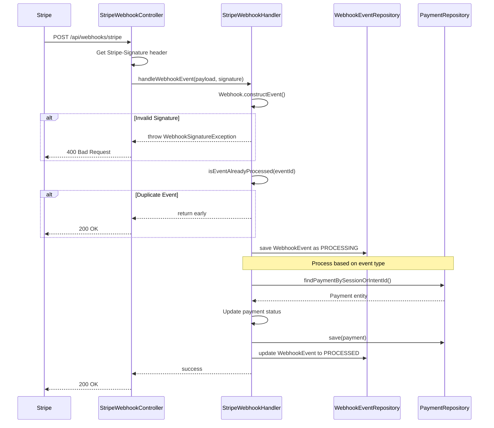
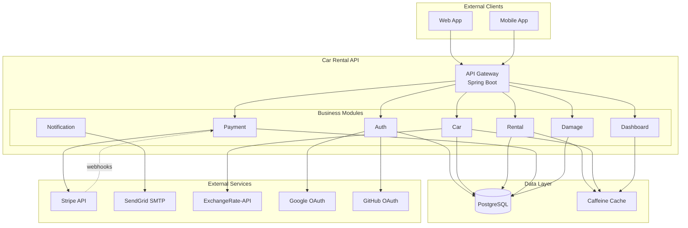

# Architecture Diagrams

This document provides visual representations of the Car Rental API's architecture, including state machines, sequence diagrams, and component diagrams.

> **Note:** All diagrams are in Mermaid format and render natively on GitHub.

---

## Table of Contents

1. [Rental Lifecycle State Diagram](#1-rental-lifecycle-state-diagram)
2. [Payment Status State Diagram](#2-payment-status-state-diagram)
3. [Complete Rental Flow](#3-complete-rental-flow-sequence-diagram)
4. [Payment Webhook Flow](#4-payment-webhook-flow-sequence-diagram)
5. [System Components](#5-system-component-diagram)

---

## Quick Reference

| Diagram | Purpose | Key Elements |
|---------|---------|--------------|
| Rental Lifecycle | Status transitions | REQUESTED → CONFIRMED → IN_USE → RETURNED |
| Payment Status | Payment state machine | PENDING → AUTHORIZED → CAPTURED |
| Rental Flow | End-to-end rental process | Request + Confirm phases |
| Webhook Flow | Stripe webhook handling | Signature verification, idempotency |
| System Components | High-level architecture | Modules, external services |

---

## Related Documentation

- [Module Dependency Diagram](../../README.md#module-dependency-diagram) - Module relationships
- [ADR-001: Spring Modulith](adr/ADR-001-spring-modulith-over-maven-multimodule.md) - Architecture decision
- [ADR-003: Event-Driven Communication](adr/ADR-003-event-driven-communication.md) - Event patterns
- [Developer Guide](DEVELOPER_GUIDE.md) - Module development patterns

---

## 1. Rental Lifecycle State Diagram

### Overview

This diagram shows the lifecycle of a rental entity from creation to completion. Each state represents a distinct phase in the rental process, and transitions are triggered by specific business operations.

**Source:** `com.akif.rental.domain.enums.RentalStatus`

### States

| State | Display Name | Description |
|-------|--------------|-------------|
| `REQUESTED` | Requested | Rental request created, awaiting admin confirmation |
| `CONFIRMED` | Confirmed | Rental confirmed, payment authorized, car reserved |
| `IN_USE` | In Use | Car picked up by customer, payment captured |
| `RETURNED` | Returned | Car returned, rental completed |
| `CANCELLED` | Cancelled | Rental cancelled (refund processed if applicable) |

### Valid Transitions

| From | To | Trigger | Guard Method |
|------|-----|---------|--------------|
| `REQUESTED` | `CONFIRMED` | `confirmRental()` | `canConfirm()` |
| `REQUESTED` | `CANCELLED` | `cancelRental()` | `canCancel()` |
| `CONFIRMED` | `IN_USE` | `pickupRental()` | `canPickup()` |
| `CONFIRMED` | `CANCELLED` | `cancelRental()` | `canCancel()` |
| `IN_USE` | `RETURNED` | `returnRental()` | `canReturn()` |
| `IN_USE` | `CANCELLED` | `cancelRental()` | `canCancel()` |

### State Diagram



### Business Rules

1. **REQUESTED → CONFIRMED**: Requires successful payment authorization
2. **CONFIRMED → IN_USE**: Triggers payment capture
3. **IN_USE → RETURNED**: May trigger late return penalty calculation
4. **Any → CANCELLED**: Processes refund based on current state

---

## 2. Payment Status State Diagram

### Overview

This diagram shows the lifecycle of a payment entity. Payments are created during rental confirmation and progress through authorization, capture, and potential refund states. Status changes are triggered by both application logic and Stripe webhooks.

**Source:** `com.akif.payment.api.PaymentStatus`

### States

| State | Display Name | Description |
|-------|--------------|-------------|
| `PENDING` | Pending | Payment created, awaiting processing |
| `AUTHORIZED` | Authorized | Payment authorized, funds reserved but not charged |
| `CAPTURED` | Captured | Payment captured, funds transferred |
| `FAILED` | Failed | Payment failed (authorization or capture) |
| `REFUNDED` | Refunded | Payment refunded (full or partial) |

### Valid Transitions

| From | To | Trigger | Source |
|------|-----|---------|--------|
| `PENDING` | `AUTHORIZED` | `authorize()` | RentalServiceImpl |
| `PENDING` | `FAILED` | Webhook: `checkout.session.expired` | Stripe |
| `AUTHORIZED` | `CAPTURED` | `capture()` | RentalServiceImpl (pickup) |
| `AUTHORIZED` | `FAILED` | Webhook: `payment_intent.payment_failed` | Stripe |
| `AUTHORIZED` | `REFUNDED` | `cancelRental()` (before pickup) | RentalServiceImpl |
| `CAPTURED` | `REFUNDED` | `refundPayment()` | RentalServiceImpl |

### Guard Methods

| Method | Description |
|--------|-------------|
| `isSuccessful()` | Returns `true` for AUTHORIZED or CAPTURED |
| `canRefund()` | Returns `true` only for CAPTURED |

### State Diagram



### Business Rules

1. **PENDING → AUTHORIZED**: Created during `confirmRental()`, requires Stripe authorization
2. **AUTHORIZED → CAPTURED**: Triggered during `pickupRental()`
3. **CAPTURED → REFUNDED**: Only CAPTURED payments can be refunded (`canRefund()`)
4. **Webhook Updates**: Stripe webhooks can update status to FAILED for expired/failed payments

---

## 3. Complete Rental Flow Sequence Diagram

### Overview

This diagram shows the end-to-end rental creation process. The flow consists of two distinct phases:

1. **Request Phase**: Customer requests a rental (status: REQUESTED)
2. **Confirm Phase**: Admin confirms the rental, authorizes payment, reserves car (status: CONFIRMED)

**Source:** `com.akif.rental.internal.service.RentalServiceImpl`

### Participants

| Participant | Type | Description |
|-------------|------|-------------|
| User | Actor | Customer or Admin |
| RentalController | Web | REST API endpoint |
| RentalServiceImpl | Service | Core rental business logic |
| AuthService | Service | User authentication and lookup |
| CarService | Service | Car management and reservation |
| DynamicPricingService | Service | Price calculation with modifiers |
| PaymentService | Service | Payment authorization and capture |
| Stripe | External | Payment gateway |
| EventPublisher | Infrastructure | Spring event publishing |

### Flow Steps

#### Request Phase (Customer)

1. Customer calls `POST /api/rentals/request`
2. `AuthService.getUserByUsername()` retrieves user details
3. `CarService.getCarById()` retrieves car and validates status is AVAILABLE
4. Date validation (not in past, end after start)
5. Date overlap check against existing rentals
6. `DynamicPricingService.calculatePrice()` calculates final price with modifiers
7. Rental saved with status `REQUESTED`
8. Response returned to customer

#### Confirm Phase (Admin)

9. Admin calls `POST /api/rentals/{id}/confirm`
10. `PaymentService.authorize()` reserves funds via Stripe
11. `PaymentService.createPayment()` creates payment record
12. Payment status updated to `AUTHORIZED`
13. `CarService.reserveCar()` changes car status to RESERVED
14. Rental status updated to `CONFIRMED`
15. `RentalConfirmedEvent` published (triggers email notification)
16. Response returned to admin

### Sequence Diagram



### Related Events

| Event | Published When | Listeners |
|-------|----------------|-----------|
| `RentalConfirmedEvent` | Rental confirmed | EmailEventListener, DashboardEventListener |

---

## 4. Payment Webhook Flow Sequence Diagram

### Overview

This diagram shows how Stripe webhooks are processed. The webhook handler performs signature verification, idempotency checks, and updates payment status directly in the database.

> ⚠️ **Important:** This flow is specifically for Stripe Checkout Session webhooks. The main rental flow uses `RentalServiceImpl` → `PaymentService` chain, which publishes business events. **The webhook handler does NOT publish events.**

**Source:** `com.akif.payment.internal.webhook.StripeWebhookHandler`

### Participants

| Participant | Type | Description |
|-------------|------|-------------|
| Stripe | External | Payment gateway sending webhook events |
| StripeWebhookController | Web | REST endpoint at `/api/webhooks/stripe` |
| StripeWebhookHandler | Service | Webhook processing logic |
| WebhookEventRepository | Repository | Stores webhook events for idempotency |
| PaymentRepository | Repository | Updates payment status directly |

### Supported Event Types

| Stripe Event | Result | Description |
|--------------|--------|-------------|
| `checkout.session.completed` | `CAPTURED` | Checkout session successfully completed |
| `checkout.session.expired` | `FAILED` | Checkout session expired without payment |
| `payment_intent.payment_failed` | `FAILED` | Payment intent failed during processing |

### Flow Steps

1. Stripe sends webhook POST to `/api/webhooks/stripe`
2. Controller extracts `Stripe-Signature` header
3. Handler calls `Webhook.constructEvent()` to verify signature
4. If signature invalid → return 400 Bad Request
5. Handler checks `isEventAlreadyProcessed(eventId)` for idempotency
6. If duplicate event → return 200 OK (skip processing)
7. Handler saves `WebhookEvent` with status `PROCESSING`
8. Handler finds payment by session ID or payment intent ID
9. Handler updates payment status (CAPTURED or FAILED)
10. Handler saves payment via `PaymentRepository`
11. Handler updates `WebhookEvent` status to `PROCESSED`
12. Return 200 OK to Stripe

### Sequence Diagram



### Important Notes

> **⚠️ No Event Publishing:** The `StripeWebhookHandler` does **NOT** publish domain events like `PaymentCapturedEvent` or `RentalConfirmedEvent`.
>
> Business events are published by `RentalServiceImpl` during:
> - `confirmRental()` → publishes `RentalConfirmedEvent`
> - `pickupRental()` → publishes `PaymentCapturedEvent`
> - `cancelRental()` → publishes `RentalCancelledEvent`
>
> The webhook handler only updates the payment status in the database for Stripe Checkout Session flow.

### Idempotency Strategy

| Status | Action |
|--------|--------|
| Event not found | Process normally, save as `PROCESSING` |
| Status: `PROCESSED` | Mark as `DUPLICATE`, skip processing |
| Status: `PROCESSING` | Skip (another instance handling) |
| Status: `DUPLICATE` | Skip |
| Status: `FAILED` | May retry (implementation specific) |

---

## 5. System Component Diagram

### Overview

This diagram provides a high-level view of the Car Rental API architecture, showing the business modules, data layer, and external service integrations.

**Architecture:** Spring Modulith-based Modular Monolith

### Internal Components

| Component | Type | Description |
|-----------|------|-------------|
| Auth | Module | Authentication, authorization, OAuth2 |
| Car | Module | Car inventory, status management, pricing |
| Rental | Module | Core rental operations, lifecycle management |
| Payment | Module | Payment processing, Stripe integration |
| Damage | Module | Damage reporting and assessment |
| Dashboard | Module | Admin analytics and quick actions |
| Notification | Module | Email notifications (event-driven) |
| Currency | Module | Exchange rate management |
| Shared | Kernel | Cross-cutting concerns (config, security, exceptions) |
| PostgreSQL | Database | Primary data store |
| Caffeine Cache | Cache | In-memory caching for performance |

### External Services

| Service | Type | Purpose |
|---------|------|---------|
| Stripe API | Payment | Payment authorization, capture, refund |
| SendGrid SMTP | Email | Transactional email delivery |
| ExchangeRate-API | Currency | Real-time exchange rates |
| Google OAuth | Auth | Social login |
| GitHub OAuth | Auth | Social login |

### Module Dependencies

```
auth       → shared
currency   → shared
car        → currency, shared
notification → shared (event listeners only)
payment    → shared
damage     → rental, car, payment, shared
dashboard  → rental, car, payment, damage, shared
rental     → car, auth, currency, payment, shared
```

### Component Diagram



### Key Architectural Decisions

| Decision | Rationale | Reference |
|----------|-----------|-----------|
| Spring Modulith | Module boundaries without deployment complexity | [ADR-001](adr/ADR-001-spring-modulith-over-maven-multimodule.md) |
| Event-Driven Notification | Loose coupling, async processing | [ADR-003](adr/ADR-003-event-driven-communication.md) |
| Shared Kernel | Cross-cutting concerns (security, config) | [ADR-004](adr/ADR-004-shared-kernel-boundaries.md) |
| Payment Module Separation | Stripe integration isolation | [ADR-005](adr/ADR-005-payment-module-separation.md) |

### Data Flow Summary

| Flow | Direction | Description |
|------|-----------|-------------|
| Client → API | Inbound | REST API requests |
| API → Database | Internal | JPA/Hibernate persistence |
| API → External | Outbound | Third-party API calls |
| Stripe → API | Inbound | Webhook notifications (dotted line) |
| Module → Module | Internal | Public API interfaces only |

---

## See Also

### Module Dependency Diagram

For the module dependency graph showing inter-module relationships, see:
- [README.md - Module Dependency Diagram](../../README.md#module-dependency-diagram)

### Architecture Decision Records (ADRs)

| ADR | Title | Relevant Diagrams |
|-----|-------|-------------------|
| [ADR-001](adr/ADR-001-spring-modulith-over-maven-multimodule.md) | Spring Modulith over Maven Multi-Module | Component Diagram |
| [ADR-002](adr/ADR-002-cross-module-entity-strategy.md) | Cross-Module Entity Strategy | Rental Flow |
| [ADR-003](adr/ADR-003-event-driven-communication.md) | Event-Driven Communication | Rental Flow, Webhook Flow |
| [ADR-004](adr/ADR-004-shared-kernel-boundaries.md) | Shared Kernel Boundaries | Component Diagram |
| [ADR-005](adr/ADR-005-payment-module-separation.md) | Payment Module Separation | Payment Status, Webhook Flow |
| [ADR-006](adr/ADR-006-dynamic-pricing-strategy.md) | Dynamic Pricing Strategy | Rental Flow |
| [ADR-007](adr/ADR-007-late-return-penalty.md) | Late Return Penalty | Rental Lifecycle |
| [ADR-008](adr/ADR-008-authentication-strategy.md) | Authentication Strategy | Component Diagram |

### Related Documentation

| Document | Description |
|----------|-------------|
| [Developer Guide](DEVELOPER_GUIDE.md) | Module development patterns and best practices |
| [Migration Guide](MIGRATION.md) | Spring Modulith migration documentation |
| [API Conventions](../api/API_CONVENTIONS.md) | REST API design standards |
| [Test Strategy](../testing/TEST_STRATEGY.md) | Testing approach and patterns |
| [Security Policy](../security/SECURITY_POLICY.md) | Security implementation details |

### Source Code References

| Diagram | Primary Source |
|---------|----------------|
| Rental Lifecycle | `com.akif.rental.domain.enums.RentalStatus` |
| Payment Status | `com.akif.payment.api.PaymentStatus` |
| Rental Flow | `com.akif.rental.internal.service.RentalServiceImpl` |
| Webhook Flow | `com.akif.payment.internal.webhook.StripeWebhookHandler` |
| Component Diagram | `src/main/java/com/akif/*/package-info.java` |

---

*Last updated: 2026-01-12*

