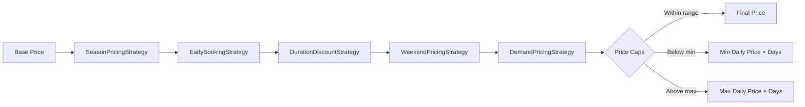

# ADR-006: Dynamic Pricing Strategy

## Status
**Accepted**

## Context

Car rental pricing should be dynamic rather than a static daily rate. Multiple factors affect pricing:

- **Seasonal Demand:** Prices should increase during summer, decrease in winter
- **Early Booking:** Reservations made in advance should receive discounts
- **Rental Duration:** Longer rentals should receive quantity discounts
- **Weekend Demand:** Weekend rentals typically have higher demand
- **Real-time Demand:** Prices should adjust based on current fleet availability

**Problem:** Hardcoding these factors in a single place causes:
1. Adding new pricing strategies is difficult
2. Testing each strategy independently is impossible
3. Changing strategy order is risky
4. Violation of Single Responsibility Principle

**Requirement:** An extensible, testable, and configurable pricing system.

## Decision

Implement dynamic pricing using the **Strategy Pattern**:

1. Each pricing factor is an independent `PricingStrategy` implementation
2. All strategies are applied sequentially (Chain of Multipliers)
3. `PricingConfig` makes all parameters configurable via application properties
4. Min/max daily price caps prevent extreme pricing

### Pricing Strategies (Execution Order)

| Order | Strategy | Description |
|-------|----------|-------------|
| 1 | `SeasonPricingStrategy` | Peak/off-peak season multipliers |
| 2 | `EarlyBookingStrategy` | Lead time based discounts |
| 3 | `DurationDiscountStrategy` | Long rental discounts |
| 4 | `WeekendPricingStrategy` | Weekend surcharge pricing |
| 5 | `DemandPricingStrategy` | Availability-based pricing |

### Price Calculation Formula

```
finalPrice = basePrice × rentalDays × strategy1.multiplier × strategy2.multiplier × ... × strategyN.multiplier
```

**Price Caps:**
- `minDailyPrice`: Minimum daily price (default: 100)
- `maxDailyPrice`: Maximum daily price (default: 10,000)

## Rationale

### Alternatives Evaluated

| Approach | Pros | Cons |
|----------|------|------|
| **Strategy Pattern** (chosen) | Extensible, testable, SRP compliant, easy to add/remove strategies | More classes, slightly complex initialization |
| **Rule Engine (Drools)** | Flexible business rules, non-developers can modify | Steep learning curve, additional dependency, overkill for 5 rules |
| **ML-based Pricing** | Adaptive, learns from data, optimal pricing | Unpredictable results, requires training data, complex infrastructure |
| **Hardcoded Logic** | Simple, fast to implement | Not maintainable, testing nightmare, SRP violation |

### Why Strategy Pattern?

1. **Extensibility:** Adding a 6th pricing strategy requires only implementing `PricingStrategy` interface and annotating with `@Component`. No existing code changes.

2. **Testability:** Each strategy can be unit tested in isolation with specific `PricingContext` inputs. No mocking of other strategies required.

3. **Single Responsibility:** Each strategy class handles exactly one pricing factor. `SeasonPricingStrategy` knows nothing about demand or duration.

4. **Configurability:** Strategies can be enabled/disabled via `PricingConfig.strategy.*Enabled` properties without code changes.

5. **Order Control:** The `getOrder()` method in each strategy ensures predictable execution order. Changing order only requires updating order values.

6. **Chain of Responsibility:** Multipliers compound naturally. If season = 1.25× and weekend = 1.15×, the combined effect is 1.4375× (not 1.40×).

### Decision Drivers

- **Industry Standard:** Strategy Pattern is a well-established GoF pattern for varying behavior, reducing risk of unfamiliar implementations
- **Maintainability:** Business pricing rules change frequently; adding/removing strategies should require minimal code changes
- **Quality Assurance:** High test coverage expectations require each pricing factor to be independently testable

## Implementation Details

### Strategy Interface

```java
public interface PricingStrategy {
    PriceModifier calculate(PricingContext context);
    String getStrategyName();
    boolean isEnabled();
    int getOrder();
}
```

### Strategy Implementations

#### 1. SeasonPricingStrategy (Order: 1)
Calculates weighted multiplier based on days in peak/off-peak seasons.

| Season | Period | Multiplier |
|--------|--------|------------|
| Peak | June 1 - August 31 | 1.25× |
| Off-Peak | November 1 - February 28 | 0.90× |
| Regular | All other dates | 1.00× |

**Logic:** Weighted average of multipliers based on rental day distribution across seasons.

#### 2. EarlyBookingStrategy (Order: 2)
Rewards advance reservations with tiered discounts.

| Lead Time | Multiplier | Discount |
|-----------|------------|----------|
| 30+ days | 0.85× | 15% off |
| 14-29 days | 0.90× | 10% off |
| 7-13 days | 0.95× | 5% off |
| < 7 days | 1.00× | No discount |

#### 3. DurationDiscountStrategy (Order: 3)
Quantity discounts for longer rentals.

| Duration | Multiplier | Discount |
|----------|------------|----------|
| 30+ days | 0.80× | 20% off |
| 14-29 days | 0.85× | 15% off |
| 7-13 days | 0.90× | 10% off |
| < 7 days | 1.00× | No discount |

#### 4. WeekendPricingStrategy (Order: 4)
Applies surcharge for weekend days (Friday, Saturday, Sunday).

| Weekend Days | Multiplier |
|--------------|------------|
| Per weekend day | 1.15× |

**Logic:** Weighted average based on weekend/weekday ratio in rental period.

#### 5. DemandPricingStrategy (Order: 5)
Dynamic pricing based on real-time fleet occupancy.

| Occupancy | Multiplier | Surcharge |
|-----------|------------|-----------|
| > 80% | 1.20× | +20% |
| 50-80% | 1.10× | +10% |
| < 50% | 1.00× | None |

**Logic:** Counts overlapping rentals for the requested period via `RentalRepository`.

### Price Calculation Flow



### Price Cap Mechanism

```java
private BigDecimal applyPriceCaps(BigDecimal calculatedPrice, int rentalDays) {
    BigDecimal dailyPrice = calculatedPrice.divide(BigDecimal.valueOf(rentalDays));
    
    if (dailyPrice.compareTo(config.getMinDailyPrice()) < 0) {
        return config.getMinDailyPrice().multiply(BigDecimal.valueOf(rentalDays));
    }
    
    if (dailyPrice.compareTo(config.getMaxDailyPrice()) > 0) {
        return config.getMaxDailyPrice().multiply(BigDecimal.valueOf(rentalDays));
    }
    
    return calculatedPrice;
}
```

**Default Values:**
- `pricing.min-daily-price`: 100
- `pricing.max-daily-price`: 10,000

### Configuration Properties

All pricing parameters are configurable via `application.yml`:

```yaml
pricing:
  min-daily-price: 100
  max-daily-price: 10000
  strategy:
    season-enabled: true
    early-booking-enabled: true
    duration-enabled: true
    weekend-enabled: true
    demand-enabled: true
  season:
    peak:
      start: "06-01"
      end: "08-31"
      multiplier: 1.25
    offpeak:
      start: "11-01"
      end: "02-28"
      multiplier: 0.90
  early-booking:
    tier1: { days: 30, multiplier: 0.85 }
    tier2: { days: 14, multiplier: 0.90 }
    tier3: { days: 7, multiplier: 0.95 }
  duration:
    tier1: { days: 7, multiplier: 0.90 }
    tier2: { days: 14, multiplier: 0.85 }
    tier3: { days: 30, multiplier: 0.80 }
  weekend:
    multiplier: 1.15
    days: [FRIDAY, SATURDAY, SUNDAY]
  demand:
    high: { threshold: 80, multiplier: 1.20 }
    moderate: { threshold: 50, multiplier: 1.10 }
```

## Consequences

### Positive

1. **High Extensibility:** Adding a new pricing strategy (e.g., loyalty discount, holiday surcharge) requires only:
   - Create new class implementing `PricingStrategy`
   - Add `@Component` and `@Order(n)` annotations
   - Zero changes to existing code

2. **Independent Testability:** Each strategy has dedicated unit tests (`SeasonPricingStrategyTest`, etc.) with no inter-strategy dependencies. Test coverage per strategy class exceeds 90%.

3. **Runtime Configurability:** All multipliers, thresholds, and enable/disable flags are externalized to `application.yml`. Pricing adjustments don't require redeployment.

4. **Transparent Pricing:** `PricingResult` includes `appliedModifiers` list showing exactly which strategies affected the price and by how much. Useful for customer disputes and debugging.

5. **Performance:** Strategies are Spring-managed singletons. No instantiation overhead per price calculation. Chain execution is O(n) where n = enabled strategies (max 5).

### Negative

1. **Increased Class Count:** 5 strategy classes + interface + service + config + DTOs = ~10 classes for pricing logic alone. May seem over-engineered for simple use cases.

2. **Initialization Complexity:** Spring auto-wires all `PricingStrategy` implementations into a `List<PricingStrategy>`. Order depends on `@Order` annotation correctness.

3. **Cross-Module Dependency:** `DemandPricingStrategy` depends on `RentalRepository` from the rental module to calculate occupancy. This couples car pricing to rental data.

4. **Debugging Complexity:** When final price seems wrong, developer must trace through all 5 strategies to find the cause. Mitigated by detailed `PriceModifier` descriptions.

5. **Multiplier Compounding:** Extreme cases can produce unexpected results. Example: Peak (1.25×) + Weekend (1.15×) + High Demand (1.20×) = 1.725× base price. Price caps mitigate this.

## Related ADRs

- ADR-003: Event-Driven Inter-Module Communication
- ADR-004: Shared Kernel Boundaries

## Code References

- Interface: `com.akif.car.internal.service.pricing.PricingStrategy`
- Service: `com.akif.car.internal.service.pricing.impl.DynamicPricingServiceImpl`
- Config: `com.akif.rental.internal.config.PricingConfig`
- Strategies: `com.akif.car.internal.service.pricing.strategy.*`
