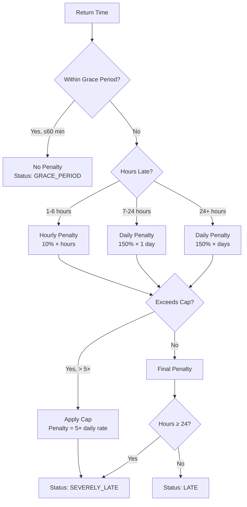

# ADR-007: Late Return Penalty Calculation

## Status
**Accepted**

## Context

When customers return rental vehicles after the agreed end date, the business must:

- **Recover Revenue Loss:** The vehicle was unavailable for other bookings during the late period
- **Deter Late Returns:** Encourage customers to return on time or communicate delays
- **Maintain Fairness:** Penalties should be proportional to lateness, not punitive

**Problem:** Designing a penalty system that balances:
1. Business protection (revenue recovery)
2. Customer experience (not overly harsh)
3. Transparency (predictable, easy to understand)
4. Configurability (business rules change)

**Constraints:**
- Grace period needed for minor delays (traffic, parking)
- Cap needed to prevent unreasonably high penalties
- Different rates for short vs. extended delays

## Decision

Implement a **tiered penalty system** with the following structure:

### Penalty Tiers

| Tier | Duration | Rate | Calculation |
|------|----------|------|-------------|
| Grace Period | 0-60 min | 0% | No penalty |
| Hourly | 1-6 hours | 10%/hour | dailyRate × 0.10 × hours |
| Daily | 7-24 hours | 150%/day | dailyRate × 1.50 |
| Extended | 24+ hours | 150%/day | dailyRate × 1.50 × days |
| **Cap** | Any | 5× max | Maximum: dailyRate × 5.0 |

### Late Return Status

| Status | Condition | Description |
|--------|-----------|-------------|
| `ON_TIME` | Returned ≤ end date | Normal return |
| `GRACE_PERIOD` | 0-60 min late | No penalty applied |
| `LATE` | 1-24 hours late | Standard penalty applies |
| `SEVERELY_LATE` | 24+ hours late | Extended penalty, possible escalation |

## Rationale

### Alternatives Evaluated

| Approach | Pros | Cons |
|----------|------|------|
| **Tiered Penalty** (chosen) | Fair, proportional, predictable, configurable | Slightly complex calculation |
| **Flat Fee** | Simple to understand and implement | Not proportional to delay; unfair for short delays |
| **Progressive (Exponential)** | Strong deterrent for extended delays | Can become excessive quickly; customer complaints |
| **No Cap** | Maximum revenue recovery | Legal risk, chargebacks, reputation damage |
| **Percentage of Total Rental** | Proportional to rental value | Punishes expensive rentals unfairly |

### Why Tiered Penalty?

1. **Proportionality:** 1-hour delay pays less than 6-hour delay. Customers perceive this as fair.

2. **Industry Alignment:** Major car rental companies (Hertz, Enterprise, Avis) use similar tiered structures. Customers expect this model.

3. **Revenue Recovery:** The 150% daily rate accounts for:
   - Lost rental opportunity (100%)
   - Administrative overhead for rescheduling (25%)
   - Risk premium for vehicle condition uncertainty (25%)

4. **Customer Retention:** The grace period and cap show good faith. Customers are more likely to return despite incurring penalties.

5. **Legal Defensibility:** Tiered penalties with documented rationale are easier to defend if disputed. Arbitrary penalties invite lawsuits.

### Design Decisions

**Why 60 minutes grace period?**
- Average airport-to-rental-lot transit time: 20-30 minutes
- Buffer for traffic and parking: 15-20 minutes
- Reasonable buffer for minor delays: 10-15 minutes

**Why 10% hourly rate?**
- 6 hours at 10% = 60% of daily rate
- Transitioning to daily rate at 7 hours (≈67% would be) makes daily rate fair
- Easy mental math for customer: "1 hour = 10% of daily cost"

**Why 150% daily rate?**
- 100% covers the lost rental day
- 50% surcharge deters abuse without being punitive
- Lower than competitors (some charge 200%+)

**Why 5× cap?**
- Equivalent to ~3.3 days of late fees at 150%
- After 3+ days late, the situation requires customer service escalation anyway
- Prevents runaway penalties during vehicle theft investigations

## Implementation Details

### Grace Period (0-60 minutes)

**Rationale:** Traffic delays, parking difficulties, and minor scheduling issues are common. A grace period:
- Reduces customer complaints for trivial delays
- Avoids administrative overhead of processing small penalties
- Maintains positive customer relationships

**Configuration:**
```yaml
penalty:
  grace-period-minutes: 60  # Valid range: 0-120
```

**Implementation:**
```java
if (minutesAfterEndDate <= config.getGracePeriodMinutes()) {
    return PenaltyResult.noPenalty(LateReturnStatus.GRACE_PERIOD);
}
```

### Hourly Penalty (1-6 hours late)

**Rationale:** For delays of a few hours, hourly billing is fairer than a full day charge. The 10% per hour rate:
- Is proportional to actual delay
- Recovers partial revenue loss
- Caps at 60% of daily rate (6 hours × 10%)

| Hours Late | Penalty |
|------------|---------|
| 1 hour | 10% of daily rate |
| 2 hours | 20% of daily rate |
| 3 hours | 30% of daily rate |
| 6 hours | 60% of daily rate |

**Configuration:**
```yaml
penalty:
  hourly-penalty-rate: 0.10  # Valid range: 0.05-0.25
```

**Calculation:**
```java
public BigDecimal calculateHourlyPenalty(BigDecimal dailyRate, int lateHours) {
    return dailyRate
        .multiply(config.getHourlyPenaltyRate())
        .multiply(BigDecimal.valueOf(lateHours));
}
```

### Daily Penalty (7+ hours late)

**Rationale:** When a vehicle is late by more than 6 hours, it likely missed another booking window. The 150% daily rate:
- Recovers lost rental revenue (100%)
- Adds deterrent surcharge (50%)
- Is industry-standard for car rentals

| Days Late | Penalty |
|-----------|---------|
| 1 day (7-24 hours) | 150% of daily rate |
| 2 days | 300% of daily rate |
| 3 days | 450% of daily rate |

**Configuration:**
```yaml
penalty:
  daily-penalty-rate: 1.50  # Valid range: 1.00-2.00
```

**Calculation:**
```java
public BigDecimal calculateDailyPenalty(BigDecimal dailyRate, int lateDays) {
    return dailyRate
        .multiply(config.getDailyPenaltyRate())
        .multiply(BigDecimal.valueOf(lateDays));
}
```

### Penalty Cap (Maximum 5× daily rate)

**Rationale:** Uncapped penalties could result in:
- Customer bankruptcy for extended delays
- Legal disputes and chargebacks
- Reputation damage from "predatory" billing

The 5× cap ensures:
- Maximum penalty equals ~3.3 late days (500% ÷ 150%)
- Legally defensible maximum
- Predictable worst-case for customers

**Configuration:**
```yaml
penalty:
  penalty-cap-multiplier: 5.0  # Valid range: 3.0-10.0
```

**Implementation:**
```java
public BigDecimal applyPenaltyCap(BigDecimal penalty, BigDecimal dailyRate) {
    BigDecimal maxPenalty = dailyRate.multiply(config.getPenaltyCapMultiplier());
    return penalty.compareTo(maxPenalty) > 0 ? maxPenalty : penalty;
}
```

### Penalty Decision Flow



### Configuration Validation

`PenaltyConfig` validates all parameters on startup:

```java
@PostConstruct
public void validate() {
    validateGracePeriod();      // 0-120 minutes
    validateHourlyPenaltyRate(); // 0.05-0.25 (5%-25%)
    validateDailyPenaltyRate();  // 1.00-2.00 (100%-200%)
    validatePenaltyCapMultiplier(); // 3.0-10.0 (3×-10×)
}
```

Invalid values are logged and reset to defaults.

## Consequences

### Positive

1. **Fair and Proportional:** Customers only pay for the inconvenience they caused. 1-hour delays don't incur full-day charges.

2. **Predictable:** Customers can calculate exact penalties before returning late. No hidden fees or arbitrary charges.

3. **Configurable:** All parameters (grace period, rates, cap) are externalized. Business rules can change without code deployment.

4. **Auditable:** `PenaltyResult` includes full breakdown (`lateHours`, `lateDays`, `status`, `breakdown` string) for dispute resolution.

5. **Defensive Design:** Cap prevents runaway penalties. Grace period prevents trivial charges. Both reduce customer service escalations.

6. **Event Integration:** Late return triggers `RentalReturnedLateEvent` for notification module. Customer receives automatic penalty explanation email.

### Negative

1. **Calculation Complexity:** Determining whether to apply hourly vs. daily rate requires conditional logic. Edge cases (exactly 6 hours, exactly 24 hours) need careful handling.

2. **Timezone Sensitivity:** End date comparison must account for rental location timezone. Currently uses server timezone, which may differ from customer expectation.

3. **No Partial Day Credit:** If customer is 25 hours late, they pay for 2 full days (150% × 2 = 300%). No credit for the "extra" 1 hour being less than 6 hours.

4. **Currency Coupling:** Penalty is calculated in the rental's currency. No automatic conversion if customer pays in a different currency.

5. **Manual Override Needed:** Edge cases (weather delays, accidents, medical emergencies) require manual penalty waiver by admin. No automated exception handling.

## Related ADRs

- ADR-003: Event-Driven Inter-Module Communication (late return triggers notification)
- ADR-006: Dynamic Pricing Strategy (penalty uses daily rate from pricing)

## Code References

- Service: `com.akif.rental.internal.service.penalty.impl.PenaltyCalculationServiceImpl`
- Config: `com.akif.rental.internal.config.PenaltyConfig`
- Result DTO: `com.akif.rental.internal.dto.penalty.PenaltyResult`
- Enum: `com.akif.rental.domain.enums.LateReturnStatus`
