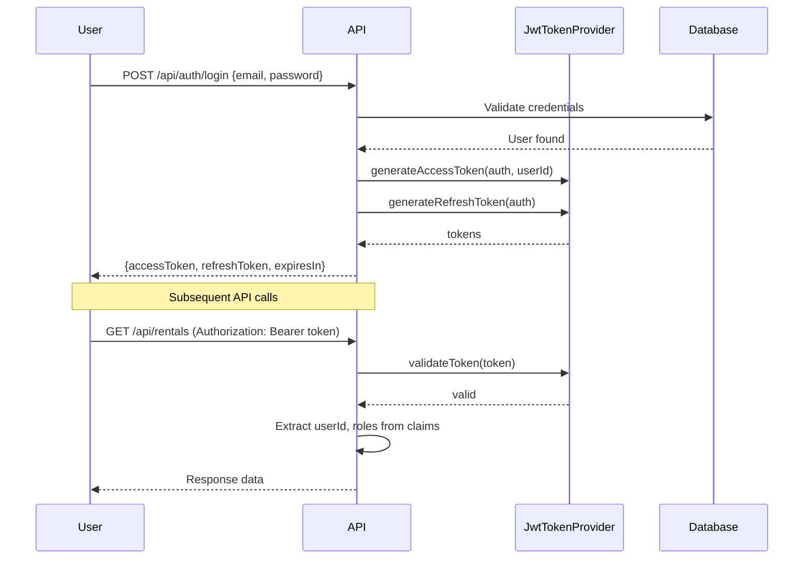
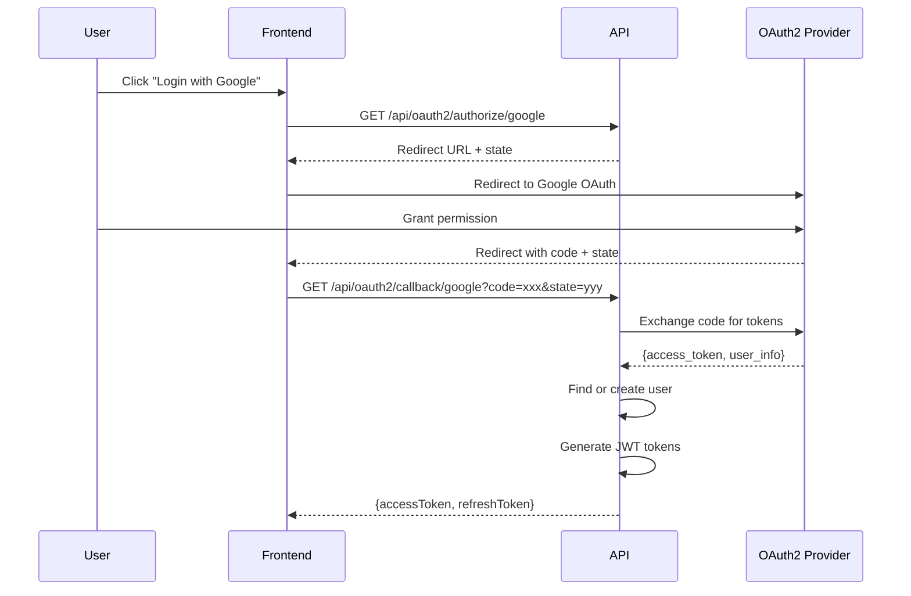
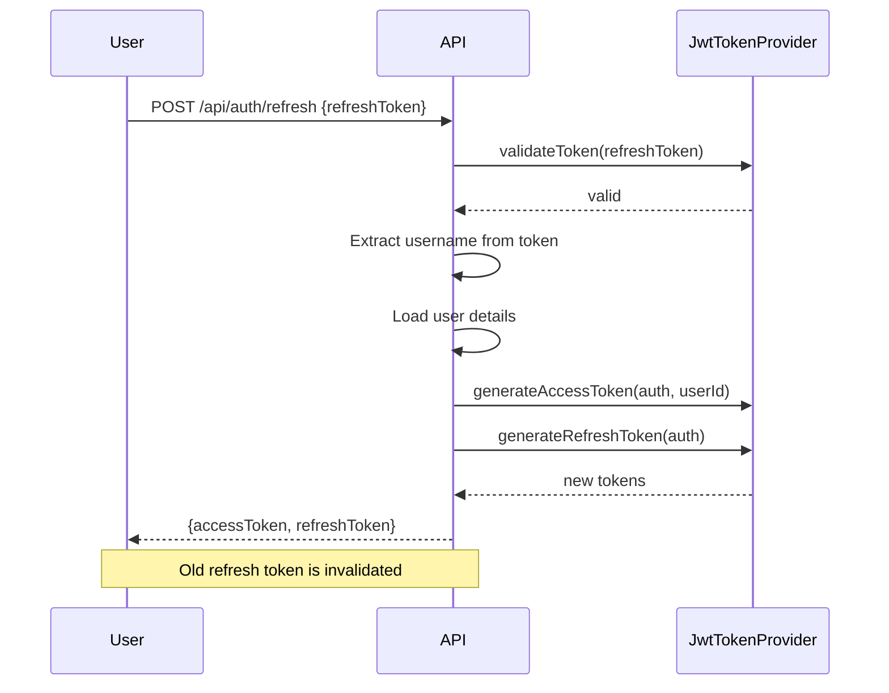

# ADR-008: Authentication Strategy

## Status
**Accepted**

## Context

The Car Rental API requires secure authentication and authorization:

- **Stateless Architecture:** API must scale horizontally without shared session state
- **Social Login:** Users expect "Login with Google/GitHub" convenience
- **Role-Based Access:** Different permissions for customers (USER) and staff (ADMIN)
- **Token Security:** Credentials must be protected in transit and at rest

**Problem:** Choosing an authentication mechanism that balances:
1. Security (industry best practices)
2. Scalability (stateless, no session storage)
3. User experience (social login, seamless refresh)
4. Developer experience (easy to implement and debug)

**Constraints:**
- No server-side session storage
- Support for web and mobile clients
- OAuth2 providers must be configurable
- Token refresh without forcing re-login

## Decision

Implement **JWT-based authentication** with OAuth2 social login:

### Token Architecture

| Token Type | Purpose | Expiration |
|------------|---------|------------|
| Access Token | API authorization | Short-lived (configurable, default: 1 hour) |
| Refresh Token | Obtain new access token | Long-lived (configurable, default: 7 days) |

### Access Token Claims

```json
{
  "sub": "username",
  "userId": 12345,
  "roles": ["USER"],
  "iat": 1704067200,
  "exp": 1704070800
}
```

### OAuth2 Provider Support

| Provider | Status | Rationale |
|----------|--------|-----------|
| Google | ✅ Enabled | Most common identity provider, trusted |
| GitHub | ✅ Enabled | Developer-focused audience |
| Facebook | ❌ Not included | Privacy concerns, declining developer adoption |
| Twitter/X | ❌ Not included | API instability, frequent breaking changes |

### Security Mechanisms

- **Signing Algorithm:** HMAC-SHA256 with secret key
- **Token Storage:** HttpOnly cookies recommended
- **Stateless Validation:** No database lookup for token verification
- **Refresh Rotation:** New refresh token issued on use

## Rationale

### Alternatives Evaluated

| Approach | Pros | Cons |
|----------|------|------|
| **JWT** (chosen) | Stateless, scalable, self-contained claims | Token size, revocation complexity |
| **Session-based** | Simple revocation, familiar | Server state required, horizontal scaling issues |
| **Opaque Tokens** | Small token size, easy revocation | Database lookup per request, single point of failure |
| **PASETO** | More secure than JWT, simpler spec | Less library support, team unfamiliarity |
| **OAuth2 + OIDC** | Standard protocol, token introspection | Infrastructure overhead, complexity |

### Why JWT?

1. **Stateless Validation:** Token contains all claims. No database lookup for authorization checks. Enables horizontal scaling.

2. **Standard Format:** JWT (RFC 7519) is widely adopted. Libraries available in all languages. Easy debugging with jwt.io.

3. **Flexible Claims:** `userId` and `roles` embedded in token. Backend doesn't need to query user table on every request.

4. **Ecosystem Compatibility:** Works seamlessly with Spring Security. `JwtAuthenticationFilter` integrates into security chain.

5. **Dual Token Strategy:** Short-lived access tokens minimize exposure window. Long-lived refresh tokens maintain session without re-login.

### Why HMAC-SHA256 (HS256)?

| Algorithm | Use Case | Our Choice |
|-----------|----------|------------|
| **HS256** (symmetric) | Single-service authentication | ✅ Chosen |
| **RS256** (asymmetric) | Multi-service / microservices | Not needed |
| **ES256** (elliptic curve) | High security, smaller signatures | Overkill |

**Rationale:** This API is a monolith (Spring Modulith). No need for asymmetric keys since the same service signs and verifies tokens.

### OAuth2 Provider Selection

| Provider | Status | Rationale |
|----------|--------|-----------|
| **Google** | ✅ Included | 92% of users have Google account. Most trusted identity provider. Well-documented API. |
| **GitHub** | ✅ Included | Developer-focused product. Target audience likely has GitHub. Simple OAuth flow. |
| **Facebook** | ❌ Excluded | Privacy controversies. Declining developer adoption. Complex review process. |
| **Twitter/X** | ❌ Excluded | API instability. Frequent breaking changes. Unpredictable pricing. |

### OAuth2 State Parameter Security

The `state` parameter prevents CSRF attacks:

```java
public String generateState() {
    return UUID.randomUUID().toString();
}

public void validateState(String receivedState, String storedState) {
    if (!receivedState.equals(storedState)) {
        throw new OAuth2AuthenticationException(
            OAuth2ErrorType.INVALID_STATE, provider
        );
    }
}
```

**State Storage:** In-memory cache with 10-minute TTL. Cleared after use.

### Token Expiration Rationale

| Token | Expiration | Rationale |
|-------|------------|-----------|
| Access Token | 1 hour | Short window limits damage if token leaked. Long enough to avoid frequent refreshes. |
| Refresh Token | 7 days | Balances security with UX. User re-login once per week maximum. |
| OAuth2 State | 10 minutes | Only needed during OAuth flow. Short TTL prevents replay attacks. |

## Implementation Details

### Access Token Structure

The access token is a signed JWT containing user identity and authorization info:

```java
public String generateAccessToken(Authentication authentication, Long userId) {
    List<String> roles = authentication.getAuthorities().stream()
        .map(auth -> auth.getAuthority().replace("ROLE_", ""))
        .toList();

    return Jwts.builder()
        .subject(authentication.getName())
        .claim("userId", userId)
        .claim("roles", roles)
        .issuedAt(new Date())
        .expiration(new Date(System.currentTimeMillis() + accessTokenExpiration))
        .signWith(getSigningKey())
        .compact();
}
```

**Token Claims:**

| Claim | Type | Description |
|-------|------|-------------|
| `sub` | String | Username (email) |
| `userId` | Long | Database user ID |
| `roles` | List<String> | User roles (USER, ADMIN) |
| `iat` | Timestamp | Issued at time |
| `exp` | Timestamp | Expiration time |

**Configuration:**
```yaml
jwt:
  secret: ${JWT_SECRET}  # Min 256 bits for HS256
  access-token-expiration: 3600000  # 1 hour in ms
```

### Refresh Token Structure

The refresh token is a minimal JWT for obtaining new access tokens:

```java
public String generateRefreshToken(Authentication authentication) {
    return Jwts.builder()
        .subject(authentication.getName())
        .issuedAt(new Date())
        .expiration(new Date(System.currentTimeMillis() + refreshTokenExpiration))
        .signWith(getSigningKey())
        .compact();
}
```

**Key Differences from Access Token:**
- No `userId` or `roles` claims (reduces token size)
- Longer expiration (7 days default)
- Only used for token refresh endpoint

**Configuration:**
```yaml
jwt:
  refresh-token-expiration: 604800000  # 7 days in ms
```

### Authentication Flow (JWT)



### OAuth2 Authentication Flow



### Token Refresh Flow



### Security Configuration

```java
@Bean
public SecurityFilterChain filterChain(HttpSecurity http) throws Exception {
    http
        .csrf(AbstractHttpConfigurer::disable)  // Stateless API
        .sessionManagement(session -> 
            session.sessionCreationPolicy(SessionCreationPolicy.STATELESS))
        .authorizeHttpRequests(auth -> auth
            .requestMatchers("/api/auth/**").permitAll()
            .requestMatchers("/api/oauth2/**").permitAll()
            .requestMatchers(HttpMethod.POST, "/api/rentals/request").hasRole("USER")
            .requestMatchers("/api/admin/**").hasRole("ADMIN")
            .anyRequest().authenticated()
        )
        .addFilterBefore(jwtAuthenticationFilter, 
            UsernamePasswordAuthenticationFilter.class);
    
    return http.build();
}
```

### JWT Validation

```java
public boolean validateToken(String token) {
    try {
        Jwts.parser()
            .verifyWith(getSigningKey())
            .build()
            .parseSignedClaims(token);
        return true;
    } catch (JwtException | IllegalArgumentException e) {
        log.error("Invalid JWT token: {}", e.getMessage());
        return false;
    }
}
```

**Validation Checks:**
- Signature verification (HMAC-SHA256)
- Expiration time (`exp` claim)
- Malformed token detection
- Invalid signature detection

## Consequences

### Positive

1. **Horizontal Scalability:** No shared session state. Any API instance can validate tokens independently. Load balancer can route to any node.

2. **Performance:** Token validation is a local cryptographic operation (~1ms). No database query or network call per request.

3. **Social Login UX:** Users can sign up/login with one click. No password creation required. Reduces registration abandonment.

4. **Mobile-Ready:** JWT works identically for web, iOS, and Android clients. No cookie management issues on mobile.

5. **Self-Contained Authorization:** Role checks happen from token claims, not database. User role changes take effect on next token refresh.

6. **Debuggability:** Tokens can be decoded at jwt.io for troubleshooting. Claims are human-readable JSON.

### Negative

1. **Token Revocation Complexity:** Cannot instantly invalidate a token. Solutions:
   - Short expiration (1 hour) limits exposure window
   - Token blacklist (requires shared state, defeats stateless goal)
   - Refresh token revocation (implemented - see Related ADRs)

2. **Token Size:** JWT with claims is ~500 bytes vs ~32 bytes for opaque session ID. Adds overhead to every request header.

3. **Secret Key Management:** Compromised JWT secret allows forging any token. Mitigation:
   - Secret stored in environment variable
   - Minimum 256-bit key enforced
   - Key rotation requires coordinated deployment

4. **OAuth2 Provider Dependency:** If Google/GitHub is down, social login fails. Mitigation:
   - Email/password fallback always available
   - Provider status monitoring recommended

5. **Clock Skew Sensitivity:** Token expiration relies on system clocks. Significant clock drift between client and server can cause premature or delayed expiration.

## Related ADRs

- ADR-003: Event-Driven Inter-Module Communication (auth events)
- ADR-004: Shared Kernel Boundaries (security in shared kernel)

## Code References

- JWT Provider: `com.akif.shared.security.JwtTokenProvider`
- Auth Filter: `com.akif.shared.security.JwtAuthenticationFilter`
- Security Config: `com.akif.shared.security.SecurityConfig`
- OAuth2 Service: `com.akif.auth.internal.service.oauth2.OAuth2AuthService`
- OAuth2 Controller: `com.akif.auth.web.OAuth2Controller`
- Google Provider: `com.akif.auth.internal.service.oauth2.impl.GoogleOAuth2ProviderService`
- GitHub Provider: `com.akif.auth.internal.service.oauth2.impl.GitHubOAuth2ProviderService`
