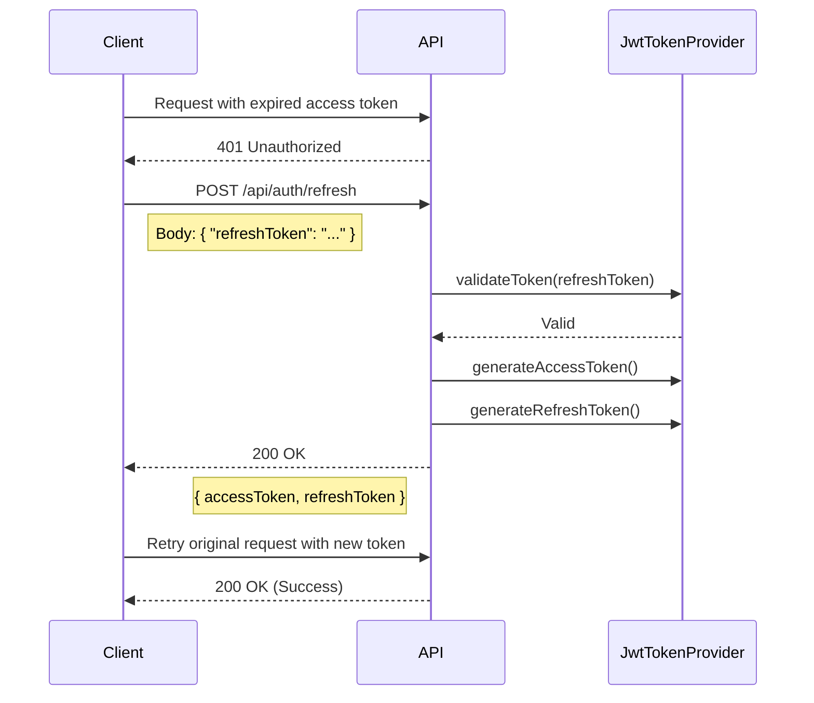
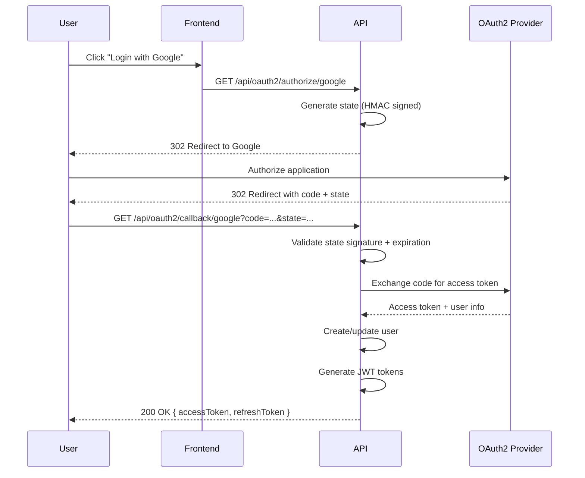

# Authentication & Authorization

> Comprehensive documentation of Car Rental API's authentication and authorization mechanisms.

## Table of Contents

1. [Overview](#1-overview)
2. [JWT Authentication](#2-jwt-authentication)
3. [OAuth2 Social Login](#3-oauth2-social-login)
4. [Authorization](#4-authorization)
5. [Webhook Security](#5-webhook-security)
6. [Security Best Practices](#6-security-best-practices)

---

## 1. Overview

Car Rental API uses a multi-layered authentication approach:

| Mechanism | Purpose | Implementation |
|-----------|---------|----------------|
| **JWT** | Stateless API authentication | Access + Refresh tokens |
| **OAuth2** | Social login | Google, GitHub |
| **Role-based Access Control** | Authorization | USER, ADMIN roles |

### Key Components

```
src/main/java/com/akif/
├── shared/security/
│   ├── SecurityConfig.java        # URL-based security rules
│   ├── JwtTokenProvider.java      # JWT generation/validation
│   ├── JwtAuthenticationFilter.java # Request authentication
│   └── CorrelationIdFilter.java   # Request tracing
└── auth/
    ├── web/
    │   ├── AuthController.java    # Login/register endpoints
    │   └── OAuth2Controller.java  # Social login endpoints
    └── internal/service/
        └── oauth2/                # OAuth2 provider implementations
```

---

## 2. JWT Authentication

### 2.1 Token Structure

Car Rental API uses JSON Web Tokens (JWT) with HMAC-SHA256 signing.

#### Access Token Claims

```json
{
  "sub": "username",
  "userId": 123,
  "roles": ["USER"],
  "iat": 1736640000,
  "exp": 1736643600
}
```

| Claim | Type | Description |
|-------|------|-------------|
| `sub` | String | Username (subject) |
| `userId` | Long | User's database ID |
| `roles` | Array | User roles without "ROLE_" prefix |
| `iat` | Long | Issued at timestamp (epoch seconds) |
| `exp` | Long | Expiration timestamp (epoch seconds) |

#### Refresh Token Claims

```json
{
  "sub": "username",
  "iat": 1736640000,
  "exp": 1737244800
}
```

Refresh tokens contain only the subject - no roles or userId (for security).

### 2.2 Token Lifecycle

| Token Type | Configuration Property | Purpose |
|------------|----------------------|---------|
| Access Token | `jwt.access-token-expiration` | Short-lived API authentication |
| Refresh Token | `jwt.refresh-token-expiration` | Long-lived token renewal |

**Configuration Example (application.properties):**
```properties
jwt.secret=${JWT_SECRET}
jwt.access-token-expiration=${JWT_ACCESS_TOKEN_EXPIRATION}
jwt.refresh-token-expiration=${JWT_REFRESH_TOKEN_EXPIRATION}
jwt.token-prefix=Bearer
jwt.header-string=Authorization
```

### 2.3 Token Generation

**Code Reference: `JwtTokenProvider.java`**

```java
public String generateAccessToken(Authentication authentication, Long userId) {
    String username = authentication.getName();
    Date expiryDate = new Date(System.currentTimeMillis() + accessTokenExpiration);

    List<String> roles = authentication.getAuthorities().stream()
            .map(authority -> authority.getAuthority().replace("ROLE_", ""))
            .toList();

    return Jwts.builder()
            .subject(username)
            .claim("userId", userId)
            .claim("roles", roles)
            .issuedAt(new Date())
            .expiration(expiryDate)
            .signWith(getSigningKey())
            .compact();
}
```

### 2.4 Token Refresh Flow



**Endpoint:** `POST /api/auth/refresh`

**Request:**
```json
{
  "refreshToken": "eyJhbGciOiJIUzI1NiJ9..."
}
```

**Response:**
```json
{
  "accessToken": "eyJhbGciOiJIUzI1NiJ9...",
  "refreshToken": "eyJhbGciOiJIUzI1NiJ9...",
  "tokenType": "Bearer"
}
```

### 2.5 JwtAuthenticationFilter

The filter intercepts every request and validates JWT tokens.

**Code Reference: `JwtAuthenticationFilter.java`**

```java
@Override
protected void doFilterInternal(HttpServletRequest request, 
                                HttpServletResponse response,
                                FilterChain filterChain) {
    try {
        String jwt = getJwtFromRequest(request);
        
        if (StringUtils.hasText(jwt) && tokenProvider.validateToken(jwt)) {
            String username = tokenProvider.getUsernameFromToken(jwt);
            UserDetails userDetails = userDetailsService.loadUserByUsername(username);
            
            UsernamePasswordAuthenticationToken authentication = 
                new UsernamePasswordAuthenticationToken(
                    userDetails, null, userDetails.getAuthorities());
            authentication.setDetails(
                new WebAuthenticationDetailsSource().buildDetails(request));
            
            SecurityContextHolder.getContext().setAuthentication(authentication);
        }
    } catch (Exception ex) {
        log.error("Could not set user authentication in security context", ex);
    }
    
    filterChain.doFilter(request, response);
}
```

**Flow:**
1. Extract token from `Authorization` header
2. Remove "Bearer " prefix
3. Validate token signature and expiration
4. Load user details from database
5. Set `SecurityContext` for the request

### 2.6 Password Security

**Algorithm:** BCrypt  
**Work Factor:** Default (10 rounds)

**Code Reference: `SecurityConfig.java`**
```java
@Bean
public PasswordEncoder passwordEncoder() {
    return new BCryptPasswordEncoder();
}
```

**Why BCrypt?**
- Adaptive: Work factor can be increased as hardware improves
- Built-in salt: Each hash includes a unique salt
- Slow by design: Resistant to brute-force attacks

---

## 3. OAuth2 Social Login

### 3.1 Supported Providers

| Provider | Authorization Endpoint | Scopes |
|----------|----------------------|--------|
| Google | `/api/oauth2/authorize/google` | openid, email, profile |
| GitHub | `/api/oauth2/authorize/github` | user:email, read:user |

### 3.2 OAuth2 Flow



### 3.3 State Parameter (CSRF Protection)

The state parameter prevents CSRF attacks during OAuth2 flow.

**Implementation: `OAuth2StateService.java`**

**State Structure:**
```
Base64Url(timestamp.random.signature)
```

| Component | Description |
|-----------|-------------|
| `timestamp` | Unix epoch seconds |
| `random` | 16 bytes SecureRandom |
| `signature` | HMAC-SHA256 of timestamp.random |

**Validation:**
1. Decode Base64Url
2. Split into parts
3. Verify HMAC signature (constant-time comparison)
4. Check timestamp expiration (configurable, default 10 minutes)

### 3.4 Account Linking

Existing users can link social accounts to their profile.

**Endpoint:** `POST /api/oauth2/link/{provider}?code=...&state=...`

**Requirements:**
- User must be authenticated
- Social account must not be linked to another user

---

## 4. Authorization

### 4.1 Roles and Permissions

| Role | Description | Capabilities |
|------|-------------|--------------|
| `USER` | Regular customer | Request rentals, view own data, cancel own rentals |
| `ADMIN` | Administrator | Manage all rentals, cars, users, view dashboards |

### 4.2 Protected Endpoints by Role

#### ADMIN Only

| Endpoint Pattern | Method | Description |
|-----------------|--------|-------------|
| `/api/rentals/*/confirm` | POST | Confirm rental request |
| `/api/rentals/*/pickup` | POST | Mark car as picked up |
| `/api/rentals/*/return` | POST | Process car return |
| `/api/rentals/admin` | GET | List all rentals |
| `/api/cars/**` | POST/PUT/PATCH/DELETE | Car management |
| `/api/cars/business/**` | ALL | Business analytics |
| `/api/admin/**` | ALL | Admin operations |
| `/api/dashboard/**` | ALL | Dashboard data |
| `/api/exchange-rates/refresh` | POST | Force currency refresh |

#### USER Only

| Endpoint Pattern | Method | Description |
|-----------------|--------|-------------|
| `/api/rentals/request` | POST | Request new rental |
| `/api/rentals/me` | GET | Get user's own rentals |

#### Authenticated (Any Role)

| Endpoint Pattern | Method | Description |
|-----------------|--------|-------------|
| `/api/rentals/*` | GET | View specific rental |
| `/api/rentals/*/cancel` | POST | Cancel own rental |
| `/api/pricing/calculate` | POST | Calculate pricing |
| `/api/oauth2/link/**` | POST | Link social account |

### 4.3 @PreAuthorize Usage

Method-level security is implemented using Spring's `@PreAuthorize` annotation.

**Example:**
```java
@PreAuthorize("hasRole('ADMIN')")
@PostMapping("/{id}/confirm")
public ResponseEntity<RentalResponse> confirmRental(@PathVariable Long id) {
    // Only ADMIN can execute this
}
```

**Current Usage:** 23 methods across controllers:
- `CarController`: 5 methods
- `RentalController`: 3 methods
- `DamageReportController`: 4 methods
- `DamageHistoryController`: 4 methods
- `DashboardController`: Class-level
- `AlertController`: Class-level
- `QuickActionController`: Class-level

### 4.4 Public Endpoints

These endpoints do not require authentication:

- `/api/auth/**` - Login, register, refresh
- `/api/oauth2/authorize/**`, `/api/oauth2/callback/**` - Social login
- `/api/cars` (GET) - Car listing and search
- `/api/pricing/preview`, `/api/pricing/strategies` - Pricing info
- `/api/exchange-rates/**` (GET) - Currency rates
- `/api/webhooks/**` - Stripe webhooks
- `/health`, `/actuator/health` - Health checks
- `/swagger-ui/**`, `/v3/api-docs/**` - API documentation

### 4.5 Error Responses

| HTTP Status | Description | When |
|-------------|-------------|------|
| `401 Unauthorized` | Missing or invalid token | No token, expired token, invalid signature |
| `403 Forbidden` | Insufficient permissions | Valid token but wrong role |

---

## 5. Webhook Security

### 5.1 Stripe Webhook Verification

Stripe webhooks are verified using signature verification.

**Header:** `Stripe-Signature`

**Code Reference: `StripeWebhookHandler.java`**
```java
Event event = Webhook.constructEvent(
    payload, 
    signature, 
    stripeConfig.getWebhookSecret()
);
```

### 5.2 Replay Attack Prevention

| Mechanism | Implementation |
|-----------|----------------|
| Event ID Idempotency | `WebhookEvent` entity stores each event |
| Status Tracking | PROCESSING → PROCESSED or FAILED |
| Duplicate Detection | `isEventAlreadyProcessed()` check |

### 5.3 Supported Events

| Event Type | Action |
|------------|--------|
| `checkout.session.completed` | Mark payment as CAPTURED |
| `checkout.session.expired` | Mark payment as FAILED |
| `payment_intent.payment_failed` | Mark payment as FAILED with error |

---

## 6. Security Best Practices

### For API Developers

| Practice | Implementation |
|----------|----------------|
| Never log sensitive data | Tokens, passwords excluded from logs |
| Use @PreAuthorize | Method-level security for business logic |
| Validate all input | `@Valid` on all request DTOs |
| Use parameterized queries | Spring Data JPA, no raw SQL |

### For API Consumers

| Practice | Recommendation |
|----------|----------------|
| Store tokens securely | HttpOnly cookies or secure storage |
| Implement token refresh | Handle 401 and refresh automatically |
| Use HTTPS only | Never send tokens over HTTP |
| Validate token expiration | Check `exp` claim client-side |

### Token Storage Recommendations

| Platform | Recommended Storage |
|----------|-------------------|
| Web (SPA) | HttpOnly cookie with SameSite=Strict |
| Mobile | Secure Keychain (iOS) / Keystore (Android) |
| Server-to-Server | Environment variables, secrets manager |
